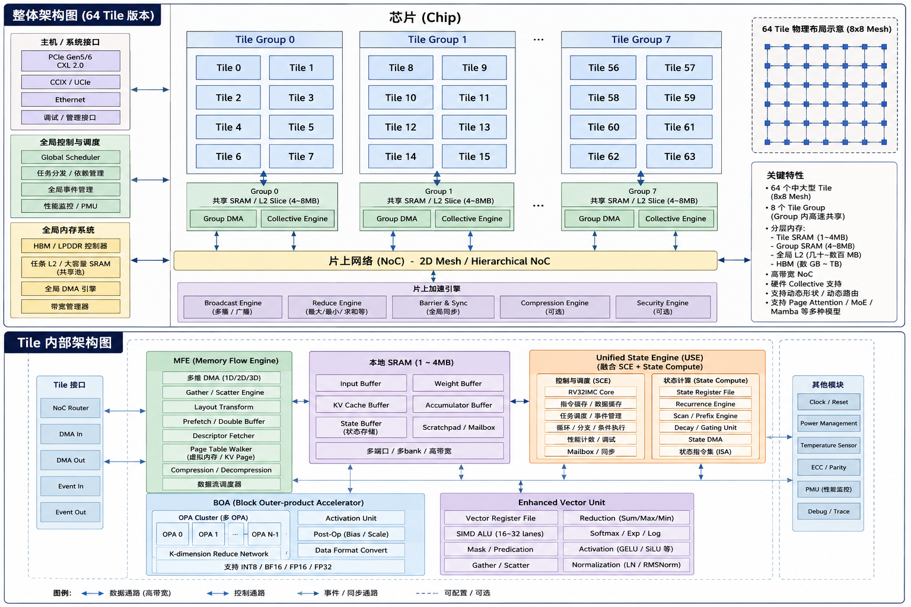

# Nexus — ELENOR 架构与 Pipeline Validator

> 本仓库由人类与大模型（LLM）共同打造：架构设想、代码实现、测试与设计文档均在人机协作中迭代完成。

## 项目简介

ELENOR 的**调度与资源架构方向**以 `pipeline_validator/` 为当前参考实现，
不是“下一步大概想法”。模型规模为 1 Group × 4 Tile，执行
`Graph → Context(root) → Grid → Task → Tile Program → Engine`；
可运行特征与条件见[实例矩阵](./examples/README.md#调度方法与代表实例)，
架构边界见[主规格](./design/ELENOR_Architecture_Design_v1.md)。
三层定位：**模型事实**由编译/运行证据支持；**架构方向**将这些合同
作为芯片设计基线；物理 SRAM/NoC、引擎张量算术、硅片 UCE 数与
binary ABI **尚未冻结**，不将模拟周期当器件性能。

```text
source xDSL ModuleOp
  └─ compiler.compile_program(...)            # 证明 + lowering
       └─ CompiledProgram（不可变 artifact，schema_version=2 / compiler_abi=v2）
            └─ loader.load_program(...)       # 只读加载，不导入 compiler
                 └─ LoadedProgram
                      └─ Simulator.run(LoadedProgram)   # 唯一接受的输入类型
```

`Simulator.run` 拒绝源 `ModuleOp`、私有 DTO 和未加载的 `CompiledProgram`；不存在
runtime 源 IR lowering 回退路径。

## 核心架构思想

### 1. 编译期证明，运行期不补合同（prove, don't repair）

- `compile_program` 对每个已声明 Profile 与实际 L1/L2 组合、
  逐 bank stripe/padding、Frame、live event frontier、Grid/control
  和 R×子 Arena 包络做检查。L2 no-rebind 的高水位若大于源
  `l2_spm_bytes`，编译器会**向上规范化可执行 reservation**
  并重新逐 Profile 验证；不删 mode、不调低 R，更不是 runtime 扩容。
- 不可变软件 artifact 携带 source/Registry/target/artifact hash；
  独立 verifier 重推导静态资源、依赖、sharing 与 hazard。Loader
  只读验证 actual bindings，不重编译或插入缺失等待。
- 静态可判定的非法合同在运行前拒绝；真实运行仍可能因有限资源
  等待、动态故障或取消而不能完成。普通 await 不自动升级为全局
  静默；真正的 Profile 切换需要编译出的配置/维护事务及 ACK。

### 2. Compute / Control / Data Movement 分层进入 IR 与硬件边界

`Compute != Control != Data Movement` 不是口号，而是 IR 的所有权类型系统：

| 前缀      | 所有者                 | 能表达什么                                              | 不能表达什么                 |
| --------- | ---------------------- | ------------------------------------------------------- | ---------------------------- |
| `tile.*`  | 一个 Task/Tile Program | L1 alloc、load/store、engine launch、local await/signal | 跨 Task 调度、L2 分配        |
| `nest.*`  | 一个 root Context      | L2 alloc、prefetch/store、dispatch、release、组内 await | Tile 内 L1 布局、Host 控制流 |
| `nexus.*` | Host/CPU 模型          | submit_context、跨 root 依赖、await、return             | 任何片上资源细节             |

`device.py` CPU controller 通过 DevicePort 消息提交，不读写 Group/Tile
的 PC。GroupPort 请求先只占有界 pending metadata，root 准入才完整
提交 Group execution slot、L2 Arena、事件/控制预算；CPU 可已标
ACTIVE 而 Group `active_cycle` 仍未到达。准备失败可能 abort/rollback，
保证不暴露半提交；已接受计算靠 drain/cancel-confirm 收敛，并非
任意计算可事务回滚。

### 3. 一切资源有限，且每类等待都可归因

模型里没有无界队列。Group 调度器就是一张有限表：`action_capacity=16`、
`scan_width=4`、每 Context quota=8、`event_capacity=4096`、inflight=32、
prefetch/store/dispatch 各自有 credit；Event Table 使用**编译器证明的 live frontier**
（而非全部历史事件）。Task 准入的失败被精确分类为：

`WAIT_CAPACITY` / `WAIT_FRAGMENTATION` / `WAIT_SLOT` / `WAIT_CONTROL_RESOURCE` /
`WAIT_CONTEXT_LIMIT`

纯 plan 无副作用；永久不可能的请求（空池也放不下的 per-bank 需求）直接 fault，而不是
进入等待队列假装有机会。总空闲字节不能掩盖 stripe 碎片化失败。所有等待类都进 PMU——
报告由真实快照生成，`report.py` 明确**不**从 trace 名字反推硬件事件。

### 4. 分层 SRAM Profile：可重构片上内存的一等公民

L1/L2 各自独立地在 SPM / Cache 之间划分（schema-2 YAML 声明每层 mode 表），而"切换
分区"是被完整建模的显式操作，而不是配置魔法：

- 每次真实切换都是编译产物中的 `ProfileReconfigDesc`，携带 expected/target mode、
  Registry hash、generation 绑定的 await 证明、受影响域与成员清单，执行固定十二步
  序列 `ACQUIRE → CHECK_FRONTIER → CLOSE_ISSUE → DRAIN_REFERENCES → CLEAN_INVALIDATE
→ DRAIN_DOWNSTREAM → PREPARE → WAIT_READY_ACK → COMMIT → WAIT_COMMIT_ACK →
OPEN_ISSUE → RELEASE`。
- `ProfileController` 是唯一 L1/L2 writer，Prepare/Commit ACK 走有界成员总线（每
  Tick 一对请求/响应），按成员身份与 generation 校验。**generation 单调递增**：迟到
  的返回写不进已被复用的新 generation——ABA 问题在模型层面被封死。
- Profile 身份是**准入维度**：root 与 Task 都只对活跃 Profile 比较 SAME / COMPATIBLE
  两类 FIFO 头；Profile 不兼容的工作根本不是 runtime 候选，切换必须由编译器先行
  安排。
- L1-only 重构不触碰活父 L2 Arena；L2-only 重构必须先关闭一切可能触及 L2 的工作。

## 调度设计

```text
CPU: nexus 控制序列 → DevicePort → GroupPort 有界 pending/完整 root 准入
  → 每 root TileGroupSequencer registration cursor / fence / completion
  → Group 共享 GroupScheduler：poll completion/control → ISSUE → REGISTER
  → 有界 Grid Route → 每 Tile 独立 Task commit
  → UCE eligible-head RR 单指令 issue → 有界 engine queues → 安全退休
```

`--device-context-mode N` 是 CPU 已交付 outstanding request 上限，
`group.active_context_capacity` 是 Group execution slot 数（默认 8），
`--context-mode N` 是每 Tile 精确 UCE contexts（默认 1，模型支持 1..8）。
`requested_contexts_per_tile=R` 是同一 parent/launch generation/tile
跨所有 Grid 的 Task lease，不等于物理 context 数；Frame Slot 与 program
resident slot 又是独立资源。`placement` 的 popcount 等于非空 Task
range 数量。Group RR 的 register/issue 与准入 FIFO 是不同仲裁层。

- **Ready-action（S0/S1 策略）**：S0 每 Context 只许队首 action 参与发射（in-order），
  资源就绪的非队首被挡住时计入 `group_ordering_stall` PMU；S1（默认）允许扫描窗口
  越过 PENDING 依赖乱序发射，依赖未就绪就跳过继续扫。S2 是保留的探索值，当前与
  S1 共用发射路径。普通 action 的 `depends_on` 以 `action.dependencies` 直接携带，
  不再被额外串行化；`nest.await` 按 operand 显式 lower 为一一对应的 `WAIT_EVENT`
  action（前端提交栅栏），`nest.barrier` lower 为 `BARRIER_GROUP`（Context 局部
  全前缀完成栅栏）——两者都不会被改写为全局 barrier。
- **完成与注册解耦**：`note_completion` 独立于 action 表回收 credit 与事件——表满
  永远阻塞不了完成回收，从结构上排除"表满死锁"。
- **SAME/COMPATIBLE 双 FIFO 头**：root 准入对活跃 L2 Profile、Task 准入对每 Tile 活跃
  L1 Profile 各自维护两类队首；SAME 优先，SAME 队首无法完整提交时 COMPATIBLE 队首
  可补位，但同类内不许越头。这是"Profile 感知的准入"，不是通用乱序调度。
- **完整 Task commit，有准备失败回滚**：提交涉及 L1 Arena、Frame、
  UCE pin、父 L2 pin 与 R lease；未对外可见的失败准备可 abort/rollback。
  一个 Tile 受阻不撤销其他 Tile 已提交的 Task；已接受工作只通过
  drain/cancel-confirm 收敛。Grid 等全部 Task 安全退休。
- **R lease 共驻约束**：`requested_contexts_per_tile` 以 `(parent binding, launch
generation, tile)` 为键约束同 Tile 共驻 Task 数，只在 Task 安全退役或确认取消时
  归还——`tile.free`、`input_released`、`output_ready`、cancel 请求都不会提前归还。

## 内存与生命周期模型

- **Arena 所有权**：一次 root 调用持有一个 L2 Arena（`RootInvocation`），一个已提交
  Task 持有一个 L1 Arena（`TaskIdentity`）。`nest.release` / `tile.free` 只使命名
  view 失效，不归还父 Arena；Arena 只在 owner 安全退役时归还。零字节 owner 也有显式
  Arena/控制/lease 记录。
- **L2 backing/claim 分离**：readonly 共享的多个 view 别名同一个物理 backing，不增加
  物理占用；claim 走 `DECLARED → BOUND → RELEASED` 状态机；`nest.publish` 在生产者
  最后一次访问后封存只读导出，原 Arena 可先于读者退役，快照单列 origin-retired
  backing，协议级字节总量按 backing 身份去重。
- **L1 静态复用，L2 永久 no-rebind**：L1 `tile.free` 后可在同一
  Task 的已编译 lifetime 内重用同一 slot/offset；运行期只是再绑定
  既定布局。L2 每个 buffer 独占全 stripe-round padded span，
  即使 release/barrier 后也不在同一 Arena 内重绑。死 scratch
  无须 store，跨 Task 持久化的结果须先完成 store。
- **L2 交接有三种**：`private` 默认；`context-local` 允许同一
  invocation 内 leaf→partial→combine，无 HBM scratch 中转但占 L2；
  `readonly` 在 `nest.publish` 后借 `nexus.shared.ref` 跨 root
  claim 同一 backing，读者/pin/inflight 未关闭前 backing 不回收。
  最终 HBM Store 必须覆盖全部实际 writer，不得在 Store 后继续写。
- **逐腿传输状态机**：`full_memory` 按操作分别建立 route，而不是将所有腿串成一笔：
  - HBM→L2 prefetch：`HBM_READ → GLOBAL_DMA → NOC_RESPONSE → L2_WRITE`。
  - L2→L1 Tile load：`L2_READ → LOCAL_DMA → L1_WRITE`；Tile store：
    `L1_READ → LOCAL_DMA → L2_WRITE`。
  - L2→HBM store：`L2_READ → NOC_REQUEST → GLOBAL_DMA → HBM_WRITE`。
    每腿完成后才推进下一腿，并按 stage 归因 PMU 等待；cancel 由 generation
    隔离。`runtime` / `timing_only` 的普通搬运折叠，不能据此推断逐腿时序。

## Fidelity 阶梯与字节证明

| Fidelity      | 分配/寻址                           | 传输时序                        |
| ------------- | ----------------------------------- | ------------------------------- |
| `timing_only` | 仅逻辑契约                          | 单腿折叠                        |
| `runtime`     | 真实 HBM binding + L1/L2 Arena/view | 单腿折叠                        |
| `full_memory` | 真实 binding/Arena + bank segment   | HBM/DMA/NoC/L2/L1/LocalDMA 全腿 |

三级 fidelity 执行**完全相同**的资源、Profile、maintenance、generation 与 gate 契约；
只有 `full_memory` + 注入 `ByteStore` 才证明字节搬运。`ByteStore` 是稀疏 oracle：拒绝
未初始化读（无隐式 zero-fill）、校验 host seed 覆盖、读腿完成时捕获源字节、写腿完成
时才提交目标字节。没有 `ByteStore` 时，Gather 的命中序列是源码 authored 的确定性
profile，报告中如实标注 `deterministic_profiled_not_address_or_value_accurate`——
cache 容量从不预测命中率，BOA/EVU/USE 不计算张量数值。

## 设计定位与组合创新

本项目不与通用模拟器竞争：gem5、GPGPU-Sim 等成熟工具提供丰富的可配置调度策略、
cache 层级与互连模型，面向通用微架构探索；RTL 仿真提供实现级精确验证。本项目的
关注点不同——把 **runtime / memory 契约本身**当作验证对象：程序合法性在运行前
证明，资源行为在运行中按契约检查。以下四项特性各自在已有工作中均有先例，本项目
的主张仅是它们的**组合**在一个可执行模型中闭环：

1. **Sealed artifact**：编译产物深度不可变、携带证明与 hash 链（source / registry /
   target / artifact 四个 SHA-256），严格 codec 拒绝未知字段与重复 key；编译一次
   即可在独立进程只读重放（hermetic replay），replay 路径不导入 compiler。
2. **独立 verifier**：`execution_verifier.py` 不信任 compiler 输出，独立验证静态
   ordering / dependency contract、资源预算覆盖、hazard 与事件 live frontier 等
   不变量；动态 issue 顺序由 runtime 调度器决定，不在其内。
3. **Profile / generation 准入**：SRAM 分区切换是编译描述符 + 成员 ACK 协议 +
   单调 generation 隔离；root / Task 准入按活跃 Profile 分 SAME / COMPATIBLE 两类
   FIFO 头。
4. **Typed stalls**：等待在模型内带类型（五类 `WAIT_*`、credit / epoch / ordering
   stall），PMU 由真实快照累积，报告不从事后 trace 名字反推。

关注点差异（仅陈述定位，不声称对方缺失能力）：

| 维度       | 通用 cycle 模拟器（gem5、GPGPU-Sim 等）                 | 本项目                                              |
| ---------- | ------------------------------------------------------- | --------------------------------------------------- |
| 定位       | 通用微架构研究：可配置调度器、cache、互连的设计空间扫描 | 面向一种目标契约（ELENOR runtime/memory）的定点验证 |
| 输入       | 用户或工具链直接提供的程序                              | 仅接受编译期证明通过并封印的 artifact               |
| 合法性保障 | 按配置执行并给出统计                                    | 任何 cycle 之前完成静态证明，verifier 独立重推导    |
| 片上 SRAM  | 可配置 cache / scratchpad 层级                          | 显式 Profile 分区 + 描述符化切换 + generation 隔离  |
| stall 观测 | 统计计数与流水线级可视化                                | 模型内带类型的等待 + 快照累积 PMU                   |

有意保留的边界（不是疏漏）：单 Tile Group、固定 4-Tile 拓扑、无 task stealing、FIFO
队首约束、静态 Arena 布局、Profile 物理值 `由后续规格冻结`。完整清单见
[`pipeline_validator/Limitation.md`](./pipeline_validator/Limitation.md)。

## 代码结构

```text
pipeline_validator/
├── compiler/            # 证明型编译器：api(流水线) / lowering / resources / profile_pass
├── dialects/elenor.py   # xDSL 自定义汇编方言（tile.* / nest.* / nexus.*）
├── workload_ir.py       # 源 IR parse / print / verify
├── execution_ir.py      # 冻结的 compiler/loader/runtime DTO
├── compiled_program.py  # 不可变 package + 严格 codec
├── execution_verifier.py# 独立只读语义验证器（不信任 compiler）
├── loader.py            # 只读加载：验证 + binding 检查 → LoadedProgram
├── profiles.py          # Profile Registry、契约、布局、控制描述符
├── config.py            # HardwareConfig / SimConfig / schema-2 YAML
├── device.py            # CPU 侧控制器（DevicePort 消息协议）
├── runtime/             # group_port(消息适配) / event_table / program_table / reset / fault
├── group_scheduler.py   # 有限 ready-action 调度器（S0/S1）
├── tile_group.py        # root/Grid 准入与退役
├── tile.py              # 每 Tile Task 准入、UCE context、eligible-head RR
├── tile_group_sequencer.py
├── engines.py           # BOA/EVU/USE Roofline 单 job 时序 + MFE 多 lane
├── memory/              # arena / profile_controller / transfer / cache / allocator /
│                        # noc / mshr / byte_store / l1_slot_frame / hbm_region / payload
├── stream_queue.py      # credit/backpressure/EOS 生产者-消费者契约
├── simulator.py         # 只消费 LoadedProgram 的 cycle driver
├── pmu.py / trace.py / report.py   # 观测性：PMU、Perfetto trace、快照报告
└── cli.py               # 源编译与 compiled replay 入口
```

## 快速开始

```bash
# Python 3.11 conda 环境（依赖：xdsl、pyyaml、pytest）
conda env create -f pipeline_validator/environment.yml
conda activate elenor-validator

# 全部测试
python -m pytest pipeline_validator/tests/ -v

# 可运行示例目录
bash examples/run.sh list

# 运行一个 workload（compile → persist → load → run 全链路）
bash examples/run.sh gather-matmul --json

# 追加 Perfetto trace 与内存细节
bash examples/run.sh matmul-2048x512-boa256 \
  --trace-json /tmp/matmul.json --memory-trace
```

CLI 常用路径：

```bash
# 只编译，产出 review.json + .exec.txt + .compiled.mlir.txt + .target.yaml
python -m pipeline_validator --ir-file path/to/workload.mlir \
  --input-binding Y=0x100000:131072:rw \
  --compile-only --compiled-output artifacts/review.json

# 独立进程只读重放 artifact（不读源文件、不导入 compiler）
python -m pipeline_validator --compiled-file artifacts/review.json \
  --hw-config artifacts/review.target.yaml \
  --input-binding Y=0x100000:131072:rw
```

常用开关：`--group-policy s0|s1|s2`、`--context-mode N`、`--device-context-mode N`、
`--sim-override KEY=VALUE`（含 `fidelity=full_memory`）、`--max-cycles N`、
`--json` / `--report`、`--detailed`、`--trace-json` / `--trace-html` /
`--memory-trace`。完整语义见
[`pipeline_validator/README.md`](./pipeline_validator/README.md)。

## 质量门槛

- **测试**：`python -m pytest pipeline_validator/tests/ -v`。
- **Lint / 类型**：`conda run -n elenor-validator pre-commit run -a`
  （ruff、mypy、prettier 等）。本说明不以历史测试数量代替本轮运行证据。
- **Python 风格**：108 列、2 空格缩进、双引号、LF。

## 文档导航：特点 → 实例 → 源码 → 正式规格

1. [调度特征与可运行实例](./examples/README.md#调度方法与代表实例)：
   Tile-SPMD/异步流水/异构引擎/资源补位/依赖/尾部/context-local/readonly/Profile；
   `bash examples/run.sh list` 获取唯一 case 绑定入口。
2. [validator 使用手册](./pipeline_validator/README.md)、
   [源 IR 合同](./pipeline_validator/IR_SPEC.md) 与
   [模型边界](./pipeline_validator/Limitation.md)；源码从
   `pipeline_validator/compiler/api.py`、`loader.py`、`device.py`、
   `runtime/group_port.py`、`group_scheduler.py`、`tile_group.py`、
   `tile.py` 跟到 `simulator.py`。
3. [ELENOR 主架构规格](./design/ELENOR_Architecture_Design_v1.md)
   §7/12/15–20：集成权威；模块按 ownership 阅读
   [Compiler](./design/elenor_compiler/ELENOR_Compiler_Stack_Design.md)、
   [Tile Group](./design/elenor_tile_group/ELENOR_Tile_Group_Design.md)、
   [Tile UCE](./design/elenor_tile_uce/ELENOR_Tile_UCE_Design.md)、
   [Memory/NoC](./design/elenor_memory_noc/ELENOR_Memory_NoC_Design.md)、
   [Workload Mapping](./design/elenor_workload_mapping/ELENOR_Workload_Mapping_Design.md)。
   `design/proposal/` 和 `review/` 保留历史演进，不覆盖正式规格。

## ELENOR 芯片架构方向与设计文档

BOA 目标为 dense、EVU 为 irregular/vector、MFE 为数据流、USE 为
state/control；它们的内部硬件规格不等于 validator 中 timing
descriptor 的张量数值实现。Edge（8–16 Tile）、Balanced（64 Tile）、
High End（128 Tile）是待 PPA 验证的产品建议，不是本轮仿真规模。
图像是历史器件组织示意；当前控制拓扑以主规格 §7 的 ASCII 图为准。



需要导出 PDF 时从仓库根目录运行：

```bash
bash scripts/generate_pdf.sh -f design/ELENOR_Architecture_Design_v1.md
```

## License

See [`LICENSE`](./LICENSE).
