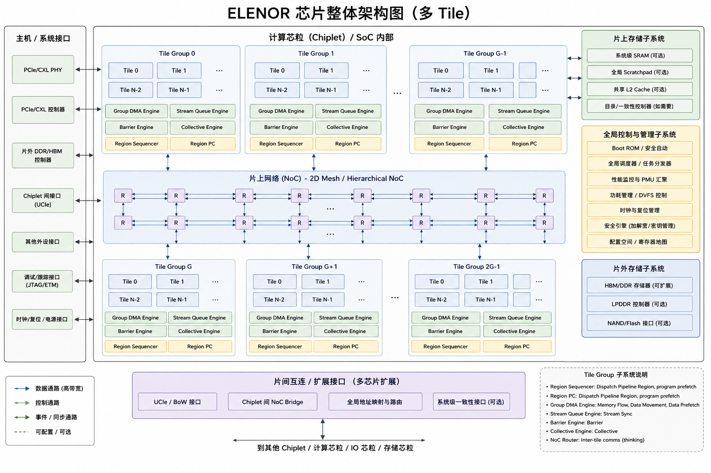
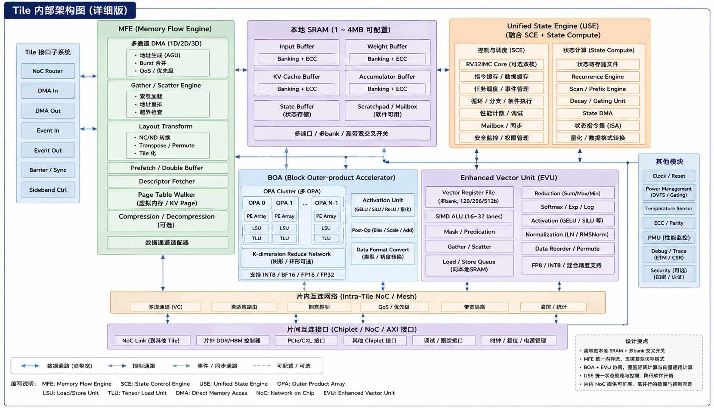
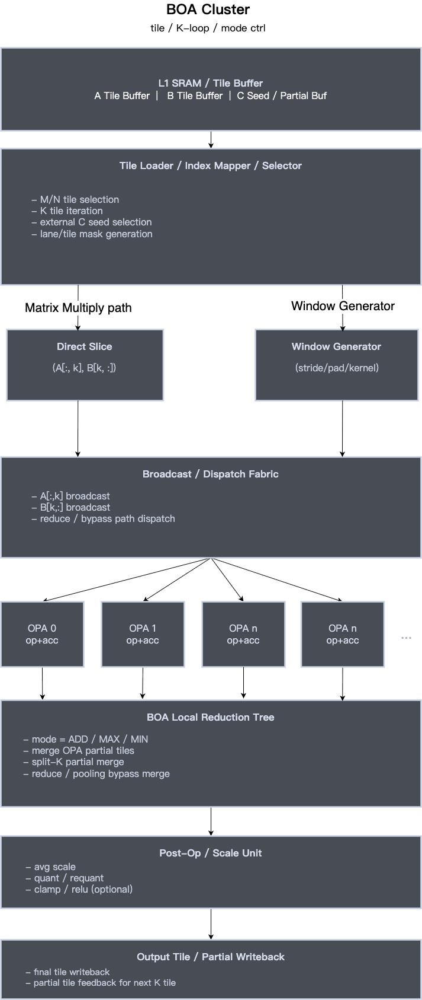
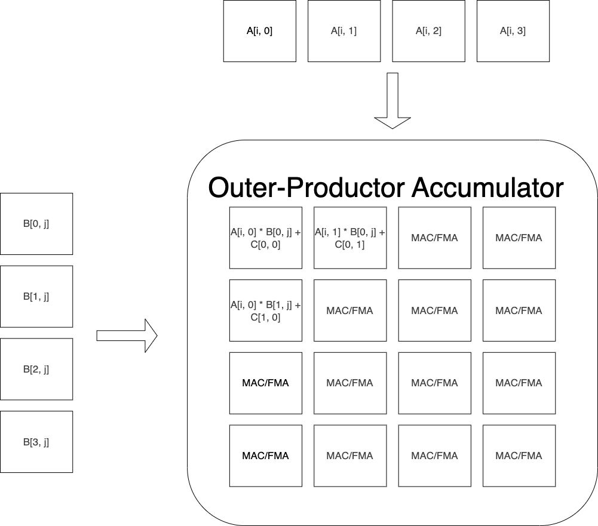

---
title: "ELENOR AI Compute Accelerator"
author: [Yongxi Yang]
date: "2026-06-03"
subject: "Markdown"
keywords: [Markdown, AI, Chips]
listings-disable-line-numbers: true
fontfamily: xeCJK
...

# ELENOR AI Compute Accelerator 架构设计文档

版本: v0.1-review

状态: 架构评审稿

适用范围: 架构评审、RTL 拆解、编译器/runtime 任务拆解、driver/firmware ABI 讨论、性能建模和验证规划

## 0. 文档目的

本文给出 ELENOR 架构的正式设计说明。ELENOR 是一个面向未来 5 到 10 年 AI 推理和轻训练场景的统一 AI compute accelerator 架构，可以实现为独立加速芯片、SoC 内 NPU 子系统，或 chiplet 形式接入更大的计算系统。

本文面向架构、RTL、编译器、runtime、driver、firmware、profiling 和验证团队，目标是让评审者能够清楚理解：

- ELENOR 要解决的 workload 范围和不解决的系统边界。
- Chip、Tile Group、Compute Tile、Engine 四层职责边界。
- BOA、Enhanced Vector、MFE、USE 四类执行能力的分工。
- Device Runtime、Tile Group Sequencer、Tile UCE、Stream Queue 的控制流模型。
- HBM/DDR/LPDDR -> L2 -> L1 -> engine 的数据流模型。
- Command buffer、descriptor、program、event 和 runtime ABI 的基本形态。
- 编译器 lowering、runtime package、Tile Program template 和 descriptor auto-patch 的配合方式。
- Paged Attention、MoE、SSM、Embedding/GNN、多模型并发等关键 workload 的映射。
- 性能模型、PMU counter、验证计划、实施路线和关键风险。

本文不是最终 RTL specification，也不是 compiler dialect 的完整语法定义。它是架构层面的正式评审稿，用于锁定方向、边界、关键接口和后续任务拆解。

## 1. Executive Summary

ELENOR 的核心判断是：未来 AI workload 不再只是 dense GEMM 问题。Dense Transformer、Paged Attention、MoE、SSM、dynamic shape、多模型并发和长上下文推理，会同时带来 dense compute、irregular compute、dynamic memory streaming、stateful compute 和 runtime control 的压力。

ELENOR 因此不选择纯 TPU、纯 GPU SIMT 或纯 descriptor-list NPU 的单一路线，而采用如下组合：

```text
structured dense accelerator
+ predicated programmable vector
+ memory flow engine
+ state/control engine
+ descriptor-driven runtime
+ TileGroupTask / Tile Program execution model
```

架构的基本原则是：

```text
Compute != Control != Data Movement
```

在这个原则下，ELENOR 把执行能力拆成四类核心引擎：

| 子系统                | 主要职责          | 典型 workload                                                      |
| --------------------- | ----------------- | ------------------------------------------------------------------ |
| BOA                   | Dense Compute     | GEMM、Conv、QK、AV、Expert MLP                                     |
| Enhanced Vector / EVU | Irregular Compute | Softmax、Norm、RoPE、Activation、Gather/Scatter、tail 处理         |
| MFE                   | Memory Flow       | Page Stream、Segment Stream、Sparse Block Stream、layout transform |
| USE                   | State / Control   | Scan、Recurrence、Dynamic Shape assist、Token Routing、Event       |

ELENOR 的硬件消费 command buffer、descriptor、TileGroupTask 和 Tile Program，不直接消费高层 graph。高层动态图由 compiler/runtime 降到可执行 command sequence、descriptor table 和 executable package。

一句话总结 ELENOR 的执行模型：

```text
Graph Schedule 描述 group task 依赖；
TileGroupTask 推进 device pipeline（Tile Group Sequencer 准备 Tile-SPMD role dispatch）；
Tile Program 推进 tile-local kernel pipeline；
Stream Queue 连接 role；
Group DMA 搬 HBM/DDR/LPDDR 到 L2；
Tile DMA 搬 L2 到 L1；
BOA/Vector/MFE/USE 分别承担 dense、irregular、memory-flow 和 state/control。
```

## 2. 设计定位和系统边界

### 2.1 ELENOR 负责的范围

ELENOR 负责以下类型的计算、数据流和运行时执行：

- dense compute: GEMM、Conv、dense attention、expert MLP。
- irregular compute: softmax、norm、activation、gather/scatter、layout transform。
- dynamic memory streaming: paged attention、KV cache、embedding、ragged tensor、MoE dispatch。
- stateful compute: SSM、scan、recurrence、streaming state update。
- runtime command execution: command buffer、event、barrier、dynamic shape dispatch。
- profiling: performance counter、stall attribution、bandwidth and utilization monitor。

### 2.2 ELENOR 不负责的范围

ELENOR V1 不承担以下职责：

- RTOS、任务调度系统、Linux kernel 主控制逻辑。
- motor control、sensor fusion front-end、ISP、CAN、Ethernet、automotive IO。
- 完整 PyTorch eager graph 解释执行。
- 全功能 GPU SIMT 编程模型。
- 通用 CPU 式复杂控制流和操作系统级任务管理。

### 2.3 关键架构边界

核心边界是：

```text
ELENOR 硬件执行 command buffer、descriptor、TileGroupTask 和 Tile Program；
ELENOR 硬件不直接解释高层 graph，也不理解任意 tensor algebra。
```

这条边界用于控制硬件复杂度：

- BOA 不处理 fine-grained gather/scatter。
- Vector 不承担大规模矩阵乘主路径。
- MFE 不做任意图遍历，而把动态/分页/分段数据流规整成 stream。
- USE 不演化成通用 CPU，而聚焦 loop、state、scan、recurrence 和 event fast path。
- Device Runtime 不逐 tile 调度细节，而提交 Group Task。

## 3. V1 设计目标

ELENOR V1 需要覆盖以下 workload：

- Dense Transformer。
- MoE。
- Paged Attention。
- Dynamic Shape。
- SSM，例如 Mamba / RWKV。
- 多模型并发。
- 边缘与数据中心复用。

### 3.1 统一目标

ELENOR 希望提供一套统一但分层清晰的执行架构，使同一架构能够在 Edge、Balanced 和 High End 配置中复用。

推荐基础规模：

| 配置     | Tile 数量 | Tile Group 数量 | Memory           | 目标场景                                        |
| -------- | --------: | --------------: | ---------------- | ----------------------------------------------- |
| Edge     |   8 到 16 |          1 到 2 | LPDDR            | 小模型推理、车端、移动端、小 batch              |
| Balanced |        64 |               8 | HBM 或高带宽 DDR | LLM inference、Paged Attention、MoE、多模型并发 |
| High End |       128 |              16 | HBM              | 数据中心长上下文推理、大 MoE、多模态、轻训练    |

### 3.2 V1 最小能力集合

V1 不追求一次实现所有扩展能力，建议固化以下最小能力：

- BOA: INT8/BF16 GEMM、attention QK/AV、expert MLP 主路径。
- EVU: elementwise、activation、softmax、norm、mask/tail、gather/scatter。
- MFE: Page Stream、Segment Stream。
- USE: prefix scan、simple recurrence、state checkpoint/restore、event assist。
- DMA: 1D、2D、strided copy、async completion event。
- Runtime: command queue、event、barrier、dynamic shape branch。
- PMU: engine active/stall、DMA bandwidth、SRAM bank conflict、NoC congestion、queue occupancy。

V1 可以预留 Sparse Block Stream 和 Persistent Memory Stream 的 descriptor flags，但不应提前实现完整复杂模式。

### 3.3 V1 范围分层和实现 cutline

为避免把“架构目标”和“首版实现范围”混在一起，ELENOR V1 需要明确分成三层：

```text
Architecture V1
  定义完整的软件/硬件抽象边界、执行模型、program/package/descriptor ABI、
  BOA/EVU/MFE/USE 的长期职责划分，以及 compiler/runtime/profiling 的系统接口。

First Silicon V1
  必须在首版 RTL / FPGA / silicon bring-up 中闭环的最小功能集合。
  目标是打通 command -> DMA -> engine -> event -> PMU 的端到端路径。

V1.x / V2 Reserved
  ABI、descriptor field、compiler dialect 和文档接口可以预留；RTL 可以分阶段实现。
  这些预留不能影响 First Silicon V1 的验证收敛。
```

推荐 First Silicon V1 cutline：

| 类别     | First Silicon V1 必须实现                                                            | V1.x / V2 可预留或后续实现                                                |
| -------- | ------------------------------------------------------------------------------------ | ------------------------------------------------------------------------- |
| BOA      | INT8/BF16 GEMM、attention QK/AV、基础 split-K reduce                                 | 更多 dataflow search、复杂 epilogue fusion、稀疏 matmul                   |
| EVU      | elementwise、mask/tail、softmax/norm、基础 gather                                    | full scatter、atomic update、复杂 permutation、跨 tile irregular access   |
| DMA      | 1D/2D/strided copy、async completion event                                           | multicast、gather list、复杂 layout transform                             |
| MFE      | Page Stream minimal：page walk、KV prefetch、reorder、stream fill                    | Segment Stream full reduce/update、Sparse Block Stream、Persistent Stream |
| USE      | state/register file、prefix scan、simple recurrence、checkpoint/restore 的接口和模型 | 高级 recurrence transform、复杂 token routing、rollback policy 扩展       |
| Runtime  | command queue、event、barrier、doorbell、basic fault record                          | priority scheduling、preemption、多模型 QoS                               |
| PMU      | engine active/stall、DMA bandwidth、SRAM conflict、queue/event wait                  | 完整 stall taxonomy、采样 trace、PMU feedback scheduler                   |
| Compiler | kernel library selection、descriptor template、command buffer emitter                | 自动 engine partition、自动 tiling/fusion、动态 shape 搜索                |

本文后续章节描述的是 Architecture V1 的目标形态；§27 单独给出实现阶段和 phase exit criteria。

### 3.4 V1 Requirements & Acceptance Matrix

| V1 需求            | 架构机制                                                       | 关键 ABI / Contract                               | PMU 证据                                                      | 验证入口                      | 首次闭环阶段 |
| ------------------ | -------------------------------------------------------------- | ------------------------------------------------- | ------------------------------------------------------------- | ----------------------------- | ------------ |
| Dense GEMM / Conv  | BOA + Tile DMA + L1 double buffer                              | BOA descriptor、DMA descriptor、event             | BOA active、operand stall、SRAM conflict                      | Python golden + RTL GEMM      | Phase 1      |
| Dense Attention    | BOA QK/AV + EVU softmax + collective reduce                    | BOA desc、EVU desc、event chain、collective desc  | BOA utilization、EVU active、collective stall                 | attention command trace       | Phase 2      |
| Paged Attention    | MFE Page Stream + BOA + EVU                                    | page stream desc、stream token、event chain       | MFE prefetch hit/miss、BOA operand stall、stream backpressure | paged attention trace         | Phase 3      |
| MoE Dispatch       | MFE Segment Stream + EVU + optional USE                        | segment desc、expert grouping、collective combine | routing imbalance、MFE stall、BOA utilization                 | 8/16-expert routing benchmark | Phase 4      |
| SSM / Mamba / RWKV | USE scan/recurrence + BOA projection + EVU local op            | USE state desc、checkpoint ABI、state slot        | USE active、state cache hit/miss、event wait                  | recurrence golden benchmark   | Phase 5      |
| 多模型并发         | group partition + command priority + SRAM quota + PMU feedback | context id、queue priority、fault/reset domain    | queue occupancy、QoS latency、fault isolation                 | multi-context runtime test    | Phase 6      |

### 3.5 本轮评审需要冻结的问题

本轮架构评审建议优先冻结以下 contract：

1. **硬件边界**：ELENOR 执行 command / descriptor / program，不解释高层 graph。
2. **Tile 控制面**：Tile UCE 和 USE 在同一个 tile-local RISC-V / micro-controller 上实现，但功能上分为控制组件和状态组件。
3. **Stream Queue**：token、credit、backpressure、EOS、error propagation 和 reset/drain 语义。
4. **Tile Slot Frame**：slot role、permission、lifetime、alignment、bank placement 和 descriptor patch 责任边界。
5. **Command/Event ABI v0**：当前结构体是样例级接口；需要保留 ABI versioning、context、queue、fault 和 timeout 扩展位。
6. **SRAM/NoC 定量闭环**：每个配置必须给出容量、带宽、端口和 area/power 假设。
7. **Bring-up 顺序**：先打通 command/event/DMA/PMU，再逐步扩 BOA、EVU、MFE、USE 和多模型调度。

## 4. 芯片级架构

### 4.1 Chip Overview

ELENOR Device 的芯片级结构如下：

```text
Host / System SoC
        |
        v
+--------------------------------------------------------------------+
| ELENOR Device                                                      |
|                                                                    |
| +------------------+   +-------------------+   +---------------+   |
| | Host Interface   |   | Runtime Processor |   | Global PMU    |   |
| | PCIe/CXL/AXI     |   | RISC-V / uCtrl    |   | Trace/Error   |   |
| +--------+---------+   +---------+---------+   +-------+-------+   |
|          |                       |                     |           |
|          v                       v                     v           |
| +----------------------------------------------------------------+ |
| | Global Scheduler / Command Queue / Event Fabric                | |
| +----------------------------------------------------------------+ |
|          |                       |                     |           |
|          v                       v                     v           |
| +------------------+   +-------------------+   +---------------+   |
| | Global DMA       |   | Memory Controller |   | Collective    |   |
| | 2D/strided/copy  |   | HBM/DDR/LPDDR     |   | reduce/bcast  |   |
| +--------+---------+   +---------+---------+   +-------+-------+   |
|          |                       |                     |           |
|          +-----------------------+---------------------+           |
|                                  |                                 |
|                                  v                                 |
|                              NoC / Router                         |
|                                  |                                 |
|                                  v                                 |
|                        Tile Group x N                             |
+--------------------------------------------------------------------+
```

### 4.2 芯片级模块职责

| 模块              | 职责                                                                                                          |
| ----------------- | ------------------------------------------------------------------------------------------------------------- |
| Host Interface    | 连接 PCIe/CXL/AXI 等 host/system interconnect，提交 command buffer 和管理 doorbell。                          |
| Runtime Processor | RISC-V 或 micro-controller，负责 command queue consume、shape branch、fault handling、profiling aggregation。 |
| Global Scheduler  | 解析 graph schedule，调度 Group Task，管理全局 event 和资源。                                                 |
| Global DMA        | 支持 host/HBM/DDR/LPDDR 与 device 内部 memory hierarchy 的大粒度搬运。                                        |
| Memory Controller | 管理 HBM/DDR/LPDDR 访问。                                                                                     |
| Collective        | 支持跨 group 或全局 reduce/broadcast 等操作。                                                                 |
| Global PMU        | 采集全局性能、trace 和错误信息。                                                                              |
| NoC / Router      | 承载 command/control、data stream、collective 三类流量。                                                      |

## 5. Tile Group 架构

### 5.1 Tile Group 定位

Tile Group 是 ELENOR 的局部数据复用和局部同步单元。它避免所有 tile 都直接冲击全局内存和全局 NoC。



```text
Tile Group
├── Tile Group Sequencer
├── Stream Queue Engine
├── Barrier / Event Engine
├── Shared SRAM
├── Group DMA
├── Collective Engine
├── Multicast / Broadcast Unit
├── Group PMU
└── Compute Tile x 8
```

Tile Group 解决以下问题：

- Group 内数据复用。
- Group 内 role / tile task 管理。
- HBM/DDR/LPDDR -> L2 预取。
- Role 间 producer-consumer stream。
- Group 内 barrier/event。
- Group 内 reduce/broadcast/all-reduce。
- Program cache、stream buffer、prefetch buffer、partial result buffer。

推荐 Group SRAM 容量：

| 配置     | Group SRAM 建议容量 |
| -------- | ------------------: |
| Edge     |           2 到 8 MB |
| Balanced |         16 到 64 MB |
| High End |        64 到 128 MB |

### 5.2 Tile Group 模块职责

| 模块                       | 层级       | 核心职责                                                                             | 不负责                               |
| -------------------------- | ---------- | ------------------------------------------------------------------------------------ | ------------------------------------ |
| Tile Group Sequencer       | Tile Group | Group Task action index 推进、Group DMA、role dispatch、group 级同步                 | BOA 执行、Vector 执行、Tile 内部调度 |
| Stream Queue Engine        | Tile Group | Producer-Consumer 队列、Backpressure、Credit 管理、EOS 传播                          | 数据计算                             |
| Barrier / Event Engine     | Tile Group | Tile 同步、role 同步、DMA 完成通知、事件传播                                         | 数据搬运                             |
| Group DMA Engine           | Tile Group | HBM 到 L2 数据搬运、Weight Prefetch、Activation Prefetch、Pipeline Prefetch          | L2 到 L1 搬运                        |
| Shared SRAM / L2           | Tile Group | Group 共享缓存、Stream Buffer、Prefetch Buffer、Partial Result Buffer、Program Cache | Cache coherency                      |
| Collective Engine          | Tile Group | Reduce、Broadcast、AllReduce、ReduceScatter、Group 同步归约                          | Tile 内部计算                        |
| Multicast / Broadcast Unit | Tile Group | 权重广播、Activation 广播、多 consumer fanout                                        | 数据计算                             |
| Group PMU                  | Tile Group | DMA 利用率、Pipeline stall、Buffer occupancy、Group 级性能统计                       | 调度决策                             |
| Tile Dispatcher            | Tile Group | Tile Program 派发、Tile 资源绑定                                                     | Graph 调度                           |

## 6. Compute Tile 架构

### 6.1 Compute Tile 定位



Compute Tile 是 kernel 执行域，负责 Tile Program 内的 L2 到 L1 搬运、BOA/Vector/MFE/USE 协同和 Local SRAM 管理。

```text
Compute Tile
├── Tile Command Queue
├── Local Event / Barrier Unit
├── Unified State Engine
├── MFE
├── BOA Cluster
├── Enhanced Vector Unit
├── Local SRAM
├── Tile DMA Port
├── Router Port
└── PMU / Trace
```

推荐基础配置：

- Local SRAM: 2 MB / Tile。
- Vector: 32 lanes，predicated execution。
- BOA: 4 个 OPA，单 OPA 为 16x16 或 32x16 outer-product tile。
- Data type: INT8、INT4 optional、BF16、FP16、INT32 accumulation、optional FP32 accumulation。
- Local SRAM bank: 至少 16 banks，High End 可提升到 32 banks。

### 6.2 Compute Tile 模块职责

| 模块                | 层级         | 核心职责                                                                                                   | 不负责                                                |
| ------------------- | ------------ | ---------------------------------------------------------------------------------------------------------- | ----------------------------------------------------- |
| Compute Tile        | Tile         | Kernel 执行域，承载 L1 SRAM、Tile DMA、BOA、EVU、MFE、USE/UCE 控制面                                       | Graph 调度、跨 group 全局调度                         |
| Tile UCE            | Tile control | Tile Program PC、launch/wait/branch、stream token、descriptor patch、DMA/BOA/EVU/MFE/USE 编排、buffer 切换 | 高层 graph 解释、HBM 全局 memory policy               |
| USE                 | Tile state   | prefix scan、simple recurrence、state update、checkpoint/restore、tile-local event assist                  | Tile Program 主控制流、page table walk、通用 CPU 任务 |
| Tile DMA Engine     | Tile         | L2 到 L1 数据搬运、Tile 级 prefetch、storeback                                                             | HBM 访问调度                                          |
| L1 SRAM             | Tile         | Tile working set、input tile、output tile、accumulator、scratch buffer、program/descriptor/status region   | Group 共享、cache coherency                           |
| MFE Tile Port       | Tile         | 接收 MFE 生成的 page/segment stream，写入 L1 stream/metadata slot                                          | 任意图遍历、通用 memory processor                     |
| BOA                 | Tile         | MatMul、Conv、Dense Compute、Attention QK/AV、Expert MLP 主路径                                            | Elementwise 计算、fine-grained gather/scatter         |
| EVU / Vector Engine | Tile         | Elementwise、Reduce、Softmax、LayerNorm、RMSNorm、Gather、Scatter、tail/mask 处理                          | 大规模矩阵乘主路径                                    |
| BOA Sequencer       | Tile compute | BOA 内部 loop 控制、K-tiling、Accumulator 管理                                                             | Tile 调度                                             |
| Vector Sequencer    | Tile compute | Vector loop、mask、reduction、elementwise 控制                                                             | Tile 调度                                             |

### 6.3 Tile UCE 与 USE 的实现关系

架构上，Tile UCE 和 USE 是两个**功能组件**；实现上，推荐把它们放在同一个 tile-local RISC-V / micro-controller 或等价 micro-sequencer 上：

```text
Tile-local RISC-V / micro-controller
├── UCE front-end
│   ├── Tile Program fetch/decode
│   ├── launch.boa / launch.evu / launch.mfe / launch.use
│   ├── wait / fence / branch
│   ├── stream pop / push / EOS
│   └── descriptor template patch
└── USE back-end
    ├── state register file
    ├── state cache
    ├── prefix scan / prefix max
    ├── affine recurrence / gated update
    ├── checkpoint / restore
    └── local event assist
```

这个划分的目的不是增加两个独立控制器，而是在同一个可实现控制核心中保持职责清晰：

- **UCE 负责程序控制和 engine 编排**。
- **USE 负责状态计算和状态生命周期**。
- **MFE 负责大多数数据相关的动态内存访问**，例如 page walk、address generation、prefetch、reorder 和 stream fill。
- 对 program 本身的 memory access pattern，Tile UCE 负责控制和调度，MFE 负责把数据流规整成 BOA/EVU/USE 可消费的 stream。

## 7. 分层职责和控制流

ELENOR 的关键是把 workload 拆到不同层级，避免任一硬件模块承担过多职责。

| 层级         | 解决的问题                                                              | 不应该做的事                         |
| ------------ | ----------------------------------------------------------------------- | ------------------------------------ |
| OPA          | 局部 outer-product / contraction primitive                              | window、broadcast、全局 mapping      |
| BOA          | 多 OPA 编排、K tiling、partial sum、reduce tree                         | fine-grained gather/scatter          |
| EVU          | predicated vector、tail/mask、softmax/norm、irregular elementwise       | 大规模 dense matmul 主路径           |
| MFE          | page/segment walk、prefetch、reorder、coalesce、stream fill             | 任意图遍历、程序控制流               |
| USE          | state register/cache、scan、recurrence、checkpoint/restore              | Tile Program 主控制流、通用 CPU 任务 |
| Tile UCE     | Tile Program、engine launch、event wait、stream token、descriptor patch | 高层 graph 解释、全局调度            |
| Tile Group   | group 内同步、broadcast、collective、shared SRAM、Tile Group Sequencer  | 全芯片 memory policy                 |
| Chip Runtime | command buffer、event、shape dispatch、multi-model scheduling           | 高层 graph 解释                      |

### 7.1 控制流层次

```text
Graph Schedule PC / Group Task Iterator
        |
        v
Tile Group Sequencer action index
        |
        v
Tile PC / Tile UCE
        |
        v
BOA / EVU / MFE / USE tasks
        |
        v
BOA / EVU micro-sequencer and datapath
```

| 控制层        | 控制器               | 管理对象                                                    |
| ------------- | -------------------- | ----------------------------------------------------------- |
| Graph Level   | Device Runtime       | Graph schedule、group task dependency、context、queue       |
| Group Level   | Tile Group Sequencer | Group Task、Group DMA、role dispatch、group barrier         |
| Kernel Level  | Tile UCE             | Tile Program、stream token、descriptor patch、engine launch |
| State Level   | USE                  | state update、scan、recurrence、checkpoint/restore          |
| Compute Level | BOA / EVU Sequencer  | Micro loop、operand fetch、local reduce、vector mask        |

### 7.2 数据流层次

| 数据路径                        | 控制模块                           |
| ------------------------------- | ---------------------------------- |
| HBM 到 L2                       | Group DMA Engine / MFE global path |
| L2 到 L1                        | Tile DMA Engine / Tile UCE         |
| Page/segment metadata 到 stream | MFE                                |
| L1 到 BOA                       | Tile UCE + BOA Sequencer           |
| L1 到 EVU                       | Tile UCE + EVU Sequencer           |
| L1 到 USE state                 | Tile UCE + USE                     |
| Role 到 Role                    | Stream Queue Engine                |
| Tile 到 Tile                    | Collective Engine / Broadcast Unit |

### 7.3 Pipeline 层次

| Pipeline 层      | 推进者               | 粒度                           |
| ---------------- | -------------------- | ------------------------------ |
| Device Pipeline  | Tile Group Sequencer | Group Task / Role              |
| Kernel Pipeline  | Tile UCE             | DMA -> BOA/EVU/MFE/USE -> DMA  |
| State Pipeline   | USE                  | scan / recurrence / checkpoint |
| Compute Pipeline | BOA / EVU Sequencer  | Micro-op / Loop                |

## 8. BOA: Block Outer-product Accelerator



### 8.1 定位

BOA 负责规则、密集、block 化的矩阵型计算，是 ELENOR dense compute 主路径。

BOA 适合：

- GEMM。
- Conv lowering 后的 GEMM / implicit GEMM。
- Dense attention QK^T。
- Attention AV。
- MoE expert MLP。
- Dense reduction。
- Block-level matmul-like compute。

BOA 不适合：

- fine-grained gather。
- scatter。
- dynamic sparse graph traversal。
- per-element branch。
- 小粒度不规则 kernel。

这些任务应交给 Enhanced Vector、MFE 或 USE。

### 8.2 BOA Pipeline

```text
Descriptor Fetch
    |
Tile Decode
    |
Operand Fetch / Double Buffer
    |
OPA Array Compute
    |
Local Accumulate
    |
Reduce Network
    |
Post-Op / Output Convert
    |
Writeback
```

BOA 通过 descriptor 启动，不暴露复杂可编程 ISA。Tile UCE 通过 `launch.boa desc` 触发 BOA 执行。

关键设计点：

1. BOA 由 descriptor 驱动，descriptor 描述 shape、dtype、layout、tile size、dataflow、reduce 和 post-op。
2. BOA 内部关注局部 contraction 和局部 reduce，不处理全局 tensor mapping。
3. BOA 需要与 L1 SRAM banking 和 operand buffer layout 协同，降低 operand fetch 冲突。
4. BOA 应支持 double buffering，使 operand fetch 与 OPA compute 重叠。
5. Attention、MoE 和 large GEMM 场景需要跨 tile partial sum merge，因此 BOA reduce tree 要和 tile/group collective 层级配合。

### 8.3 OPA Primitive



OPA 是 BOA 的 compute primitive。

```text
A fragment + B fragment
        |
        v
outer producter
        |
        v
pipeline reg
        |
        v
accumulate / reduce
        |
        v
pipeline reg
```

OPA 支持模式：

| 模式       | 含义          | 用途                               |
| ---------- | ------------- | ---------------------------------- |
| MUL        | A x B         | MatMul、Conv、Attention            |
| PASS       | A passthrough | ReduceSum、ReduceMax、pooling 输入 |
| REDUCE_ADD | 局部加法规约  | sum、average 前半段                |
| REDUCE_MAX | 局部 max 规约 | maxpool、softmax max               |
| REDUCE_MIN | 局部 min 规约 | normalization/statistics           |

OPA 不处理 window、broadcast、index mapping。OPA 只处理 K 内局部 contraction 和局部 reduce。

### 8.4 OPA RTL 形态示意

```systemverilog
typedef enum logic [2:0] {
  OPA_MUL,
  OPA_PASS,
  OPA_REDUCE_ADD,
  OPA_REDUCE_MAX,
  OPA_REDUCE_MIN
} opa_mode_e;

always_ff @(posedge clk) begin
  if (rst) begin
    acc_q <= '0;
  end else if (valid_i) begin
    unique case (mode_i)
      OPA_MUL:        acc_q <= acc_q + a_i * b_i;
      OPA_PASS:       acc_q <= a_i;
      OPA_REDUCE_ADD: acc_q <= acc_q + a_i;
      OPA_REDUCE_MAX: acc_q <= (a_i > acc_q) ? a_i : acc_q;
      OPA_REDUCE_MIN: acc_q <= (a_i < acc_q) ? a_i : acc_q;
      default:        acc_q <= acc_q;
    endcase
  end
end
```

该示意不是最终 RTL，仅说明 pipeline 和 mode 边界。

### 8.5 BOA Reduction Hierarchy

```text
Level 0: OPA 内部 accumulate
Level 1: BOA 内 reduce tree
Level 2: Tile / Group collective reduce
Level 3: Memory merge, optional
```

该层级对 attention、MoE 和大 GEMM 非常关键。原则是：

```text
能早规约就早规约，但不能让 OPA 承担全局 mapping。
```

### 8.6 BOA Descriptor

BOA descriptor 在本文中仍是架构级示例，不是最终二进制 ABI。正式 ABI 需要在 §18 的 command/descriptor ABI v0 中冻结 version、size、alignment、endianness、validation 和扩展字段。

基础 BOA descriptor：

```c
typedef struct {
    uint64_t a_addr;
    uint64_t b_addr;
    uint64_t c_addr;

    uint32_t M, N, K;
    uint32_t lda, ldb, ldc;

    uint32_t tile_m;
    uint32_t tile_n;
    uint32_t tile_k;

    uint32_t dtype_a;
    uint32_t dtype_b;
    uint32_t dtype_acc;
    uint32_t reduce_op;
    uint32_t post_op;
    uint32_t flags;
} elenor_boa_desc_t;
```

在 Tile-SPMD 设计中，更推荐 slot-based descriptor，使 tile program 不绑定绝对物理地址：

```c
typedef struct {
    uint16_t op_kind;
    uint16_t flags;

    uint32_t m;
    uint32_t n;
    uint32_t k;
    uint32_t batch;

    uint16_t tile_m;
    uint16_t tile_n;
    uint16_t tile_k;
    uint16_t split_k;

    uint16_t dtype_a;
    uint16_t dtype_b;
    uint16_t dtype_acc;
    uint16_t dtype_out;

    uint16_t a_slot;
    uint16_t b_slot;
    uint16_t c_slot;
    uint16_t bias_slot;

    uint16_t a_layout;
    uint16_t b_layout;
    uint16_t c_layout;
    uint16_t dataflow;

    uint16_t transpose_flags;
    uint16_t rounding_mode;
    uint16_t saturation_mode;
    uint16_t epilogue_kind;

    uint16_t quant_param_slot;
    uint16_t epilogue_param_slot;
    uint32_t reserved;
} boa_desc_v0_t;
```

关键字段需要支持：

- activation dtype、weight dtype、accumulator dtype、output dtype。
- INT8/INT4 quantization scale、zero point、per-tensor / per-channel quantization。
- split-K、batch stride、layout id、transpose flag。
- saturation、rounding、requantization。
- epilogue fusion: bias、relu、gelu、residual add、requant。

V1 可以只实现字段子集，但 descriptor layout 应预留扩展空间，避免后续 ABI 破坏。

### 8.7 算子映射

| 算子               | BOA 路径                    | 其他引擎                      |
| ------------------ | --------------------------- | ----------------------------- |
| MatMul             | OPA(MUL) + ADD reduce       | Post-Op optional              |
| Conv               | im2col/implicit tile + OPA  | MFE layout stream optional    |
| Dot                | OPA + lane mask             | Vector tail mask              |
| ReduceSum          | OPA(PASS) + ADD             | Vector for small tail         |
| ReduceMax          | OPA(PASS) + MAX             | Vector for tail               |
| AvgPool            | WindowGen/MFE + ADD + scale | Vector/Post-Op scale          |
| MaxPool            | WindowGen/MFE + MAX         | None                          |
| Dense Attention QK | OPA(MUL)                    | Vector softmax                |
| Attention AV       | OPA(MUL)                    | MFE page stream               |
| MoE Expert         | OPA(MUL)                    | MFE dispatch + Vector combine |

### 8.8 Feather+ / MINISA 思想的吸收边界

Feather+ / MINISA 的核心思想可以借鉴为：

```text
不要控制每个物理 PE，而是定义虚拟计算单元和 layout/dataflow mapping。
```

在 ELENOR 中，该思想建议落到 BOA 内部，而不是扩展为全芯片编程模型：

```text
Feather+ VN      -> VBB / Virtual BOA Block
Feather+ layout  -> BOA/MFE layout descriptor
Feather+ mapping -> BOA dataflow / reduce / K-tiling descriptor
```

结论：

```text
Feather+ inside BOA, not whole chip.
```

Whole chip 采用 TileGroupTask / Tile Program IR + Tile UCE ISA + USE state task + descriptor task；BOA 内部采用 Feather+-like VBB mapping / layout / dataflow abstraction。

## 9. Enhanced Vector Unit / EVU

### 9.1 定位

Enhanced Vector Unit 是 BOA 的补充，不是小 GPU。它用于不值得映射到 BOA、或天然带 mask、index、branch、tail 的 kernel。

EVU 负责：

- elementwise。
- activation。
- normalization。
- softmax。
- RoPE。
- layout transform。
- gather/scatter。
- boundary handling。
- dynamic shape tail processing。
- 小规模 reduce / prefix。

推荐模型：

```text
RVV/SVE-like predicated vector
+ indexed LSU
+ strided LSU
+ permute / shuffle
+ mask engine
+ small micro-thread assist, optional
```

不建议做完整 GPU SIMT：

- 不做 warp scheduler。
- 不做 full per-thread PC。
- 不做 reconvergence stack。
- 不保留大量 thread context。

### 9.2 EVU Pipeline

```text
Vector Decode
    |
VL / Mask Setup
    |
Address Generation
    |
Vector LSU
    |
Vector ALU / Compare / Reduce
    |
Shuffle / Permute
    |
Writeback
```

### 9.3 功能单元优先级

| 单元                | 优先级 | 说明                                            |
| ------------------- | -----: | ----------------------------------------------- |
| Vector LSU          |   最高 | unit-stride、strided、indexed、gather/scatter   |
| Predicate / Mask    |   最高 | dynamic shape tail、boundary、sparse valid lane |
| Shuffle / Permute   |     高 | softmax、layout transform、RoPE                 |
| Vector ALU          |     中 | add、mul、max、exp approximation、compare       |
| Reduction Unit      |     中 | sum、max、prefix、small reduce                  |
| Micro-thread Assist |   可选 | 边界复杂 kernel，不做 GPU 化                    |

### 9.4 EVU V1 能力边界

EVU 可以面向最终设计保留较完整的 irregular compute 能力；实现阶段需要按复杂度分层，以便验证和 PMU 归因收敛。

| 优先级 | 能力                                                                         | 说明                                               |
| ------ | ---------------------------------------------------------------------------- | -------------------------------------------------- |
| P0     | unit-stride load/store、strided load/store、masked load/store、tail handling | 必须支持 dynamic shape tail、softmax/norm 基础路径 |
| P1     | indexed gather、bank conflict replay、shuffle/permute                        | 支持 paged attention、embedding、layout transform  |
| P2     | scatter、duplicate index handling、limited atomic update                     | 支持 MoE combine、GNN/recommender 扩展             |
| P3     | cross-tile irregular access、complex micro-thread assist                     | 作为后续优化能力，不应阻塞 First Silicon V1        |

设计目标可以覆盖大工程能力，但实现计划必须明确每一层的验证入口、PMU counter 和 fallback 路径。

### 9.5 指令形态示意

```asm
vsetvl      vl, n, e32
vle32.v     v0, (src)
vse32.v     v0, (dst)
vluxei32.v  v1, (base), vidx
vsuxei32.v  v1, (base), vidx
vadd.vv     v2, v0, v1
vmax.vv     v3, v2, vzero
vmerge.vvm  v4, v_true, v_false, mask
```

### 9.6 Vector Kernel Descriptor

```c
typedef struct {
    uint64_t code_addr;
    uint64_t arg_addr;
    uint32_t vector_len;
    uint32_t elem_bits;
    uint32_t mask_policy;
    uint32_t scratch_bytes;
    uint32_t flags;
} elenor_vector_kernel_desc_t;
```

Slot-based EVU descriptor 示例：

```c
typedef struct {
    uint32_t op_kind;
    uint16_t src_slot;
    uint16_t dst_slot;
    uint32_t elements;
    uint32_t dtype;
    uint32_t activation_kind;
} evu_desc_t;
```

## 10. MFE: Memory Flow Engine

### 10.1 定位

未来 AI workload 越来越 memory-dominated。Paged attention、long context、MoE dispatch、embedding lookup、GNN aggregation、sparse block attention 都不是单纯增加 TOPS 可以解决的问题。

MFE 的职责是把动态、不规则、分段、分页的数据流规整成 BOA、Vector、USE 可以消费的 stream。

```text
Metadata
   |
   v
Address / Page / Segment Walk
   |
   v
Prefetch / Reorder / Coalesce
   |
   v
Stream Buffer
   |
   v
BOA / Vector / USE / SRAM
```

MFE 不是通用 memory processor。V1 应控制复杂度，优先覆盖 Page Stream 和 Segment Stream。

### 10.2 MFE State Machine

```text
IDLE
  |
  v
DESC_FETCH
  |
  v
METADATA_WALK
  |
  v
PREFETCH
  |
  v
STREAM
  |
  v
COMMIT
  |
  v
IDLE
```

### 10.3 内部模块

| 模块                  | 说明                                           |
| --------------------- | ---------------------------------------------- |
| Metadata Decoder      | 解析 page table、offsets、sparse metadata      |
| Page / Segment Walker | 产生物理地址和 stream 边界                     |
| Address Generator     | 支持 base + stride + index + segment           |
| Prefetch Queue        | 提前拉取 KV page、expert weight、embedding row |
| Stream Buffer         | 双缓冲，供 BOA/Vector 消费                     |
| Reorder Buffer        | 合并乱序返回，恢复 logical order               |
| Commit Unit           | 更新 event、状态和错误码                       |

#### Queue 架构、Load/Store 路径和 Window/Layout 规则

MFE 的 queue 架构应保持 **external command ingress** 与 **internal data/event pipeline** 分层，而不是为每个功能复制独立 queue：

- Tile UCE 到 MFE 至少区分 load/store 两类 command ingress（可实现为 `LD_CMD_Q` / `ST_CMD_Q` 或等价 launch class）；精确深度、仲裁和是否共享物理 storage 由后续规格冻结。
- MFE 内部保留 `RD_REQ`、`RD_RESP`、`WR_REQ` 和 event/commit path 的最小 queue 组合；精确 entries / beats 预算由 SRAM profile、NoC profile 和 PPA exploration 冻结。
- 现有 **Prefetch Queue** 继续作为 MFE 内部预取/请求跟踪路径的一部分存在；它不是 UCE→MFE 的 external command ingress 替代物。
- **Window Generator** 是 streaming address-generation stage，直接喂给 read-request path；V1 不建议把它做成独立 command queue。
- **Layout Transform** 在 streaming case 走 `DMA -> XFORM -> SRAM` 或带小 skid buffer 的路径；只有当可见顺序真的需要时才引入 reorder buffer，不建议给 layout transform 单独建 command queue。
- V1 避免的默认结构：per-feature command queue、WindowGen queue、LayoutTransform queue、full-tile write-data staging FIFO。

推荐的数据路径形态：

```text
Load:
  UCE -> load command ingress -> Window / Addr Gen -> RD request path
      -> DMA read -> RD response path -> optional layout transform
      -> L1 stream / metadata slot

Store:
  UCE -> store command ingress -> L1 read -> optional layout transform
      -> WR request path -> DMA write -> L2 / HBM
      -> event / commit path
```

### 10.4 Mode 1: Page Stream

用于：

- Paged Attention。
- KV cache。
- Long context。

功能：

- page table walk。
- page prefetch。
- page reorder。
- double buffering。
- page residency hint。

Descriptor：

```c
typedef struct {
    uint64_t page_table_addr;
    uint64_t q_addr;
    uint64_t k_stream_addr;
    uint64_t v_stream_addr;

    uint32_t batch;
    uint32_t num_heads;
    uint32_t head_dim;
    uint32_t page_size;
    uint32_t seq_len;
    uint32_t flags;
} elenor_mfe_page_stream_desc_t;
```

### 10.5 Mode 2: Segment Stream

用于：

- embedding bag。
- recommender。
- ragged tensor。
- GNN aggregation。
- MoE token group。

Segment Stream 的长期目标可以覆盖 gather、segment reduce、scatter/update 和 expert grouping；实现阶段应显式区分 mode，避免 V1 一次承担 atomic/coherence 的完整复杂度。

```c
typedef enum {
    MFE_SEG_GATHER_ONLY = 0,
    MFE_SEG_GATHER_REDUCE_LOCAL = 1,
    MFE_SEG_SCATTER_ORDERED = 2,
    MFE_SEG_SCATTER_ATOMIC_ADD = 3,
} mfe_segment_mode_t;
```

First Silicon V1 推荐实现：

```text
Segment gather + local reduce + ordered output
```

V1.x / V2 再扩展：

```text
global scatter atomic
duplicate index update
cross-tile unordered reduce
fine-grained coherence
```

Descriptor：

```c
typedef struct {
    uint64_t table_base;
    uint64_t indices_addr;
    uint64_t offsets_addr;
    uint64_t output_addr;

    uint32_t batch;
    uint32_t feature_dim;
    uint32_t reduce_op;
    uint32_t dtype;
    uint32_t segment_mode;
    uint32_t flags;
} elenor_mfe_segment_desc_t;
```

一致性原则：

1. V1 不默认支持跨 tile unordered atomic update。
2. duplicate index 的行为必须由 descriptor mode 明确规定。
3. Segment reduce 的 partial result owner 必须是 MFE、EVU 或 Collective 中的一个，不能隐式共享。
4. 对于需要全局一致性的 scatter/update，优先通过 runtime 分桶、group-level reduce 或 V2 atomic path 解决。

### 10.6 Mode 3: Sparse Block Stream

用于：

- block sparse attention。
- MoE expert grouping。
- sparse matmul block scheduling。

V1 可以先不实现完整 sparse graph，只实现 block metadata decode、block prefetch 和 block schedule 的预留。Sparse Block Stream 建议放到 V2。

### 10.7 Mode 4: Persistent Memory Stream

用于：

- agent memory。
- recurrent memory。
- world model latent state。
- long-running session cache。

该模式建议作为后续版本能力，不作为 V1 首要目标。V1 可以预留 descriptor flags 和 state/page binding 字段。

### 10.8 MFE Load Descriptor 示例

```c
typedef struct {
    uint64_t global_src;
    uint16_t local_dst_slot;
    uint32_t bytes;

    uint32_t src_stride[4];
    uint32_t dst_layout;
    uint32_t transform;
} mfe_load_desc_t;
```

### 10.9 Store visibility、L2 barrier 和 gather sync

MFE 的 store completion 不应只暴露“store done”一个平面语义。V1 至少要区分三层 **概念性可见性阶段**；具体 event 名称、编码和 ABI 归属由后续共享规格冻结：

| 概念阶段       | 含义                                                                      |
| -------------- | ------------------------------------------------------------------------- |
| store accepted | MFE 已接受 store command，后续 buffer lifecycle 可按显式 release 规则推进 |
| L2 visible     | 数据已提交到 L2 / group-visible region，可参与后续 barrier 统计           |
| global visible | 数据已对更大系统范围可见（例如 host / system agent 需要的路径）           |

共享规则：

1. Tile / L1 不默认因为 store 尚未达到 L2/global visible 而阻塞；是否等待由 descriptor、event dependency 或上层 runtime contract 明确声明。
2. 对当前 **multi-level matmul + gather** 映射，架构同步点是 **matmul store 达到 L2 visible 之后的显式 L2 barrier**；gather 只在 barrier complete 后启动。
3. partial store、split accumulation 或多 tile producer 都只为 barrier 提供 arrival，不单独释放 gather。
4. `ready_table[region][tile][version]` 一类结构可以作为 barrier manager / MFE / tile-group 的内部 bookkeeping，但不是当前 V1 对外冻结的 gather 触发 ABI。
5. 因此，依赖 gather / region consumer 的 source of truth 是 **L2 visible + barrier complete**，而不是隐含的“store issued”/“DMA accepted”或单独 per-tile ready event。

#### Zero-copy buffer aliasing 和 view descriptor system

MFE 的 zero-copy path 不应重新发明一套独立 view schema，而应复用共享 `TensorView` 语义：descriptor 通过 slot/frame 绑定到 backing storage，再通过 view 解释 offset / extent / stride / layout。

- **zero-copy aliasing** 表示多个逻辑 view 共享同一 backing store，而不是再分配一份新的 L1/L2 buffer。
- 纯 view 变换（subview、slice、stride/extent 改写、只读 layout reinterpret）保持 zero-copy。
- 需要真实数据重排、顺序恢复或 bank/layout materialization 时，MFE 才退回到显式 reorder/bufferized path。
- V1 不放宽 Slot Frame 的 writable alias 规则：只允许只读 alias，或由显式 release/barrier 分隔的 phase-disjoint handoff；不允许同时存活的重叠 writable alias。
- 具体 view binding 字段、alias policy 编码和 release handle 由后续规格冻结。

## 11. Unified State Engine / USE

### 11.1 定位

USE 是 ELENOR 的 tile-local state engine。它与 Tile UCE 可以在同一个 RISC-V / micro-controller 上实现，但在架构职责上分开：

```text
Tile UCE = program control and engine orchestration
USE      = state compute and state lifecycle
```

USE 不是通用 CPU，也不是 memory processor。它面向模型状态、循环状态、scan、recurrence、token routing metadata 和 event assist。

主要职责：

- state register / state cache。
- prefix sum / prefix max / associative scan。
- affine recurrence / gated update。
- state checkpoint / restore。
- dynamic shape branch assist 的 tile-local 快路径。
- token routing metadata update。
- local event / barrier assist。

USE 不负责：

- Tile Program fetch/decode 主路径。
- BOA/EVU/MFE 的常规 launch sequence。
- page table walk 和大多数数据相关的动态内存访问。
- 全局 command queue consume、graph schedule、multi-model scheduling。

典型形式：

```text
S[t + 1] = f(S[t], X[t])
```

### 11.2 USE Pipeline

```text
State Descriptor Fetch
    |
State Load
    |
Input Load / Align
    |
Update Compute
    |
State Merge / Prefix
    |
Commit / Checkpoint
```

### 11.3 功能单元

| 单元                | 职责                                                        |
| ------------------- | ----------------------------------------------------------- |
| State Register File | 小状态、循环变量、tile-local scalar metadata                |
| State Cache         | 大状态块缓存，例如 SSM hidden state                         |
| Scan Unit           | prefix sum、prefix max、associative scan                    |
| Recurrence Unit     | affine recurrence、gated update                             |
| Event Assist        | wait/signal/barrier 的 local fast path，不取代 UCE 主控制流 |
| Token Router Assist | top-k result reorder、expert offset update                  |
| Checkpoint Buffer   | rollback、streaming model state snapshot                    |

### 11.4 USE Descriptor

```c
typedef struct {
    uint64_t state_addr;
    uint64_t input_addr;
    uint64_t output_addr;

    uint32_t state_dim;
    uint32_t seq_len;
    uint32_t batch;
    uint32_t update_type;

    uint32_t dtype_state;
    uint32_t dtype_input;
    uint32_t checkpoint_policy;
    uint32_t flags;
} elenor_use_state_desc_t;
```

### 11.5 支持操作

- prefix sum。
- prefix max。
- scan。
- affine recurrence。
- gated update。
- state checkpoint。
- state restore。
- loop counter update。
- event wait / signal assist。

### 11.6 USE 与 Tile UCE / RISC-V Runtime 的关系

推荐分工：

| 控制模块                               | 职责                                                                                   |
| -------------------------------------- | -------------------------------------------------------------------------------------- |
| Global RISC-V Runtime                  | command buffer 提交、shape dispatch、错误处理、profiling 聚合                          |
| Group Scheduler / Tile Group Sequencer | group 内 group task dispatch、barrier、collective 协调、HBM 到 L2 预取                 |
| Tile UCE                               | Tile Program PC、launch/wait/branch、stream token、descriptor patch、L2 到 L1 DMA 编排 |
| USE                                    | tile-local state/loop/event 快路径、scan、recurrence、checkpoint/restore               |
| MFE                                    | page/segment metadata walk、address generation、prefetch、reorder、stream fill         |

实现上可采用：

```text
一个 tile-local RISC-V / micro-controller
+ UCE instruction subset
+ USE custom instruction / state functional units
```

这样可以共享 instruction fetch、debug、exception、CSR 和 firmware toolchain，同时避免在架构文档中把 UCE 与 USE 混成同一个职责。

### 11.7 USE 实现路线选择

| 方案                           | 描述                                                            | 优点                 | 缺点             |
| ------------------------------ | --------------------------------------------------------------- | -------------------- | ---------------- |
| ROM bytecode interpreter       | USE/UCE ROM 解释 tile bytecode                                  | 灵活，仿真快         | 性能较低         |
| 极简硬件 tile sequencer        | UCE 硬件 decode launch/wait/patch，USE 作为 state FU            | 小、快、能效好       | 工具链自研       |
| 小 RISC-V + custom instruction | RISC-V 执行控制流，USE 通过 custom instruction / MMIO task 启动 | 工具链成熟、调试方便 | decoder/面积稍重 |

推荐路线：

```text
架构仿真 v0: bytecode interpreter
RTL 原型 v1: 小 RISC-V 或极简 sequencer + USE state FU
工业化 v2: RISC-V + custom instruction，或 sequencer + fallback RISC-V
```

## 12. Memory Hierarchy 和 SRAM / NoC 定量模型

### 12.1 层级结构

```text
Host Memory / HBM / DDR / LPDDR
        |
        v
Global Memory Controller
        |
        v
Global DMA / NoC
        |
        v
Group Shared SRAM / L2
        |
        v
Tile Local SRAM / L1
        |
        +--> Program / Descriptor / Event region
        +--> BOA operand buffer
        +--> BOA accumulator buffer
        +--> EVU vector buffer
        +--> MFE stream buffer
        +--> USE state cache
        +--> DMA staging buffer
```

### 12.2 Local SRAM 分区建议

以 2 MB / Tile 为例：

| 分区                         | 建议容量 | 用途                                         |
| ---------------------------- | -------: | -------------------------------------------- |
| Program / Descriptor / Event |   128 KB | Tile Program、descriptor cache、event/status |
| BOA operand buffer           |   512 KB | A/B tile double buffer                       |
| BOA accumulator              |   384 KB | INT32/BF16 partial sum                       |
| EVU vector buffer            |   256 KB | softmax/norm/layout temp                     |
| MFE stream buffer            |   384 KB | page/segment stream double buffer            |
| USE state cache              |   128 KB | SSM/recurrence state                         |
| DMA staging / shared         |   256 KB | copy、spill、command scratch                 |

具体分区应该可配置。不同模型瓶颈差异很大，固定死分区会降低利用率。

### 12.3 容量、带宽和面积预算

ELENOR 的最终架构可以覆盖 Edge、Balanced、High End 多档配置；但 SRAM 容量必须绑定工艺、封装和面积假设，不能只给宽区间。

| 配置           |     Tile L1 |   Group SRAM | 总片上 SRAM 粗算 | SRAM macro / packaging 假设          | 目标用途             | 备注                              |
| -------------- | ----------: | -----------: | ---------------: | ------------------------------------ | -------------------- | --------------------------------- |
| Edge           | 1 MB x 8~16 | 2~8 MB x 1~2 |         12~32 MB | 常规 6T SRAM                         | 移动端/车端小模型    | 可作为早期原型目标                |
| Balanced-small |   1 MB x 64 |     8 MB x 8 |           128 MB | 常规 SRAM + 严格 floorplan           | LLM inference 初版   | 更适合作为 first-silicon 现实配置 |
| Balanced-large |   2 MB x 64 |    16 MB x 8 |           256 MB | SRAM/eDRAM/先进工艺                  | 长上下文推理         | 需要面积/功耗论证                 |
| High End       |  4 MB x 128 |   64 MB x 16 |        1.5 GB 级 | chiplet / 3D SRAM / eDRAM / 近存缓存 | 数据中心长上下文/MoE | 不能默认用普通片上 SRAM 实现      |

设计原则：

1. Architecture V1 可以描述高端目标形态。
2. First Silicon V1 应选择能闭合面积、时序、功耗和验证的 SRAM profile。
3. 若 Group SRAM 超过常规片上 SRAM 合理范围，应明确是 eDRAM、3D SRAM、HBM cache、chiplet SRAM die，还是外部近存层。

### 12.4 Banking 和端口策略

推荐至少 16 banks，High End 可提升到 32 banks。

关键设计：

- BOA 使用 bank-aware tile layout，降低 operand fetch 冲突。
- EVU LSU 需要 bank conflict detection 和 replay。
- MFE stream buffer 使用 ping-pong buffer。
- USE state cache 可以保留 protected region，避免被 DMA 临时数据挤掉。
- Program / descriptor / event region 不应和 BOA operand hot path 争用同一组 bank。
- PMU 记录 bank conflict rate，并能归因到 consumer。

### 12.5 SRAM 并发访问预算

每个 Tile 需要建立如下 bandwidth budget：

```text
BW_sram_required =
  BW_boa_A_read
+ BW_boa_B_read
+ BW_boa_acc_read_write
+ BW_evu_lsu
+ BW_mfe_stream_write
+ BW_dma_load_store
+ BW_use_state
+ BW_program_desc_event
```

必须满足：

```text
BW_sram_required <= BW_sram_peak * efficiency
```

建议用如下表格作为后续规格模板：

| Consumer | 访问对象                 | 访问模式                |              峰值 BW | 是否 burst | 是否可 stall | PMU stall owner          |
| -------- | ------------------------ | ----------------------- | -------------------: | ---------- | ------------ | ------------------------ |
| BOA      | A/B tile                 | sequential / bank-aware | 由 SRAM profile 冻结 | yes        | yes          | boa_operand_stall        |
| BOA      | accumulator              | read-modify-write       | 由 SRAM profile 冻结 | no         | limited      | boa_acc_stall            |
| EVU      | vector buffer            | unit/strided/indexed    | 由 SRAM profile 冻结 | mixed      | yes          | evu_lsu_replay           |
| MFE      | stream buffer            | burst write/read        | 由 SRAM profile 冻结 | yes        | yes          | mfe_stream_stall         |
| DMA      | L2/L1 copy               | burst                   | 由 SRAM profile 冻结 | yes        | yes          | dma_stall                |
| USE      | state cache              | small random            | 由 SRAM profile 冻结 | no         | yes          | use_state_stall          |
| UCE      | program/descriptor/event | small instruction/data  | 由 SRAM profile 冻结 | no         | yes          | uce_fetch_or_event_stall |

### 12.6 DMA Descriptor

```c
typedef struct {
    uint64_t src;
    uint64_t dst;
    uint32_t bytes;
    uint32_t src_stride;
    uint32_t dst_stride;
    uint32_t rows;
    uint32_t flags;
} elenor_dma_desc_t;
```

必需能力：

- descriptor driven。
- async completion event。
- 1D copy。
- 2D copy。
- strided copy。
- multicast optional。
- gather list optional。

V1 优先级：

```text
1D/2D/strided copy > async event > multicast > gather list
```

## 13. Tile L1 Slot Frame 和 Descriptor Patch Contract

固定内存地址做固定事情的想法有价值，但更推荐抽象成：

```text
固定 slot ABI + 可变 Tile Frame
```

不建议把某个绝对物理地址永远绑定到某个算子语义，例如 `0x0000` 永远是 matmul A、`0x8000` 永远是 matmul B。该方式对 softmax、paged attention、dynamic shape 和 workspace 都不友好。

### 13.1 推荐 Slot 设计

```text
Tile L1 SRAM
├── Program Region       # tile.text
├── Descriptor Region    # tile.desc
├── Const Region         # tile.const
├── Event/Status Region
├── Slot 0: A / input
├── Slot 1: B / input
├── Slot 2: C / accumulator
├── Slot 3: workspace
└── Slot 4: metadata / page list / shape info
```

### 13.2 Tile Frame 示例

```c
#define TILE_SLOT_COUNT 16

typedef enum {
    ELENOR_SLOT_INPUT        = 1 << 0,
    ELENOR_SLOT_OUTPUT       = 1 << 1,
    ELENOR_SLOT_ACCUMULATOR  = 1 << 2,
    ELENOR_SLOT_WORKSPACE    = 1 << 3,
    ELENOR_SLOT_METADATA     = 1 << 4,
    ELENOR_SLOT_CONST        = 1 << 5,
    ELENOR_SLOT_STATE        = 1 << 6,
    ELENOR_SLOT_PROGRAM      = 1 << 7,
} elenor_slot_role_t;

typedef enum {
    ELENOR_SLOT_READ         = 1 << 0,
    ELENOR_SLOT_WRITE        = 1 << 1,
    ELENOR_SLOT_ACCUMULATE   = 1 << 2,
    ELENOR_SLOT_PERSISTENT   = 1 << 3,
    ELENOR_SLOT_BANK_PINNED  = 1 << 4,
} elenor_slot_flags_t;

typedef struct {
    uint32_t base;
    uint32_t size;
    uint16_t layout;
    uint16_t role;
    uint16_t alignment;
    uint16_t bank_policy;
    uint32_t flags;
} elenor_tile_slot_t;

typedef struct {
    uint32_t frame_id;
    uint32_t slot_count;
    elenor_tile_slot_t slots[TILE_SLOT_COUNT];
} elenor_tile_frame_t;
```

### 13.3 Slot 生命周期和权限

| 生命周期         | 用途                                        | owner                               |
| ---------------- | ------------------------------------------- | ----------------------------------- |
| per command      | 单个 engine task 的 input/output/workspace  | Tile UCE / descriptor               |
| per tile program | tile kernel 内跨多个 engine 复用            | Tile UCE                            |
| per group task   | role 间缓存或 partial result                | Tile Group Sequencer / Stream Queue |
| resident         | program、const、hot descriptor、state cache | Runtime / firmware                  |

设计原则：

1. slot 访问权限必须由 frame/descriptor 明确表达。
2. accumulator slot 需要单独标记，避免被 DMA 或 EVU 当作普通 workspace 覆盖。
3. metadata/page-list slot 可以由 MFE 写入、UCE/USE 读取，但写入 owner 必须唯一。
4. state slot 由 USE 管理，DMA 只能通过明确 command 或 checkpoint/restore path 修改。
5. bank placement 应能被 compiler/runtime 指定或 hint，以降低 BOA/EVU/MFE 并发冲突。

### 13.4 Descriptor Template Auto-Patch

为了降低 UCE patch 指令数量，推荐支持 descriptor template auto-patch。

地址模板：

```c
typedef enum {
    ADDR_DIRECT = 0,
    ADDR_BASE_TILE_LINEAR = 1,
    ADDR_BASE_TILE_2D = 2,
    ADDR_BASE_GROUP_TILE = 3,
    ADDR_PAGE_LIST = 4,
} addr_mode_t;

typedef struct {
    uint64_t base_addr;

    uint32_t tile_stride_x;
    uint32_t tile_stride_y;
    uint32_t group_stride;

    uint16_t slot;
    uint16_t layout;
    uint16_t addr_mode;
    uint16_t flags;
} tensor_addr_template_t;
```

Launch 时由 UCE/MFE/descriptor patch unit 自动计算：

```text
effective_addr = base_addr
               + tile_id  * tile_stride
               + group_id * group_stride
```

### 13.5 Patch 责任边界

| Patch 类型                         | 推荐 owner          | 说明                                         |
| ---------------------------------- | ------------------- | -------------------------------------------- |
| static shape / dtype / layout      | Compiler            | package build 时固定                         |
| context id / base IOVA / residency | Runtime / firmware  | load package 或 bind context 时 patch        |
| tile_id / group_id / slot offset   | Tile UCE auto-patch | launch tile program 时 patch                 |
| page list / segment offset         | MFE                 | 数据相关动态地址由 MFE 管理                  |
| state slot / checkpoint pointer    | USE / Tile UCE      | state lifecycle 由 USE 管理，控制由 UCE 发起 |

错误处理：

- patch field 越界必须产生 invalid descriptor fault。
- warm launch 允许 patch descriptor data，但必须遵守 descriptor cache coherence / invalidate 规则。
- program text 不允许在 running 状态下被 patch。
- descriptor patch 失败必须关联 command id、program id、tile id 和 fault record。

## 14. NoC 和 Collective

### 14.1 NoC 目标

NoC 需要支撑三类流量：

| 流量            | 来源                 | 目标                    |
| --------------- | -------------------- | ----------------------- |
| command/control | Runtime / Scheduler  | Tile Queue / Event Unit |
| data stream     | DMA / MFE / Memory   | SRAM / BOA / Vector     |
| collective      | Tile partial results | Group / Global reduce   |

### 14.2 NoC 建议

| 配置     | 建议                                             |
| -------- | ------------------------------------------------ |
| Edge     | crossbar + small mesh                            |
| Balanced | 2D mesh 或 hierarchical mesh                     |
| High End | hierarchical mesh + group router + global router |

推荐 virtual channel：

| VC  | 用途               |
| --- | ------------------ |
| VC0 | command and event  |
| VC1 | DMA read response  |
| VC2 | DMA write / stream |
| VC3 | collective         |

这种划分用于避免大数据流把 event 和 barrier 阻塞住。

### 14.3 Collective Engine

支持操作：

- reduce add。
- reduce max。
- reduce min。
- broadcast。
- multicast。
- all-reduce optional。

典型用途：

- attention partial score merge。
- large GEMM split-K merge。
- MoE expert output combine。
- multi-tile normalization statistics。

## 15. Execution Objects 和 Implicit Program Residency

### 15.1 Package 组织

Program 不是整个 graph，也不是单个 op，而是 TileGroupTask / Kernel Tile Program。

````text
model.pkg
|
├── graph_schedule.bin
|   ├── group task table
|   ├── role binding table
|   ├── dependency table
|   ├── memory lifetime table
|   └── launch metadata
|
├── tile_programs/
|   ├── tile_kernel_a.program
|   ├── tile_kernel_b.program
|   ├── tile_kernel_c.program
|   └── tile_epilogue.program
|
├── descriptors/
|   ├── tensor_desc_table
|   ├── dma_desc_table
|   ├── stream_desc_table
|   └── tile_desc_table
|
├── weights/
|
└── relocation_table

### 15.2 核心对象

| 对象            |                              粒度 | 作用                                                          |
| --------------- | --------------------------------: | ------------------------------------------------------------- |
| Graph Schedule   |                              整图 | 描述 group task 间依赖、context、queue、memory lifetime           |
| TileGroupTask    |                        Tile Group | group task、Group DMA prefetch/store、role dispatch、group barrier |
| TileRoleBinding  |                  Tile Group role | tile_mask、tile_program_id/version/hash、in/out stream、descriptor window |
| Prepared Tile Task|                          Tile | local program handle、descriptor window、slot frame、stream binding |
| Tile Program     |                              Tile | 由 Tile UCE 执行，控制 L2 到 L1 DMA、BOA、EVU、MFE、USE       |
| Descriptor       |                          动态参数 | shape、stride、address、tiling、stream、state、patch 信息     |
| Stream Queue     |                        role 间 | producer-consumer、credit、backpressure、EOS/error token      |
| Slot Frame      |                           Tile L1 | tile program 和 descriptor 引用的 L1 memory binding           |
| Program Table   | runtime 索引 / residency registry | program_id 到 section metadata / local resident handle 的映射 |
| Event Table     |            runtime / group / tile | completion、dependency、fault、timeout 状态                   |

### 15.3 Program Residency Contract

```text
Compiler-visible:
    program_id / template_id / program_ref / cache hint

Runtime-visible:
    register program section
    patch program_iova / version / hash

Tile Group-visible:
    lookup / miss fetch / verify / install / ready gating

Tile UCE-visible:
    resident local program handle only
````

执行时：

```text
Program backing store:
    HBM repository
      -> Tile Group Program Residency Manager
      -> Group/Tile local program slot + I-cache

Data:
    HBM -> L2 via Group DMA / MFE
    L2  -> L1 via Tile DMA / MFE tile port
```

核心约束：

- compiler 不生成 `program.load/program.prefetch/program.install` 指令。
- runtime 只注册 program metadata，不直接管理 group/tile local slot。
- Tile Group Sequencer 必须在 dispatch 前保证 program ready。
- Tile UCE 只消费 resident local handle，不从 global memory 直接拉 program。

### 15.4 Cold Launch

Cold Launch 表示首次执行命中 residency miss，需要由硬件/firmware 隐式完成 fetch/verify/install。

```text
Host Runtime:
    load package
    allocate HBM
    upload programs / weights / descriptors
    register program sections and hashes
    patch context-level descriptors
    ring doorbell

Device Runtime:
    receive launch
    parse graph schedule
    validate command / descriptor version
    issue group task
    wait done

Tile Group Sequencer:
    receive group task
    lookup Program Residency Manager
    fetch/verify/install tile program on miss (per TileRoleBinding)
    init stream queues
    dispatch prepared tile tasks (per role)

Compute Tile UCE:
    receive prepared tile task
    validate local program handle / frame generation
    bind slot frame / descriptor
    start tile loop
```

### 15.5 Warm Launch

Warm Launch 表示 program 已经 resident，只更新 descriptor / context / shape metadata。

```text
Host Runtime:
    patch descriptors
    invalidate or flush descriptor cache when needed
    ring doorbell

Device Runtime:
    parse graph schedule
    issue group task

Tile Group Sequencer:
    program residency hit
    init streams
    dispatch prepared tile tasks (per role)

Tile UCE:
    local handle hit
    bind descriptor
    run tile program
```

Warm path 的目标是减少 residency miss，主要 patch descriptor，从而降低 launch overhead；正确性仍由 `program_id + version + hash + epoch` 保证。

## 16. TileGroupTask、Tile Program 和 Stream Queue Contract

### 16.1 Device Pipeline 语义

一个 TileGroupTask 可以有多个 role（TileRoleBinding）：

```text
Role0 -> Role1 -> Role2
```

Role 之间不是严格串行的全量执行：

```text
不是：Role0 全部完成 -> Role1 开始 -> Role2 开始
而是：Block 粒度流动，role 之间通过 stream queue 连接。
```

Stream Queue 提供：

- producer-consumer token 传递。
- credit。
- backpressure。
- EOS 传播。
- error token 传播。
- role 间异步重叠。

### 16.2 Stream Queue Binary Contract

```c
typedef enum {
    ELENOR_STREAM_TOKEN_VALID = 1 << 0,
    ELENOR_STREAM_TOKEN_EOS   = 1 << 1,
    ELENOR_STREAM_TOKEN_ERROR = 1 << 2,
} elenor_stream_token_flags_t;

typedef struct {
    uint32_t queue_id;
    uint32_t depth;
    uint32_t token_size;
    uint32_t producer_mask;
    uint32_t consumer_mask;
    uint32_t flags;
} elenor_stream_queue_desc_t;

typedef struct {
    uint32_t token_id;
    uint32_t payload_addr;
    uint32_t payload_bytes;
    uint32_t flags;
    uint32_t producer_id;
    uint32_t sequence_id;
} elenor_stream_token_t;
```

必须冻结的语义：

1. **token 生命周期**：producer acquire credit -> fill payload -> push token -> consumer pop -> consumer release。
2. **credit 语义**：credit leak 必须可检测；reset/drain 必须回收 credit。
3. **EOS 传播**：每个 producer 的 EOS 必须能被 consumer 区分；多 producer 时需要 all-EOS 或 per-producer EOS policy。
4. **error token**：error token 必须携带 fault record index，并沿 stream 传播到 group task / tile completion。
5. **backpressure**：queue full 会 stall producer；queue empty 会 stall consumer；不能形成不可打破的循环等待。
6. **multi-consumer**：必须明确是 broadcast、refcount token，还是每个 consumer 独立 queue。
7. **reset/drain**：reset tile、reset group、reset device 时，queue 的 token、credit 和 pending event 必须有确定状态。

### 16.3 TileGroupTask 示例

TileGroupTask 的 action index 由 Tile Group Sequencer 推进。下面是一个典型的 attention-style group task pseudo-flow（两个 TileRoleBinding，通过 stream queue 做 producer-consumer 重叠）：

```asm
group_task.accept

    init_stream    S0, depth=3

    dma.prefetch   block=0, dst=L2_BUF0
    dma.prefetch   block=1, dst=L2_BUF1

    dispatch.role  role_id=0          ; QK source role: tile_mask=0x03, out_stream=S0
    dispatch.role  role_id=1          ; softmax+AV consumer role: tile_mask=0x0C, in_stream=S0

loop_blocks:
    wait.event     ev_role0_block

    dma.prefetch   next_block, dst=L2_NEXT

    signal.event   ev_role0, current_block
    wait.event     ev_role1_block

    advance_block
    branch_lt      block_id, block_count, loop_blocks

    push_eos       S0
    wait.event     ev_role1          ; role 1 completion fan-in

    collective.run reduce=partial_sum
    dma.store      L2_OUT -> HBM

group_task.complete
```

Tile Group Sequencer 的职责：

1. 维护 Group Task action index。
2. 初始化 / reset / drain stream queue。
3. 控制 Group DMA HBM 到 L2 prefetch / store。
4. Dispatch prepared tile task（per TileRoleBinding）。
5. 处理 role / event / barrier / collective。
6. 推进 group task 并发出 completion event。

### 16.4 Tile Program 示例

Tile Program 运行在每个 Compute Tile 的 UCE 上。UCE 与 USE 可以共享同一个 tile-local RISC-V / micro-controller，但 Tile Program 的 PC、launch、wait、branch 和 stream token 由 UCE 功能组件负责。

```asm
TILE_BEGIN

loop:
    STREAM_POP      in_token, S_IN
    BRANCH_EOS      in_token, done

    STREAM_ACQUIRE  out_token, S_OUT

    DMA_LOAD        L2_ADDR(in_token), L1_IN
    WAIT            dma_done

    BOA_RUN         L1_IN, L1_TMP
    WAIT            boa_done

    EVU_RUN         L1_TMP, L1_OUT
    WAIT            evu_done

    DMA_STORE       L1_OUT, L2_ADDR(out_token)
    WAIT            dma_done

    STREAM_PUSH     S_OUT, out_token
    STREAM_RELEASE  S_IN, in_token

    BRANCH          loop

done:
    STREAM_PUSH_EOS S_OUT
    SIGNAL_TILE_DONE

TILE_END
```

Tile UCE 的职责：

1. 维护 Tile PC。
2. 控制 L2 到 L1 DMA。
3. 启动 BOA / EVU / MFE / USE。
4. 管理 L1 buffer 和 slot frame。
5. 处理 stream token。
6. 执行 descriptor template patch。
7. signal tile done。

### 16.5 Tile Group Sequencer ISA 建议

```asm
DISPATCH
WAIT
STREAM_WAIT
BARRIER
REDUCE
BROADCAST
DMA_PREFETCH
JMP
END
```

### 16.6 Tile UCE ISA 建议

```asm
DMA_LOAD
DMA_STORE
STREAM_POP
STREAM_PUSH
LAUNCH_BOA
LAUNCH_EVU
LAUNCH_MFE
LAUNCH_USE
WAIT
FENCE
PATCH_DESC
BRANCH
LOOP
END
```

## 17. Tile-SPMD 编程范式

### 17.1 核心思想

ELENOR 采用类似 CUDA Tile IR 的方式对 Tile Group 编程。Tile Group 内部采用 SPMD 风格运行程序。

编程范式不是传统 GPU SIMT，也不是纯 NPU descriptor list，而是：

```text
Tile-SPMD command IR
+ Tile UCE program control ISA
+ USE state/control functional units
+ descriptor-driven MFE / BOA / EVU engines
+ Tile Group Sequencer
+ kernel template library
+ descriptor template auto-patch
```

编译器不应该为每个 tile 生成独立程序，而应该生成 group sequence，选择少量 tile kernel template，并生成 descriptor template。每个 tile 运行同一份 Tile-SPMD program，通过 tile_id、group_id 和 descriptor template 决定自己处理的数据。

```text
所有 tile 运行同一份 tile program template，
通过 tile_id / group_id / descriptor offset 决定自己处理哪块数据。
```

### 17.2 CUDA 对应关系

| CUDA                | ELENOR 设计                       |
| ------------------- | --------------------------------- |
| kernel              | tile kernel template              |
| grid                | tile grid / tile group grid       |
| block / CTA         | tile                              |
| blockIdx            | tile_id                           |
| threadIdx           | 不暴露，交给 BOA/EVU/MFE 内部处理 |
| shared memory       | tile L1 SRAM / slot frame         |
| `__syncthreads()`   | local event wait                  |
| grid-level sync     | group barrier                     |
| global load/store   | MFE / DMA descriptor              |
| tensor core MMA     | BOA descriptor                    |
| vector op           | EVU descriptor                    |
| state update / scan | USE descriptor / custom op        |

### 17.3 Group Task IR 示例

```mlir
mychip.group_task @ffn_matmul {
  mychip.launch_grid @matmul_tile_kernel
      grid = [%num_tiles_m, %num_tiles_n]
      group = @group0
      args = (%A, %B, %C, %M, %N, %K)

  mychip.group_barrier @group0
}
```

Pipeline mode（多 role producer-consumer 重叠）：

```mlir
mychip.group_task @group0(%input, %output) {
  __omp_magic("s0", "= group_task.stream depth = 3 : !group_task.stream")

  group_task.prefetch %input[%c0] to %l2_buf0
  group_task.prefetch %input[%c1] to %l2_buf1

  group_task.dispatch @role0
      tile_mask = 0x03
      program = @tile_kernel0
      out_stream = __omp_magic("s0", "")

  group_task.dispatch @role1
      tile_mask = 0x0C
      program = @tile_kernel1
      in_stream = __omp_magic("s0", "")

  group_task.wait_done
}
```

### 17.4 Tile-SPMD IR 示例

```mlir
mychip.tile.kernel @matmul_tile_kernel(%ctx, %A, %B, %C) {
  __omp_magic("tid", "= mychip.tile.id %ctx")

  mychip.launch.mfe @load_A_desc {
    tensor = __omp_magic("", "A,")
    tile_id = __omp_magic("", "tid,")
    dst_slot = #slot<A>
  } -> %e0

  mychip.launch.mfe @load_B_desc {
    tensor = __omp_magic("", "B,")
    tile_id = __omp_magic("", "tid,")
    dst_slot = #slot<B>
  } -> %e1

  mychip.wait %e0, %e1

  mychip.launch.boa @matmul_desc {
    a_slot = #slot<A>,
    b_slot = #slot<B>,
    c_slot = #slot<C>
  } -> %e2

  mychip.wait %e2

  mychip.launch.mfe @store_C_desc {
    tensor = __omp_magic("", "C,")
    tile_id = __omp_magic("", "tid,")
    src_slot = #slot<C>
  } -> %e3

  mychip.wait %e3

  mychip.ret
}
```

### 17.5 Descriptor IR 示例

```mlir
mychip.desc @matmul_desc {
  engine = "BOA",
  op = "matmul",
  tile = [128, 128, 256],
  dataflow = "output_stationary",
  a_layout = "blocked_m16k32",
  b_layout = "blocked_k32n16",
  c_layout = "blocked_m16n16"
}
```

### 17.6 Tile UCE ISA 分类

UCE ISA 用于控制 tile 内循环、engine launch、event 同步、stream token 和 descriptor patch。USE 作为状态功能组件处理 scan、recurrence、checkpoint 和 state update。

推荐 ISA 分类：

```text
Control:
  nop
  mov
  add
  cmp
  br
  brp
  ret

Engine Launch:
  launch.mfe
  launch.boa
  launch.evu
  launch.use

Sync:
  wait
  waitall
  fence

Stream:
  stream.pop
  stream.push
  stream.acquire
  stream.release
  stream.eos

Descriptor:
  patch.desc
  load.desc
  store.desc

Profiling/Error:
  prof.begin
  prof.end
  trap
```

示例 tile program：

```asm
tile_matmul_relu:
    launch.mfe desc_load_A -> e0
    launch.mfe desc_load_B -> e1
    waitall e0 | e1

    launch.boa desc_matmul -> e2
    wait e2

    launch.evu desc_relu -> e3
    wait e3

    launch.mfe desc_store_C -> e4
    wait e4

    ret
```

### 17.7 Tile Kernel Library

第一版不应该让编译器从零生成所有 tile program。建议预置 tile kernel library：

```text
firmware/tile_kernels/
├── matmul_boa_v1.tilebin
├── evu_unary_v1.tilebin
├── reduce_v1.tilebin
├── softmax_v1.tilebin
├── page_attention_qk_v1.tilebin
├── page_attention_pv_v1.tilebin
└── fallback_use_v1.tilebin
```

模型编译器只负责：

- 选择哪个 tile kernel。
- 生成 group sequence。
- 生成 descriptor template。
- 提供 runtime metadata。

该模式类似 GPU 世界中的 cuBLAS、cuDNN、CUTLASS kernel selection。

## 18. Runtime、Command ABI 和 Event Model

### 18.1 设计原则

硬件执行 command，不执行高层 graph。

```text
High-level Graph
    |
Compiler partition and lowering
    |
Descriptor generation
    |
Command buffer
    |
Runtime submit
    |
Hardware queues
```

Runtime 的职责是把 compiler 生成的 executable package 加载到 device，分配 buffer，上传 program、descriptor、weight，并在 launch 时 patch descriptor、提交 command、等待 event。

本节中的结构体是 ABI v0 的建议样例，不是最终二进制冻结定义。后续实现阶段需要根据实际需求完善 field、alignment、versioning、validation 和兼容策略。

### 18.2 TensorView

```c
#define ELENOR_MAX_RANK 6

typedef struct {
    uint64_t base;
    uint32_t rank;
    uint32_t elem_size;
    uint32_t dtype;
    uint32_t extent[ELENOR_MAX_RANK];
    uint32_t stride[ELENOR_MAX_RANK];
} elenor_tensor_view_t;
```

`elenor_tensor_view_t` 是共享 view object：BOA/EVU/MFE/Runtime 使用同一套 view 语义描述 base、extent、stride 和 dtype。MFE 的 zero-copy aliasing / view descriptor system 应引用这套 `TensorView` 语义，而不是定义并行的 MFE-only view schema。V1 仍受 Slot Frame alias policy 约束：只读 alias 或显式 release/barrier 分隔的 phase-disjoint handoff 可以成立，同时存活的重叠 writable alias 不成立。

### 18.3 StateView

```c
typedef struct {
    uint64_t base;
    uint32_t state_dim;
    uint32_t num_slots;
    uint32_t dtype;
    uint32_t flags;
} elenor_state_view_t;
```

### 18.4 Command Type

```c
typedef enum {
    ELENOR_CMD_BOA_GEMM,
    ELENOR_CMD_VECTOR_KERNEL,
    ELENOR_CMD_MFE_PAGE_STREAM,
    ELENOR_CMD_MFE_SEGMENT_STREAM,
    ELENOR_CMD_MFE_SPARSE_STREAM,
    ELENOR_CMD_USE_SCAN,
    ELENOR_CMD_USE_UPDATE,
    ELENOR_CMD_DMA,
    ELENOR_CMD_BARRIER,
    ELENOR_CMD_BRANCH_SHAPE,
    ELENOR_CMD_EVENT_WAIT,
    ELENOR_CMD_EVENT_SIGNAL,
    ELENOR_CMD_LAUNCH_GROUP_TASK,
    ELENOR_CMD_RESET_DOMAIN,
} elenor_cmd_type_t;
```

### 18.5 Command Layout v0 示例

```c
#define ELENOR_ABI_VERSION 1

typedef struct {
    uint16_t abi_version;
    uint16_t cmd_size;
    uint16_t type;
    uint16_t flags;

    uint32_t context_id;
    uint32_t queue_id;

    uint64_t desc_iova;
    uint32_t desc_bytes;
    uint32_t desc_crc_or_zero;

    uint32_t wait_event_base;
    uint16_t wait_event_count;
    uint16_t signal_event;

    uint32_t timeout_cycles;
    uint32_t fault_record_slot;
} elenor_command_v0_t;
```

最小 ABI 必须预留：

- ABI version。
- command size。
- context id。
- queue id。
- address space / IOMMU domain。
- descriptor length。
- descriptor checksum / validation mode。
- timeout policy。
- fence / memory ordering semantics。
- completion event id。
- fault record pointer。
- privilege / isolation flags。

### 18.6 Event Model

```c
typedef enum {
    ELENOR_EVENT_PENDING = 0,
    ELENOR_EVENT_DONE    = 1,
    ELENOR_EVENT_ERROR   = 2,
    ELENOR_EVENT_TIMEOUT = 3,
    ELENOR_EVENT_RESET   = 4,
} elenor_event_status_t;

typedef struct {
    uint32_t event_id;
    uint32_t status;
    uint32_t producer_id;
    uint32_t sequence;
    uint32_t error_code;
    uint32_t timestamp_lo;
    uint32_t timestamp_hi;
} elenor_event_v0_t;
```

Event 用于 engine completion、DMA completion、stage synchronization、tile done、group done 和 graph done。

### 18.7 Runtime API

```c
int elenor_submit(elenor_command_v0_t *cmds, int num_cmds);
int elenor_wait(uint32_t event_id);
int elenor_signal(uint32_t event_id);
int elenor_reset(void);
int elenor_read_counter(uint32_t counter_id, uint64_t *value);

int elenor_use_checkpoint(elenor_state_view_t *state);
int elenor_use_restore(elenor_state_view_t *state);
int elenor_use_update(elenor_state_view_t *state, elenor_tensor_view_t *input);

int elenor_mfe_page_stream(elenor_mfe_page_stream_desc_t *desc);
int elenor_mfe_segment_stream(elenor_mfe_segment_desc_t *desc);
```

### 18.8 Dynamic Shape 策略

ELENOR 使用三层策略处理 dynamic shape：

1. compiler multi-versioning: 生成 small、medium、long、paged 多版本。
2. runtime branch_shape: 根据 seq_len、batch、expert count 选择 command path。
3. vector mask / MFE descriptor: 处理 tail 和 ragged 边界。

示例：

```c
if (seq_len <= 512) {
    submit(attention_small_cmds, n_small);
} else if (seq_len <= 4096) {
    submit(attention_medium_cmds, n_medium);
} else {
    submit(attention_paged_cmds, n_paged);
}
```

硬件不理解任意 tensor algebra，只理解 base、extent、stride、slot、event、stream token 和 descriptor。

## 19. 编译器栈

### 19.1 Lowering Pipeline

```text
PyTorch / JAX / ONNX
        |
StableHLO / Torch-MLIR
        |
Tensor / Linalg
        |
Shape Specialization
        |
Engine Partition
        |
BOA Dialect
EVU Dialect
MFE Dialect
USE Dialect
Runtime Dialect
        |
Descriptor Template Generation
        |
Command Buffer Packing
        |
Hardware Runtime
```

### 19.2 Engine Partition 规则

| Pattern                          | Target             |
| -------------------------------- | ------------------ |
| matmul / conv / dense attention  | BOA                |
| elementwise / norm / softmax     | EVU                |
| gather / scatter / layout        | EVU / MFE          |
| paged attention / KV stream      | MFE + BOA + EVU    |
| embedding bag / ragged reduce    | MFE + EVU          |
| MoE token dispatch               | MFE + EVU + USE    |
| scan / recurrence / state update | USE                |
| dynamic branch                   | Runtime / Tile UCE |

### 19.3 推荐 Pass Pipeline

```text
-stablehlo-to-linalg
-canonicalize
-cse
-linalg-tile-and-fuse
-shape-specialize
-elenor-engine-partition
-elenor-kernel-library-select
-elenor-boa-desc-template
-elenor-evu-irregular-lowering
-elenor-mfe-stream-detect
-elenor-use-state-detect
-elenor-bufferize
-elenor-memory-plan
-elenor-runtime-command-buffer-lowering
-elenor-descriptor-abi-lowering
```

### 19.4 First Compiler Deliverable

首版 compiler 不应该立刻追求完整自动 partition、自动 tiling、layout search 和所有 engine 的 codegen。更合理的第一阶段目标是：

```text
1. Pattern-based kernel selection
2. Tile kernel library selection
3. Descriptor template generation
4. Command buffer packing
5. FileCheck + golden descriptor test
```

示例 lowering：

```mlir
linalg.matmul
  -> elenor.select_kernel "matmul_boa_v1"
  -> elenor.boa_desc
  -> elenor.command_buffer
```

示例 Runtime IR：

```mlir
elenor.kernel_call @matmul_boa_v1 {
  grid = [%tiles_m, %tiles_n],
  frame = @matmul_frame,
  descriptors = [@load_a, @load_b, @boa_matmul, @store_c]
}
```

这个策略允许硬件、runtime 和 compiler 基于稳定 descriptor ABI 并行开发；自动 tiling、fusion、advanced memory planning 可以在 ABI 稳定之后逐步增强。

### 19.5 Compiler 复杂度控制原则

- 先支持固定模式，再增加 dynamic shape multi-versioning。
- 先稳定 descriptor ABI，再扩展高级 workload。
- MLIR dialect 分层，避免把所有语义塞进单一 dialect。
- 每个 lowering pass 都应能用 FileCheck 做回归。
- 初期依赖 tile kernel library，不要求 compiler 生成所有 microcode。
- Descriptor ABI lowering 必须有 golden binary descriptor 测试。

## 20. Workload 映射

### 20.1 Transformer Dense Attention

映射：

```text
Q/K/V projection -> BOA
QK^T             -> BOA
score max/sum    -> Vector / BOA reduce
softmax          -> Vector
AV               -> BOA
output proj      -> BOA
```

Command sequence：

```text
DMA weights -> BOA QKV GEMM -> BOA QK -> Vector softmax -> BOA AV -> BOA output -> event signal
```

### 20.2 Paged Attention

映射：

```text
Runtime / Compiler KV metadata
        |
        v
MFE page walk / KV prefetch / reorder
        |
        v
BOA QK^T
        |
        v
EVU softmax
        |
        v
BOA AV
```

Paged Attention 不能只靠 BOA，也不适合只靠 Feather+/VBB 抽象。推荐的主分工是：

```text
Runtime / Compiler:
  管理全局 KV cache metadata，生成 page table base / block table descriptor。

Tile UCE:
  控制 tile program、launch MFE/BOA/EVU/USE、wait event、处理 EOS/error branch。

MFE:
  管理大多数数据相关的动态内存访问，包括 page table walk、block table decode、physical address generation、page gather、KV tile loading、layout transform、reorder 和 stream fill。

USE:
  管理状态和状态更新，例如 streaming state、local counters、checkpoint/restore、可选 token routing metadata update。

BOA:
  QK / PV matmul。

EVU:
  scale / mask / softmax / exp approximate / tail handling。
```

需要注意：program 本身的内存访问模式由 Tile UCE 控制，数据相关的动态地址和 stream 生成主要由 MFE 管理。Paged attention 中 page walk 的最终 owner 仍是开放设计点，但默认建议由 MFE 承担；若某些 page metadata 需要状态更新或 token routing assist，可以由 USE 处理 metadata 更新，再由 MFE 执行实际数据流。

Tile Program 示例：

```asm
launch.mfe desc_gather_K_pages -> e0
launch.mfe desc_gather_V_pages -> e1
waitall e0 | e1

launch.boa desc_qk_matmul -> e2
wait e2

launch.evu desc_scale_mask -> e3
wait e3

launch.evu desc_softmax -> e4
wait e4

launch.boa desc_pv_matmul -> e5
wait e5

launch.mfe desc_store_output -> e6
wait e6

ret
```

关键性能条件：

```text
T_prefetch <= T_qk
```

如果 MFE 预取时间小于等于 QK 计算时间，BOA 可以隐藏大部分 KV memory latency。否则 BOA 会因 KV stream 不足而 stall。

Paged Attention 后续规格必须给出 canonical case：page size、head_dim、prefetch depth、stream queue depth、L1/L2 footprint、MFE bandwidth 和预期 PMU 指纹。

### 20.3 MoE

映射：

```text
Router logits       -> BOA / Vector
Top-k               -> Vector / USE
Token grouping      -> USE + MFE Segment Stream
Expert weight fetch -> MFE / DMA
Expert GEMM         -> BOA
Combine             -> Vector / Collective
```

MoE 的核心问题不是单个 expert GEMM，而是 dispatch、load balance 和 combine。

有效利用率近似：

```text
imbalance = max(tokens_per_expert) / avg(tokens_per_expert)
U_boa = 1 / imbalance
```

缓解策略：

- token sorting。
- expert batching。
- capacity padding。
- group-level expert placement。
- MFE sparse/segment stream。

### 20.4 SSM / Mamba / RWKV

映射：

```text
Projection        -> BOA
Depthwise / local -> Vector
State update      -> USE
Scan / recurrence -> USE
Output projection -> BOA
```

如果 recurrence 具备 associative transform，可以用 chunked scan 提升并行度：

```text
sequence -> chunks -> local scan -> chunk summary scan -> fixup
```

### 20.5 Recommender / Embedding / GNN

映射：

```text
indices / offsets     -> MFE Segment Stream
embedding gather      -> MFE + Vector LSU
segment reduce        -> Vector / USE
dense tower           -> BOA
```

主要瓶颈是随机访存和 coalescing。MFE 需要尽量把 index stream 转成合并后的 burst stream。

### 20.6 多模型并发

多模型并发不建议让每个模型独占全芯片。推荐方式：

- group-level partition: 按 Tile Group 切分模型。
- command queue priority: latency-sensitive 模型高优先级。
- SRAM quota: 避免一个模型占满 shared SRAM。
- PMU feedback: 根据 stall 和利用率调整分配。

未来可以将 tile group 分成若干组，每组有局部调度硬件做管理。

## 21. 性能模型和 PMU

### 21.1 总体模型

ELENOR 有四类主要瓶颈：

```text
compute bottleneck
memory bandwidth bottleneck
stream bottleneck
state bottleneck
```

总体性能一阶近似：

```text
Perf = min(BOA_compute, EVU_compute, MFE_stream, USE_state, Memory_bw)
```

### 21.2 Roofline

```text
Arithmetic Intensity = Operations / Bytes
Performance = min(PeakCompute, Bandwidth * ArithmeticIntensity)
```

对 BOA：

```text
BOA_perf = min(BOA_peak, SRAM_bw * AI_sram, HBM_bw * AI_hbm)
```

### 21.3 Paged Attention Latency

```text
T_total =
  T_page_walk
+ T_prefetch
+ T_qk
+ T_softmax
+ T_av
+ T_writeback
- T_overlap
```

其中：

```text
T_qk = Ops_qk / BOA_peak
T_av = Ops_av / BOA_peak
T_prefetch = Bytes_kv / MFE_bw
```

### 21.4 SRAM Bandwidth

```text
BW_sram_required =
  BW_boa_operands
+ BW_vector
+ BW_mfe_stream
+ BW_use_state
+ BW_dma
+ BW_uce_program_event
```

必须满足：

```text
BW_sram_required <= BW_sram_peak * efficiency
```

Bank conflict 影响：

```text
BW_eff = BW_peak * (1 - conflict_rate)
```

### 21.5 PMU Counter

必需 counter：

- BOA active cycles。
- BOA stall cycles by operand / accumulator / writeback。
- EVU active cycles。
- EVU LSU replay cycles。
- MFE stall cycles。
- MFE prefetch hit / miss。
- USE active cycles。
- USE state cache hit / miss。
- UCE wait / branch / descriptor patch stall。
- SRAM bank conflict。
- DMA bandwidth。
- command queue occupancy。
- event wait cycles。
- stream queue occupancy / credit empty / credit full。
- NoC congestion cycles by VC。

PMU 设计应能把性能瓶颈归因到具体 engine、memory hierarchy、NoC VC、event wait 或 stream backpressure。

### 21.6 PMU 唯一归因规则

PMU 需要定义 primary stall owner，避免同一个 cycle 被多个模块重复计数。

建议 stall attribution hierarchy：

```text
1. engine_active
2. engine_wait_event
3. engine_wait_operand
4. stream_credit_empty_or_full
5. sram_bank_conflict
6. noc_backpressure
7. dma_wait_memory
8. uce_program_or_descriptor_stall
9. unknown_or_unclassified
```

示例枚举：

```c
typedef enum {
    ELENOR_STALL_NONE,
    ELENOR_STALL_WAIT_EVENT,
    ELENOR_STALL_WAIT_OPERAND,
    ELENOR_STALL_STREAM_CREDIT,
    ELENOR_STALL_SRAM_BANK,
    ELENOR_STALL_NOC_VC,
    ELENOR_STALL_DMA_MEMORY,
    ELENOR_STALL_UCE_PROGRAM_DESC,
    ELENOR_STALL_UNKNOWN,
} elenor_stall_reason_t;
```

规则：

1. 每个 stall cycle 只能有一个 primary owner。
2. 可以保留 secondary tag，用于 debug，但不进入 primary utilization 统计。
3. Engine local counter 与 global PMU 聚合必须能对齐。
4. Performance benchmark 必须声明期望 PMU 指纹，例如 paged attention 应看到 MFE prefetch 与 BOA QK overlap。

## 22. Driver、Firmware 和 Runtime 软件

### 22.1 软件分层

```text
Framework runtime
    |
Compiler generated command buffer
    |
User-mode runtime library
    |
Kernel driver
    |
Firmware / RISC-V runtime
    |
ELENOR hardware queues
```

### 22.2 Kernel Driver 职责

- device init。
- memory allocation and pinning。
- command buffer submission。
- IOMMU / address translation。
- interrupt handling。
- error recovery。
- PMU readout。
- context isolation。

### 22.3 Firmware 职责

- command queue consume。
- descriptor validation。
- event scheduling。
- shape branch。
- fault reporting。
- profiling snapshot。
- reset and drain。

### 22.4 错误模型

错误类型：

- invalid descriptor。
- address fault。
- DMA timeout。
- event deadlock timeout。
- SRAM ECC error optional。
- NoC poison packet optional。
- engine internal fault。

错误处理原则：

1. 停止受影响 queue。
2. Drain 可安全完成的 command。
3. 记录 fault descriptor 和 event id。
4. 通知 driver。
5. Runtime 选择 reset tile、reset group 或 reset device。

## 23. Verification 和 Bring-up

### 23.1 验证层级

| 层级                   | 方法                                                        |
| ---------------------- | ----------------------------------------------------------- |
| Python model           | golden reference、random tensor test、workload trace        |
| MLIR compiler          | FileCheck、descriptor ABI test、golden binary descriptor    |
| Runtime ABI            | command ring、event table、fault record、reset domain tests |
| RTL unit               | Verilator/VCS、constrained random、SVA                      |
| Tile integration       | command queue + SRAM + UCE/USE + engine smoke test          |
| Group integration      | stream queue、collective、broadcast、DMA overlap            |
| System integration     | driver + firmware + runtime end-to-end                      |
| Performance validation | PMU counter + benchmark + roofline 对齐                     |

### 23.2 最小 Bring-up 顺序

建议先打通控制面和数据搬运，再扩展复杂 engine：

1. command queue + event + barrier 最小闭环。
2. DMA 1D/2D copy + completion event。
3. BOA GEMM through command queue。
4. basic PMU counter。
5. EVU elementwise / mask / tail。
6. EVU softmax / norm。
7. MFE Page Stream。
8. Paged Attention end-to-end。
9. EVU gather/scatter。
10. MFE Segment Stream。
11. USE scan / recurrence。
12. MoE dispatch。
13. multi-model scheduling。

原因是 event / queue / DMA / reset / timeout 是系统稳定性的基础；单个 datapath 正确不代表 accelerator 可用。

### 23.3 Phase Exit Criteria

| Phase   | 必须通过的功能                    | 必须通过的验证                                            | 性能门槛                                               |
| ------- | --------------------------------- | --------------------------------------------------------- | ------------------------------------------------------ |
| Phase 0 | ABI/cutline/ownership/spec freeze | spec review checklist + golden trace format               | 无性能门槛，要求接口闭环                               |
| Phase 1 | BOA GEMM through command queue    | RTL sim + Python golden compare + command/event test      | BOA active/stall counter 合理                          |
| Phase 2 | EVU softmax/norm/tail             | random tensor test + mask/tail corner cases               | error < tolerance，EVU active/stall 可归因             |
| Phase 3 | MFE Page Stream + paged attention | page reorder、timeout、EOS/error token test               | BOA operand stall 与 MFE prefetch 指标对齐             |
| Phase 4 | MoE dispatch / Segment Stream     | routing imbalance benchmark + segment reduce golden       | BOA utilization vs imbalance model 可解释              |
| Phase 5 | USE scan / recurrence             | Mamba/RWKV golden + checkpoint/restore test               | state update correctness，USE state cache counter 有效 |
| Phase 6 | multi-model                       | context isolation + fault injection + priority queue test | QoS latency / throughput target 可量化                 |

### 23.4 开源工具链建议

早期原型：

- Verilator: RTL simulation。
- Yosys: synthesis smoke test。
- OpenSTA: timing estimate。
- OpenROAD: physical exploration。
- cocotb: Python-based verification。
- MLIR/LLVM: compiler infrastructure。
- lit/FileCheck: compiler regression。

工业实现：

- Synopsys VCS / Verdi。
- Synopsys Design Compiler / Fusion Compiler。
- Cadence Xcelium / Innovus。
- Siemens Questa。
- PrimeTime STA。
- Formality / Conformal。

### 23.5 RTL 质量检查

- lint: Verible、SpyGlass、AscentLint。
- CDC: clock domain crossing check。
- RDC: reset domain crossing check。
- SVA: protocol assertion。
- formal: FIFO、arbiter、event dependency、stream credit、EOS/error propagation。
- power: clock gating、operand gating、SRAM sleep mode。
- timing: high fanout control signal、SRAM boundary timing、NoC router critical path。

## 24. 配置建议

### 24.1 Edge 配置

| 项目        | 建议              |
| ----------- | ----------------- |
| Tiles       | 8 到 16           |
| Tile Groups | 1 到 2            |
| Local SRAM  | 1 MB / Tile       |
| Group SRAM  | 2 到 8 MB         |
| Vector      | 16 到 32 lanes    |
| BOA         | INT8/BF16 focused |
| Memory      | LPDDR             |

适合：

- 小模型推理。
- 车端 / 移动端 AI compute。
- 小 batch、latency-sensitive。

### 24.2 Balanced 配置

| 项目        | 建议                                |
| ----------- | ----------------------------------- |
| Tiles       | 64                                  |
| Tile Groups | 8                                   |
| Local SRAM  | 2 MB / Tile                         |
| Group SRAM  | 16 到 64 MB / Group                 |
| Vector      | 32 lanes                            |
| BOA         | 64x64 INT8 equivalent / Tile target |
| Memory      | HBM or high bandwidth DDR           |

适合：

- LLM inference。
- Paged attention。
- MoE。
- 多模型并发。

### 24.3 High End 配置

| 项目        | 建议                                    |
| ----------- | --------------------------------------- |
| Tiles       | 128                                     |
| Tile Groups | 16                                      |
| Local SRAM  | 4 MB / Tile                             |
| Group SRAM  | 64 到 128 MB / Group                    |
| Vector      | 32 到 64 lanes                          |
| BOA         | BF16/FP16 强化                          |
| Memory      | HBM                                     |
| NoC         | hierarchical mesh + stronger collective |

适合：

- 数据中心长上下文推理。
- 大 MoE。
- multimodal。
- 轻训练 / fine-tuning 部分 kernel。

## 25. 关键取舍

### 25.1 Vector vs GPU SIMT

| 方案                    | 优点                                       | 缺点                          | 结论       |
| ----------------------- | ------------------------------------------ | ----------------------------- | ---------- |
| Predicated Vector       | 面积小，控制简单，适合 tail/gather/softmax | 通用性弱于 GPU                | 推荐       |
| Full SIMT               | 编程模型通用，生态成熟                     | 面积和验证成本高，和 BOA 重叠 | 不推荐 V1  |
| Scalar micro-core array | 灵活                                       | 性能密度低                    | 只适合辅助 |

结论：V1 应使用 predicated vector 作为 BOA 的补充，而不是引入完整 GPU SIMT 执行模型。

### 25.2 MFE 复杂度

| 方案                     | 优点                                        | 缺点                  | 结论    |
| ------------------------ | ------------------------------------------- | --------------------- | ------- |
| Page + Segment only      | 覆盖 paged attention / embedding / MoE 初版 | sparse block 能力不足 | V1 推荐 |
| 加 Sparse Block          | 覆盖 block sparse attention                 | metadata 复杂         | V2      |
| Persistent Memory Stream | 面向 agent/world model                      | workload 尚不稳定     | V3 预研 |

结论：MFE V1 应只做 Page Stream + Segment Stream，Sparse Block 放 V2，Persistent Memory Stream 放 V3 预研。

### 25.3 USE 范围

| 方案                       | 优点       | 缺点                     | 结论    |
| -------------------------- | ---------- | ------------------------ | ------- |
| Prefix + simple recurrence | 清晰可验证 | 不能覆盖所有 state model | V1 推荐 |
| 通用状态机                 | 表达力强   | 验证成本高，像小 CPU     | 不推荐  |
| 编译器识别 scan transform  | 性能潜力高 | compiler 难度高          | V2/V3   |

结论：USE V1 应绑定 prefix scan、affine recurrence、checkpoint 和 tile 内 event 快路径。Dynamic branch 主要由 runtime 做，USE 只做 tile 内快路径。

### 25.4 固定地址 vs Slot Frame

不推荐把绝对物理地址永久绑定到算子语义。推荐固定 slot ABI，变化 frame binding。

原因：

- MatMul、softmax、paged attention、workspace 的 buffer 需求不同。
- Dynamic shape 会改变 slot size 和 layout。
- Descriptor template auto-patch 需要 slot 抽象。
- Tile kernel library 需要统一 ABI。

### 25.5 Program Template vs Per-Tile Program

不推荐为每个 tile 生成独立程序。推荐同一份 Tile-SPMD program template，通过 tile_id/group_id/descriptor offset 区分数据。

原因：

- 降低 program cache 压力。
- 降低编译器生成成本。
- 便于 firmware/tile kernel library 复用。
- 便于 descriptor auto-patch。

## 26. 风险和缓解

### Risk 1: MFE Overdesign

风险：MFE 太复杂会变成小型 memory processor，验证成本高。

缓解：

- V1 只做 Page Stream + Segment Stream。
- Sparse Block 放 V2。
- Persistent Memory Stream 放 V3。
- Descriptor ABI 预留 flags，但不提前实现所有模式。

### Risk 2: USE Workload 不清晰

风险：State engine 如果范围太泛，会演化成难验证的通用控制器。

缓解：

- V1 绑定 prefix scan + affine recurrence + checkpoint。
- Dynamic branch 主要由 runtime 做，USE 只做 tile 内快路径。
- 先用 Mamba/RWKV 类 workload 做 golden benchmark。

### Risk 3: Compiler Complexity

风险：多 engine 会带来 partition、layout、memory planning、scheduling 难题。

缓解：

- 稳定 descriptor ABI。
- MLIR dialect 分层。
- Pass 拆分，逐层 FileCheck。
- 先支持固定模式，再增加 dynamic shape multi-versioning。
- 使用 Tile Kernel Library 减轻初期 compiler codegen 压力。

### Risk 4: NoC / SRAM Contention

风险：BOA、Vector、MFE、USE 共享 SRAM 和 NoC，容易互相阻塞。

缓解：

- SRAM bank-aware layout。
- NoC virtual channel。
- PMU stall attribution。
- Compiler memory planner 避免高峰叠加。

### Risk 5: Verification Surface 过大

风险：ELENOR 覆盖 workload 广，容易出现每个模块都只完成 70% 的状态。

缓解：

- 按 bring-up sequence 推进。
- 每个 engine 有 standalone golden test。
- command/event 先稳定。
- end-to-end 先打通 GEMM、attention、paged attention、scan 四条主线。

### Risk 6: Program / Descriptor Residency 管理复杂

风险：Cold launch、warm launch、program cache、descriptor patch 和 stale handle 需要明确一致性策略。

缓解：

- Program backing store 统一放 HBM，runtime 只维护 section metadata / hash / ABI registry。
- Tile Group 内引入 Program Residency Manager，统一处理 lookup、miss fetch、verify、install、pinning。
- Tile Dispatcher 只下发 prepared tile task，附带 local program handle，不暴露 global `program_iova` 给 Tile UCE。
- Runtime 热路径主要 patch descriptor，而不是频繁 reload program。
- Tile UCE 在执行前校验 local handle 的 `program_id/version/epoch`，reset/drain 后旧 handle 必须失效。

## 27. 实施路线和实现计划

本章描述实现阶段，不改变前文 Architecture V1 的目标形态。实现计划的原则是：

```text
最终设计目标可以完整；实现路径必须阶段化；每个阶段必须有 exit criteria。
```

### 27.1 Phase 0: Architecture Freeze

目标：冻结最小 V1 架构边界和 ABI。

任务：

- 确定 Tile / Group / Chip 层级。
- 固化 UCE / USE / MFE / Runtime ownership。
- 固化 command ABI 和 TensorView / StateView 的 v0 样例接口。
- 确定 BOA / EVU / MFE / USE 的 Architecture V1 与 First Silicon V1 cutline。
- 建立 Python golden model 和 canonical workload trace 格式。
- 明确 Slot Frame ABI、Stream Queue Contract 和 descriptor template auto-patch 语义。
- 建立 SRAM / NoC capacity-bandwidth-area budget 模板。

Exit criteria：

- 有一份 ownership matrix。
- 有一份 binary ABI v0 草案。
- 有 dense attention、paged attention、MoE 三条 canonical trace。
- 有 first-silicon SRAM profile 和 NoC VC 假设。

### 27.2 Phase 1: Control Plane + BOA Runtime Skeleton

任务：

- command queue。
- event / barrier。
- DMA basic 1D/2D copy。
- Tile Slot Frame binding。
- BOA INT8/BF16 GEMM。
- Local SRAM double buffer。
- PMU basic counter。
- MLIR boa.gemm descriptor lowering。

Exit criteria：

- BOA GEMM 必须通过 command queue 触发，而不是 testbench 直接拉 datapath。
- event completion、timeout、fault record 能闭环。
- Python golden 与 RTL 输出一致。

### 27.3 Phase 2: EVU + Dynamic Shape Tail

任务：

- EVU elementwise。
- mask / predicate。
- tail handling。
- softmax / norm。
- 基础 gather。
- EVU dialect / descriptor lowering。
- dynamic shape multi-versioning prototype。

Exit criteria：

- softmax/norm random tensor test 通过。
- mask/tail corner case 通过。
- EVU PMU active/stall counter 可用。

### 27.4 Phase 3: MFE Page Stream + Paged Attention

任务：

- page table walk。
- KV prefetch。
- reorder buffer。
- stream buffer。
- paged attention command sequence。
- stream queue EOS/error token。
- MFE stall / prefetch hit-miss counter。

Exit criteria：

- Page Stream 可在 reorder、timeout、invalid page 上产生确定行为。
- Paged Attention end-to-end 通过 golden。
- `T_prefetch <= T_qk` 的 case 能在 PMU 上观察到 BOA stall 降低。

### 27.5 Phase 4: MFE Segment + MoE

任务：

- offsets decode。
- segment gather。
- local segment reduce。
- token grouping。
- expert batching。
- group collective combine。

Exit criteria：

- 8/16 expert routing imbalance benchmark 可运行。
- Segment gather + local reduce 的 duplicate index 行为被 descriptor mode 明确定义。
- MoE combine 结果与 golden 对齐。

### 27.6 Phase 5: USE Scan / Recurrence

任务：

- prefix scan。
- affine recurrence。
- state cache。
- checkpoint / restore。
- SSM prototype。

Exit criteria：

- Mamba/RWKV 类 recurrence golden 通过。
- checkpoint/restore 在 fault/reset path 下行为确定。
- USE 与 Tile UCE 共享实现时，debug、exception、event ownership 清晰。

### 27.7 Phase 6: Multi-model and Performance Closure

任务：

- group partition。
- priority queue。
- SRAM quota。
- fault isolation。
- PMU feedback scheduling。
- roofline validation。
- timing / power / area exploration。

Exit criteria：

- 多 context 隔离测试通过。
- 单模型 fault 不污染其他 context。
- QoS latency / throughput 指标可量化。
- PMU counter 能解释主要性能瓶颈。

## 28. 评审重点问题

建议评审时重点检查以下问题：

1. **架构边界是否清晰**: 硬件是否仍保持 descriptor-driven，而没有滑向高层 graph interpreter。
2. **V1 cutline 是否清晰**: Architecture V1、First Silicon V1、V1.x/V2 reserved 是否已经区分。
3. **UCE / USE / MFE / Runtime 分工是否合理**: UCE 与 USE 可共享同一个 RISC-V / micro-controller，但功能组件职责是否清楚。
4. **BOA/EVU/MFE/USE 分工是否合理**: 是否存在某个 engine 负担过重，或者多个 engine 功能重叠严重。
5. **MFE V1 范围是否可验证**: Page Stream 是否足够支撑 paged attention 初版，Segment Stream 的 scatter/atomic 是否有阶段边界。
6. **USE V1 范围是否可控**: prefix scan、affine recurrence、checkpoint、event assist 是否是合理最小集合。
7. **Tile-SPMD 模型是否能支撑 compiler/runtime**: 同一 tile program template + descriptor auto-patch 是否足以覆盖初版 workload。
8. **Slot Frame ABI 是否足够稳定**: slot 类型、权限、layout、lifetime、bank placement 是否足够表达。
9. **Stream Queue 语义是否完整**: token、credit、backpressure、EOS、stage done、error propagation、reset/drain 是否明确。
10. **Command/Event ABI 是否足够表达 dynamic shape、pipeline dependency、fault 和 timeout**。
11. **SRAM banking 和 NoC VC 是否足以支持 BOA/EVU/MFE/USE/UCE 并发访问**。
12. **PMU counter 是否能解释性能问题**: counter 是否能对应 roofline、stall attribution 和 runtime scheduling。
13. **Bring-up 顺序是否正确**: 是否优先打通 command/event/DMA/PMU，再扩展 MFE/USE。
14. **Compiler pass pipeline 是否过早复杂化**: 是否先固定 kernel library 和 descriptor template，再发展自动 tiling/fusion。

## 29. 待细化设计项

以下内容需要在后续规格中进一步展开：

1. BOA tile size、OPA shape、accumulator layout 和 SRAM banking 的定量性能模型。
2. OPA fragment 数据排布、行列循环时序和 operand fetch 细节。
3. BOA dataflow，包括 output-stationary、weight-stationary 或其他模式的取舍。
4. EVU gather/scatter、bank replay、duplicate index 和 limited atomic 的精确定义。
5. MFE Page Stream 的 RTL microarchitecture，包括 page walker、ROB、prefetch queue、error model。
6. MFE Segment Stream 的 atomic 和一致性语义，尤其是 segment reduce、scatter/update 类操作。
7. Stream Queue binary layout、credit 协议、EOS/error token 语义和 reset/drain 行为。
8. Tile Group Sequencer action index ISA 和 Tile UCE ISA 的编码格式。
9. Runtime command buffer ABI 的二进制 layout 和版本兼容策略。
10. Tile L1 slot frame 的权限、生命周期、对齐和 bank placement 规则。
11. Descriptor template auto-patch 的 hardware / firmware / compiler 责任边界。
12. MLIR ELENOR dialect 的 op 定义、type system 和 lowering pass。
13. PMU counter 与 benchmark/roofline 的一一对应关系。
14. 多模型并发下的 SRAM quota、priority、preemption 和 fault isolation。
15. Error recovery 中 reset tile、reset group、reset device 的精确定义。

## 30. 总结

ELENOR 的推荐形态是：

```text
64 Tiles
+ 8 Tile Groups
+ BOA dense compute
+ Enhanced Vector irregular compute
+ MFE memory flow
+ Tile UCE program control
+ USE state/control functional units
+ descriptor-driven runtime
+ TileGroupTask / Tile Program execution model
+ Stream Queue Contract
+ Tile Slot Frame ABI
+ MLIR compiler stack
+ PMU-guided profiling
```

它的核心优势不是单点 TOPS，而是把未来 AI workload 中最难共存的四类问题拆开：

- dense compute 交给 BOA。
- irregular compute 交给 EVU。
- dynamic data movement 交给 MFE。
- program control 交给 Tile UCE / Tile Group Sequencer / Runtime。
- stateful compute 交给 USE。

Device Runtime 提交 Group Task；Tile Group Sequencer 准备 Tile-SPMD role dispatch；Tile UCE 推进 tile-local kernel pipeline；USE 管理 state/scan/recurrence；Stream Queue 连接 role；Group DMA 搬 HBM -> L2；Tile DMA 搬 L2 -> L1；BOA/EVU/MFE/USE 完成实际计算、数据流和状态更新。

后续最值得优先细化的方向：

1. Architecture V1、First Silicon V1、V1.x/V2 reserved 的 cutline。
2. UCE / USE / MFE / Runtime ownership matrix。
3. BOA tile size 和 SRAM banking 的定量性能模型。
4. MFE Page Stream 的 descriptor 和 RTL microarchitecture。
5. MLIR ELENOR dialect 的 op 定义、type system 和 lowering pass。
6. Runtime command buffer ABI 的二进制 layout。
7. PMU counter 与 roofline benchmark 的对应关系。
8. Stream Queue 的 credit/backpressure/EOS/error/reset 形式化协议。
9. Tile Slot Frame ABI 与 descriptor template auto-patch 的精确定义。
10. Phase exit criteria 和 canonical workload trace。

这些 contract 补齐后，ELENOR 文档才能从架构评审稿进入 RTL、compiler、runtime、driver、firmware 可以并行拆解的规格阶段。
