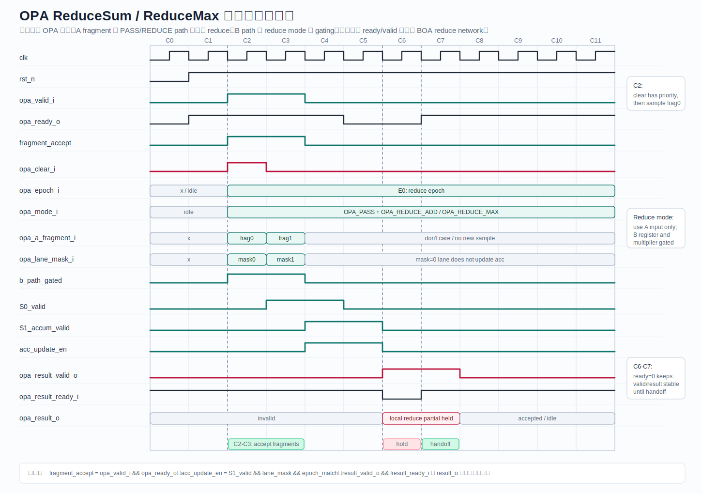
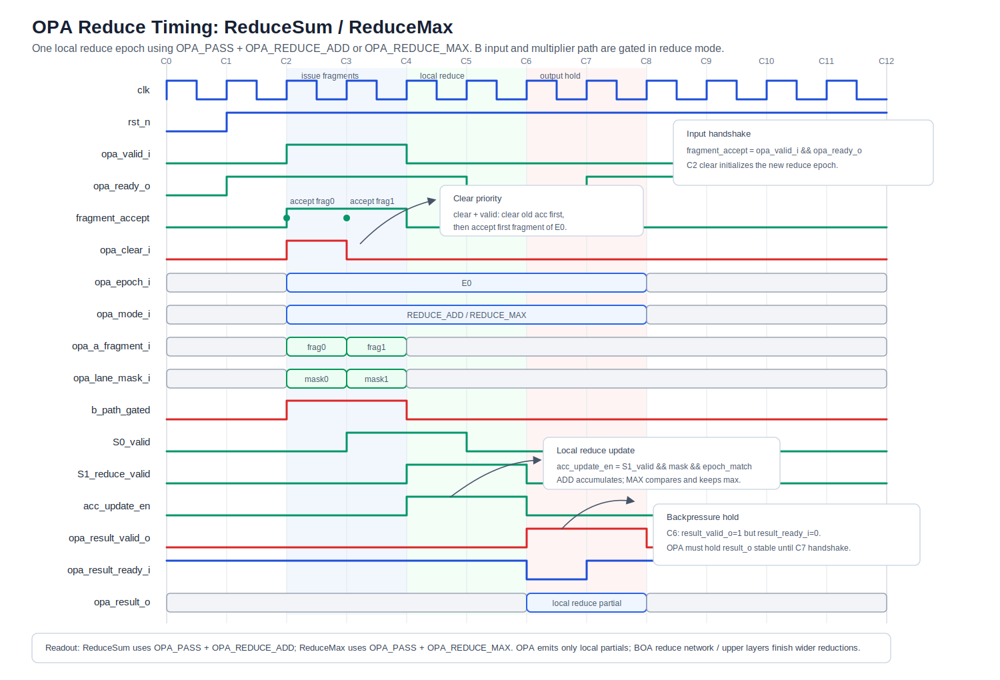
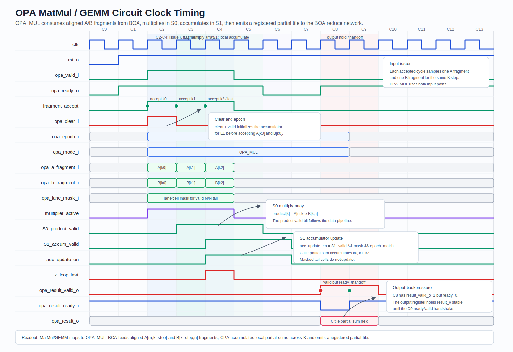

# OPA 设计文档

## 1. 定位、目标和 First Silicon cutline

OPA（Outer-product Primitive Array / Primitive）是 BOA 的最小 dense compute primitive。OPA 位于 BOA 内部，不是独立可由 runtime 调度的 engine；Tile UCE 只启动 BOA descriptor，BOA sequencer 再把 descriptor lowering 成 OPA micro-loop。OPA 的职责是对 A fragment 与 B fragment 执行局部 outer product、局部 accumulate 和受限 reduce。

OPA 的边界原则：

```text
OPA 只处理 K 内局部 contraction 和局部 reduce；不处理 window、broadcast、index mapping、page walk 或全局 tensor mapping。
```

Architecture V1 可以把 OPA 抽象为 BOA 内部的 Virtual BOA Block 计算元素，使 compiler 能通过 BOA descriptor 描述 layout/dataflow；First Silicon V1 应把 OPA RTL 收敛为固定 shape、固定 pipeline depth、固定 mode 子集，优先完成 GEMM/QK/AV/expert MLP 主路径。

| 项目                | First Silicon V1                              | 后续能力                                                 |
| ------------------- | --------------------------------------------- | -------------------------------------------------------- |
| OPA shape           | 16x16 或 32x16，由 PPA exploration 冻结       | 多 shape 或 runtime selectable shape                     |
| mode                | MUL、PASS、REDUCE_ADD、REDUCE_MAX、REDUCE_MIN | 更多统计、compare-select、特殊 activation 由后续规格冻结 |
| dtype               | INT8、BF16 输入，INT32/BF16 accumulate        | INT4、FP16、FP32 accumulate 由后续规格冻结               |
| software visibility | 只通过 BOA descriptor 间接控制                | 不暴露逐 OPA ISA                                         |
| reduce scope        | OPA 内部和 BOA 内局部 reduce                  | 跨 tile/group reduce 由 Collective 或 BOA 上层处理       |

## 2. 职责、非职责和 ownership

OPA owner 是 BOA datapath。OPA 接收 BOA sequencer 给出的 fragment、mode、valid、clear、accumulate epoch 和 reduction control，输出 partial sum 或 local reduce result。

OPA 负责：

- A/B fragment register 对齐和有效位处理。
- outer product multiply、pass-through、局部 add/max/min reduce。
- pipeline stage valid bit 传播。
- accumulator clear、hold、update 的局部执行。
- per-lane 或 per-cell mask 对无效 tail 的抑制。
- 向 BOA reduce network 输出 partial result 和 done token。

OPA 不负责：

- 从 L1 SRAM 发起 load/store。
- bank conflict replay。
- descriptor validation。
- split-K partial owner 选择。
- epilogue、requant、bias、activation。
- event/fault commit。
- MFE page/segment stream、EVU predication、USE state lifecycle。

ownership 划分：

| 对象                   | owner                      | OPA 行为                                          |
| ---------------------- | -------------------------- | ------------------------------------------------- |
| fragment 地址和 layout | BOA operand fetcher        | OPA 只消费已对齐 fragment                         |
| mode legality          | BOA descriptor validator   | OPA 可保留 default hold 防御，但 fault 在上层产生 |
| mask/tail              | BOA sequencer / descriptor | OPA 用 mask 抑制无效 lane，不解释 dynamic shape   |
| accumulator epoch      | BOA sequencer              | OPA 根据 clear/accumulate/commit 控制更新         |
| PMU active/stall       | BOA PMU                    | OPA 输出 active bubble 信息，上层聚合             |

## 3. 微架构和状态机

### 3.1 Datapath

```text
A fragment register      B fragment register
        |                       |
        +----------+------------+
                   |
           mode / mask gate
                   |
           multiply / pass path
                   |
             pipeline reg S0
                   |
        local accumulate / reduce
                   |
             pipeline reg S1
                   |
        partial output / reduce output
```

推荐模块拆分：

| 子模块           | 说明                                                        |
| ---------------- | ----------------------------------------------------------- |
| Fragment Ingress | 捕获 A/B fragment、lane mask、mode、epoch                   |
| Mode Gate        | 根据 MUL/PASS/REDUCE mode 选择 datapath                     |
| Multiply Array   | 执行 A x B outer product，输出 cell product                 |
| Reduce Lane      | 对 PASS 或 reduction input 做 add/max/min                   |
| Accumulator Cell | 保存局部 partial sum，支持 clear/hold/update                |
| Saturation Guard | 内部 overflow flag 采集；是否 saturate 由 BOA epilogue 决定 |
| Output Register  | 向 BOA reduce network 提供 registered partial               |

### 3.2 OPA mode

| mode             | 含义          | 典型用途                         | 输出                  |
| ---------------- | ------------- | -------------------------------- | --------------------- |
| `OPA_MUL`        | A x B 并累加  | GEMM、Conv、QK、AV、expert MLP   | partial sum tile      |
| `OPA_PASS`       | A passthrough | ReduceSum/Max 输入、pooling 输入 | pass value            |
| `OPA_REDUCE_ADD` | 局部加法规约  | sum、average 前半段              | scalar/vector partial |
| `OPA_REDUCE_MAX` | 局部 max 规约 | maxpool、softmax max             | max partial           |
| `OPA_REDUCE_MIN` | 局部 min 规约 | normalization/statistics         | min partial           |

mode 组合约束：

- `OPA_MUL` 使用 A/B 双输入；`OPA_PASS` 和 reduce mode 可以只使用 A input，B input 被 operand gating。
- tail mask 为 0 的 lane 不得更新 accumulator。
- `clear` 与 `valid` 同周期时，先清除旧 epoch，再接收新 epoch 的第一拍输入。
- mode 在一个 micro-loop epoch 内不得改变；需要改变 mode 时由 BOA sequencer 插入 flush 或新 epoch。

### 3.3 状态机

OPA 本身应尽量保持小状态，复杂状态留在 BOA sequencer。

```text
RESET
  |
  v
OPA_IDLE
  | valid_i
  v
OPA_LOAD_FRAGMENT
  |
  v
OPA_EXECUTE_S0
  |
  v
OPA_ACCUMULATE_S1
  | more fragment
  +---------------> OPA_LOAD_FRAGMENT
  |
  v
OPA_OUTPUT_VALID
  | ready_i
  v
OPA_IDLE
```

异常条件：

- illegal mode：OPA 本地保持输出无效，上层 BOA validator 应在 launch 前阻断；debug build 可触发 internal fault。
- accumulator overflow：记录 sticky flag，是否 fault、saturate 或 wrap 由 descriptor rounding/saturation policy 决定。
- downstream backpressure：`output_valid` 保持，禁止覆盖 output register。

## 4. 接口、descriptor、寄存器和协议

OPA 不暴露独立 descriptor。OPA control 从 BOA descriptor 派生：

| BOA descriptor 字段                 | OPA 派生控制                                          |
| ----------------------------------- | ----------------------------------------------------- |
| `op_kind`                           | `OPA_MUL` 或 reduce-like mode                         |
| `tile_m/tile_n/tile_k`              | fragment shape、loop count、epoch length              |
| `dtype_a/dtype_b/dtype_acc`         | multiplier、accumulator 宽度和 convert point          |
| `reduce_op` / `dataflow`            | local reduce tree mode                                |
| `transpose_flags` / layout          | fragment ingress swizzle，由 BOA operand fetcher 处理 |
| `rounding_mode` / `saturation_mode` | accumulator overflow sticky 与 epilogue handoff       |

推荐内部接口：

```systemverilog
typedef enum logic [2:0] {
  OPA_MUL,
  OPA_PASS,
  OPA_REDUCE_ADD,
  OPA_REDUCE_MAX,
  OPA_REDUCE_MIN
} opa_mode_e;
```

```text
opa_valid_i
opa_ready_o
opa_mode_i
opa_clear_i
opa_epoch_i
opa_a_fragment_i
opa_b_fragment_i
opa_lane_mask_i
opa_result_valid_o
opa_result_ready_i
opa_result_o
opa_overflow_o
opa_internal_error_o
```

协议要求：

- `valid_i && ready_o` 是 fragment 接收点。
- `result_valid_o && result_ready_i` 是 result 交付点。
- `epoch_i` 用于区分 accumulator clear/reuse；同一 epoch 内输出顺序保持。
- backpressure 期间输入侧可继续接收的深度由内部 skid buffer 冻结；没有 skid buffer 时必须拉低 `ready_o`。

## 5. 数据流、控制流和时序路径

### 5.1 数据流

```text
BOA Operand Buffer
  ├── A fragment bank-aligned read
  └── B fragment bank-aligned read
        |
        v
OPA ingress registers
        |
        v
Multiply / Reduce pipeline
        |
        v
Local accumulator
        |
        v
BOA reduce network / accumulator file
```

OPA 输入必须已经完成 layout swizzle 和 bank conflict replay。OPA 不应看到跨 bank 的可变延迟；可变延迟由 BOA operand buffer 的 ready/valid 吸收。

### 5.2 控制流

```text
BOA Tile Decoder -> micro-loop control -> OPA issue
OPA result -> BOA Reduce Network -> Accumulator / Writeback
```

OPA 不产生 event。只有 BOA 在整个 descriptor 完成或 fault 时向 Tile UCE 提交 event。

### 5.3 时序路径

| 路径                                          | 风险                                     | 建议                                                  |
| --------------------------------------------- | ---------------------------------------- | ----------------------------------------------------- |
| A/B register -> multiplier -> product reg     | dtype 和 array size 增加导致组合路径变长 | 固定 pipeline S0，shape 由 PPA exploration 冻结       |
| product -> accumulator add -> accumulator reg | feedback 路径关键                        | accumulator 分层、carry-save 或多拍累加由后续规格冻结 |
| max/min compare tree                          | REDUCE_MAX/MIN fan-in                    | 局部 lane reduce 后进入 BOA reduce network            |
| mode/mask fanout                              | 控制扇出到所有 cell                      | mode/mask 本地寄存复制，避免全局高 fanout             |
| overflow/sticky flag                          | 跨 cell OR tree                          | 分层 sticky 汇聚，非 hot path 采样                    |







### 5.4 工作负载映射示例

| 工作负载 micro-step | OPA mode                      | 输入 fragment                              | 输出                                             |
| ------------------- | ----------------------------- | ------------------------------------------ | ------------------------------------------------ |
| GEMM K-step         | `OPA_MUL`                     | A[m, k_step] 与 B[k_step, n]               | accumulator partial tile                         |
| Attention QK        | `OPA_MUL`                     | Q fragment 与 K fragment                   | score partial tile，交给 BOA reduce              |
| Attention AV        | `OPA_MUL`                     | softmax probability fragment 与 V fragment | output partial tile                              |
| ReduceSum tail      | `OPA_PASS` + `OPA_REDUCE_ADD` | active lane A fragment                     | local sum partial，尾部由 mask 抑制              |
| Softmax max assist  | `OPA_PASS` + `OPA_REDUCE_MAX` | score fragment                             | local max partial，后续通常由 EVU 完成 normalize |

这些示例仍由 BOA descriptor 间接触发；软件不直接 launch OPA。

## 6. 配置、PPA、性能模型和 PMU

### 6.1 配置

| 参数               | 说明                                                       |
| ------------------ | ---------------------------------------------------------- |
| `OPA_M` / `OPA_N`  | outer product tile 尺寸，由 PPA exploration 冻结           |
| `OPA_K_STEP`       | 每拍或每 micro-step 消费的 K fragment 宽度，由后续规格冻结 |
| `ACC_WIDTH`        | INT32/BF16/可选 FP32 accumulator 宽度                      |
| `PIPE_DEPTH`       | 乘法、规约、输出寄存阶段数                                 |
| `MASK_GRANULARITY` | lane mask 或 cell mask，First Silicon V1 推荐 lane mask    |

### 6.2 面积和功耗考虑

- multiplier array 是面积和动态功耗主项；tail/mask 为 0 时必须 operand gate。
- REDUCE mode 不使用 B input 时，B fragment register 和 multiplier path 应 clock/operand gated。
- accumulator register file 若放在 flops 面积高但时序简单；若放 SRAM/macro，需要处理 RMW latency。First Silicon V1 取舍由 PPA exploration 冻结。
- mode 和 dtype 可配置性越高，mux 越宽；V1 应避免每个 cell 支持过多动态 dtype 组合。
- OPA pipeline depth 增加会提升频率但增加 bubble 和 flush 成本；BOA micro-loop 应批量运行以摊薄启动开销。

### 6.3 性能模型

```text
OPA_ops_per_cycle = OPA_M * OPA_N * k_elements_per_cycle
BOA_peak = num_opa * OPA_ops_per_cycle * freq
OPA_util = active_cycles / (active_cycles + bubble_cycles + backpressure_cycles)
```

bubble 来源：

- operand buffer 未准备好。
- result backpressure。
- epoch 切换 flush。
- mode/dtype 切换。
- tail mask 导致有效 cell 降低。

OPA PMU 不需要独立软件可见寄存器，但应向 BOA PMU 提供内部信号：`opa_active`、`opa_bubble_operand`、`opa_bubble_output`、`opa_masked_cells`、`opa_overflow_sticky`。

## 7. RTL/软件实现建议

### 7.1 RTL

- OPA 写成参数化模块，但 tapeout 配置应固定参数，避免综合出过宽动态 mux。
- mode enum 使用 `unique case`，default 只 hold，不产生写入。
- valid bit 与 data pipeline 同步寄存；禁止依赖隐式延迟常量散落在 BOA sequencer。
- accumulator update 必须显式受 `valid && mask && epoch_match` 保护。
- overflow sticky flag 按 epoch clear，随 result metadata 交给 BOA。
- 随机 backpressure 下，result register 不得被新结果覆盖。

### 7.2 软件

软件不直接生成 OPA program。compiler 只通过 BOA descriptor 表达：

- tile shape 和 dtype。
- op kind 和 reduce op。
- layout id 和 dataflow。
- epilogue 与 quant 参数。

debug 工具可以把 BOA descriptor 反汇编成 OPA micro-loop trace，但该 trace 不是 ABI，不应被 runtime 依赖。

## 8. 验证、bring-up 和验收标准

### 8.1 单元验证

- `OPA_MUL`：随机 A/B fragment 与 Python golden outer product 对齐。
- `OPA_PASS`：A passthrough 在 mask/tail 下保持无效 lane 不写。
- `OPA_REDUCE_ADD/MAX/MIN`：随机向量、全 mask、单 lane mask、tail lane。
- epoch：连续两个 epoch 之间 accumulator 不串扰。
- backpressure：随机 `result_ready` 拉低不丢 result。
- overflow：构造最大值输入，sticky flag 与 saturation policy handoff 正确。

### 8.2 SVA 重点

- 接收：`valid_i && !ready_o` 时输入侧若保持 valid，OPA 不得采样新 fragment。
- 输出保持：`result_valid_o && !result_ready_i` 时 `result_o` 稳定。
- mask 抑制：mask 为 0 的 lane 不改变 accumulator。
- clear 优先级：`clear_i` 后第一个有效输出不依赖旧 epoch。
- mode 稳定：同一 epoch 内 mode 改变必须被上层阻断或触发 flush。
- active/stall 互斥：OPA active 与 output backpressure bubble 不能同周期双计 primary。

### 8.3 Bring-up

1. 单 OPA 单 mode directed test。
2. 单 OPA 随机 fragment + mask + backpressure。
3. 多 OPA 并行一致性测试。
4. 接入 BOA operand buffer，验证 bank replay 不影响 OPA result。
5. 接入 BOA reduce network，完成 micro GEMM。
6. 通过 Tile UCE command queue 触发 BOA GEMM，证明 OPA 不依赖 testbench 直连。

验收标准：OPA 单元 golden 全通过；接入 BOA 后 GEMM/QK/AV/expert MLP micro trace 与 golden 对齐；PMU 中 OPA bubble 能被 BOA primary stall 正确归因。

## 9. 风险、取舍和后续细化方向

| 风险                                      | 影响                     | 缓解                                                    |
| ----------------------------------------- | ------------------------ | ------------------------------------------------------- |
| OPA 过度可编程                            | 面积、时序和验证成本上升 | 不暴露 OPA ISA，只通过 BOA descriptor 控制              |
| accumulator feedback 时序差               | 频率下降                 | 分 pipeline、限制 shape、PPA 冻结 accumulator 实现      |
| reduce mode 与 GEMM hot path 共享过多 mux | MUL 性能受损             | reduce path 与 MUL path 局部隔离，V1 mode 子集收敛      |
| tail mask 粒度过细                        | mask fanout 大           | V1 推荐 lane mask，cell mask 由后续规格冻结             |
| 数值顺序不明确                            | RTL/golden 不一致        | descriptor 明确 reduction order、rounding 和 saturation |

后续需要冻结：OPA shape、pipeline depth、dtype 组合、mask 粒度、overflow policy、debug trace 格式和 BOA PMU 聚合信号编号。
