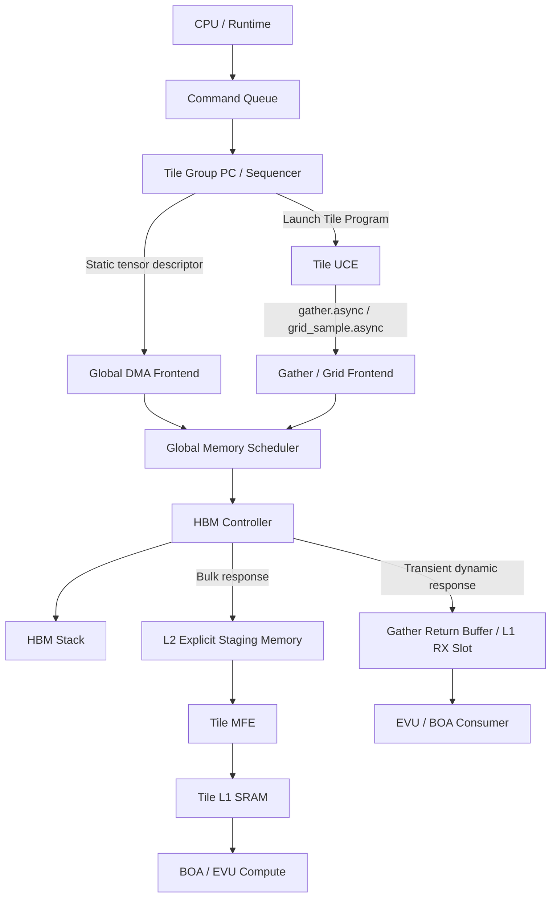

# ELENOR 混合内存执行模型设计提案

> **主题**：在保持显式预取、L2/L1 可控性和高带宽效率的前提下，引入对 Gather、GridSample、Paged KV、MoE 等运行时不规则访问的支持。
> **文档状态**：Architecture Proposal / Agent Implementation Guide
> **日期**：2026-07-20
> **适用对象**：Architecture、RTL、Compiler/MLIR、Runtime、Simulator、Performance Modeling、Verification Agent

---

## 0. 执行摘要

ELENOR 当前原始数据路径为：

```text
CPU
  -> Command Queue
  -> Tile Group PC / Sequencer
  -> Global DMA Prefetch
  -> L2 Explicit Staging Memory
  -> Tile MFE
  -> Tile L1 SRAM
  -> BOA / EVU Compute
```

该模型的主要优势是：

- 编译器明确知道数据何时进入 L2、何时从 L2 搬入 L1；
- L2/L1 生命周期和容量可以静态规划；
- HBM 访问可聚合为大粒度、对齐的 burst；
- 双缓冲和计算流水线具有较强确定性；
- 面积、功耗、带宽预算和最坏情况分析相对可控。

但该模型不容易支持运行时才产生地址的访问，包括：

- `Gather` / Embedding lookup；
- `GridSample`；
- Paged KV Cache；
- MoE routing 后的 expert block 加载；
- Block-sparse / indirect tensor access；
- 依赖运行时 page table、index list 或坐标的访问。

本提案不建议将整个架构改造成 GPU 式通用 demand-load cache machine，也不建议让每个 Tile 成为独立 HBM master。最终推荐方案为：

> **Dual-trigger, Single-backend, Split-landing 混合内存模型**

即：

1. **Static/Bulk Path**：CPU/Tile Group PC 触发 Global DMA，将规则 tensor 显式预取到 L2 staging memory；
2. **Dynamic/Irregular Path**：Tile UCE 在运行时触发 `gather.async` / `grid_sample.async` descriptor；
3. 两类请求经过同一个 **Global Memory Scheduler + HBM Controller**；
4. Dynamic Gather 在 L2 已存在数据时可以命中并读取；
5. Dynamic Gather miss 默认 **不分配 L2**，而是返回到有界的 Gather Return Buffer 或预留的 Tile L1 slot；
6. HBM transaction 发出前，必须预留完整的返回路径和 destination credit；
7. HBM Controller 的 bank/row/channel reorder 由硬件完成，小型 MCU 仅负责初始化、配置、PHY/RAS，不进入逐 transaction 数据面。

推荐数据路径：

```text
                         HBM
                          |
                   HBM Controller
            bank/row/channel hardware reorder
                          |
                 Global Memory Scheduler
       class queues / credits / QoS / forward progress
                  /                       \
                 /                         \
        Static Bulk Path             Dynamic Path
       Global DMA Prefetch        Gather/Grid Frontend
                 |                         |
                 v                         v
        L2 Explicit Staging        Gather Return Buffer
                 |                   or reserved L1 slot
                 v                         |
              Tile MFE                    v
                 |                    EVU / BOA
                 v
              Tile L1
                 |
                 v
             BOA / EVU
```

该方案保留原架构的确定性，同时为动态访问提供一条不会依赖 L2 空闲容量的 forward-progress 路径。

---

## 1. 问题定义

### 1.1 原始显式预取模型

原始模型将 L2 视为由软件/编译器显式规划的全局 staging SRAM，而不是传统硬件 cache：

```text
Compiler / Runtime
    |
    | generate prefetch descriptors
    v
Tile Group PC
    |
    v
Global DMA
    |
    v
L2 Region A/B/C
    |
    v
Tile MFE
    |
    v
Tile L1 ping-pong
    |
    v
Compute
```

其控制权清晰：

| 资源/行为          | 控制者                                |
| ------------------ | ------------------------------------- |
| L2 region 分配     | Compiler / Runtime / Device allocator |
| HBM→L2 预取时机    | Tile Group program                    |
| L2→L1 搬运时机     | Tile UCE / MFE                        |
| L1 ping-pong       | Compiler-generated tile program       |
| Compute dependency | Token / event / barrier               |
| L2 region 释放     | Tile Group program / completion event |

### 1.2 纯 compute-driven demand load 的问题

如果改为：

```text
Tile UCE
  -> MFE/LSU demand load
  -> L2 lookup
  -> miss 到 HBM
  -> L2 fill
  -> L1
  -> Compute
```

则动态访问自然，但存在以下结构性问题：

1. **Latency hiding 不足**：ELENOR 没有 GPU 数十个 warp/context 可切换；
2. **L2 容量冲突**：显式 prefetch 数据可能占满 L2，dynamic miss 无 landing space；
3. **死锁风险**：Gather 等 L2 空间，而 L2 中的数据又必须等当前 Tile 继续计算才会释放；
4. **内存控制弱化**：compiler 无法再精确规划 L2 residency；
5. **HBM burst 效率下降**：碎片化请求可能降低 transaction utilization；
6. **面积增长**：需要 tag、MSHR、replay、replacement、coherence/ordering 等 cache machinery；
7. **带宽不可预测**：dense prefetch 和 irregular demand 可能互相挤压。

因此，不能简单用 GPU demand-load 路径替代原显式预取路径。

---

## 2. 架构决策

### 2.1 核心决策

采用：

> **Dual-trigger, Single-backend, Split-landing**

#### Dual-trigger

- **Static trigger**：CPU/Tile Group PC 提交 bulk/tensor prefetch descriptor；
- **Dynamic trigger**：Tile UCE 在 index/grid/page 信息产生后提交 async irregular descriptor。

#### Single-backend

所有请求统一经过：

```text
Global Memory Scheduler
    -> HBM Controller
    -> HBM PHY
    -> HBM Stack
```

禁止：

```text
Per-Tile Gather DMA -> 独立直接访问 HBM
```

#### Split-landing

- 规则大块数据：落入显式管理的 L2 staging region；
- transient dynamic gather：落入 Gather Return Buffer / reserved L1 slot；
- reusable dynamic block：必须先 reserve L2 region，再执行 staged gather。

### 2.2 为什么不是统一落入 L2

若所有返回数据都必须进入 L2，则：

```text
Tile waits Gather
  -> Gather waits L2 free region
  -> L2 region waits Tile compute/release
  -> Tile waits Gather
```

形成环形等待。

因此必须满足不变量：

> **动态请求的 forward-progress 路径，不能依赖于可以被静态预取完全耗尽的资源。**

---

## 3. 推荐总体架构



### 3.1 模块职责

| 模块                    | 必须负责                                                       | 不应负责                         |
| ----------------------- | -------------------------------------------------------------- | -------------------------------- |
| CPU/Runtime             | kernel launch、地址/shape patch、粗粒度 graph 调度             | tile iteration、逐请求 HBM 调度  |
| Tile Group PC           | 发射静态 descriptor、启动 Tile program                         | DRAM bank/row 选择               |
| Tile UCE                | async descriptor issue、token、dependency、少量 context 切换   | 直接控制 HBM PHY                 |
| Global DMA Frontend     | dense/strided tensor descriptor 展开                           | GridSample 插值语义              |
| Gather/Grid Frontend    | index/coordinate AGU、descriptor-local merge、destination tag  | DRAM timing 决策                 |
| Global Memory Scheduler | traffic-class admission、credit、QoS、公平性                   | 算子数学计算                     |
| HBM Controller          | channel/bank/row mapping、timing、refresh、transaction reorder | 理解 Gather/GridSample 输出语义  |
| L2 Staging              | 显式 bulk residency、region/epoch 管理                         | transient gather miss 的强制分配 |
| Gather Return Buffer    | 有界 transient response landing                                | 长生命周期 tensor residency      |
| MFE/L1                  | L2→L1 搬运、Tile-local ping-pong                               | 全局 HBM 排序                    |

---

## 4. 三种内存操作语义

### 4.1 Static Tensor Prefetch

用于：

- GEMM；
- Conv；
- Dense Attention；
- MLP；
- 规则 weight/activation tile。

路径：

```text
Tile Group PC
    -> gdma.tensor.async
    -> reserve L2 region
    -> HBM
    -> L2 region READY
    -> Tile MFE
    -> L1 ping-pong
    -> Compute
```

建议 IR：

```mlir
%l2_region = elenor.l2.reserve {
  bytes = 262144,
  owner = %tile_group,
  policy = "explicit"
}

%prefetch_token = elenor.gdma.tensor_async %src, %l2_region {
  shape = [128, 64],
  strides = [%lda, 1],
  element_type = f16,
  layout = "row_major"
}

elenor.wait %prefetch_token

%l1_token = elenor.mfe.load_async %l2_region {
  dst = #l1<a_slot_0>
}
```

### 4.2 Transient Dynamic Gather

用于单次或低复用的动态访问：

- Embedding lookup；
- 动态 feature gather；
- GridSample source neighborhood；
- 小块 Paged KV；
- runtime index table。

路径：

```text
Tile UCE
    -> gather.async descriptor
    -> descriptor-local coalescing
    -> Global Memory Scheduler
    -> HBM
    -> Gather Return Buffer / reserved L1 slot
    -> EVU/BOA
```

L2 行为：

```text
若地址属于 READY 的显式 L2 residency region：可从 L2 读取
否则：直接 HBM fetch，默认不 allocate L2
```

建议 IR：

```mlir
%token = elenor.gather_async %base, %indices {
  dst = #l1<gather_slot_0>,
  ordering = "unordered",
  merge_scope = "descriptor",
  l2_lookup = true,
  l2_allocate = false,
  latency_class = "critical",
  max_bytes = 4096
}

elenor.compute_independent_work
elenor.wait %token
elenor.evu.consume #l1<gather_slot_0>
```

### 4.3 Staged Dynamic Gather

用于运行时地址才确定、但后续需要多次复用的大块数据：

- MoE expert weight block；
- 大块 Paged KV；
- block-sparse matrix blocks；
- 多个 Tile 共享的动态 block。

它可以写入 L2，但必须遵循：

```text
reserve L2 region
  -> reserve return credit
  -> issue HBM transaction
  -> fill region
  -> signal READY
```

禁止先发 HBM read、返回时再找 L2 空间。

建议 IR：

```mlir
%region = elenor.l2.reserve {
  bytes = %runtime_bytes,
  class = "dynamic_stage"
}

%token = elenor.gdma.gather_stage_async %base, %indices, %region {
  block_bytes = 128,
  allow_reorder = true
}

elenor.wait %token
```

---

## 5. Tile 如何触发动态访问而不立即阻塞

动态路径必须是 split-phase：

```text
issue != wait != consume
```

### 5.1 推荐指令语义

```asm
gather.async token0, l1_slot0, base, index_desc
compute.independent_work
wait token0
consume l1_slot0
```

禁止将关键语义定义为：

```asm
vgather v0, [base + indices]  ; 整个 Tile 原地同步等待 HBM
```

### 5.2 Token 状态

```cpp
enum class TokenState : uint8_t {
    Free,
    Issued,
    WaitingAdmission,
    InFlight,
    Returning,
    Ready,
    Error,
};
```

### 5.3 少量 coarse-grained context

ELENOR 不需要复制 GPU 大量 warp context，但可以维护少量 continuation：

```cpp
struct TileContinuation {
    uint32_t pc;
    uint16_t context_id;
    uint16_t pending_token;
    uint16_t l1_slot;

    enum State : uint8_t {
        Ready,
        Running,
        WaitingMemory,
        Finished,
    } state;
};
```

只允许在明确边界切换：

- output tile 边界；
- attention block 边界；
- expert group 边界；
- MMA tile 启动前；
- gather descriptor issue 后。

不建议在 BOA accumulator 运算中间保存完整 context。

---

## 6. Gather 请求合并与“Memory Micro-batching”

Gather 请求合并与推理 dynamic batching 在抽象上相似：

```text
收集一小批请求
  -> 根据共同特征合并/重排
  -> 提高吞吐
  -> 引入一定排队延迟
```

但必须区分三层。

### 6.1 Descriptor-local Coalescing：V1 必须支持

一条 descriptor 自带 index batch：

```text
indices = [100, 101, 102, 5000, 103, 100]
```

按 line 分组后：

```text
Line X: 100, 101, 102, 103, duplicate 100
Line Y: 5000
```

只需要两个物理 transaction，并保存 consumer mapping。

这不需要等待其他 Tile，确定性强，状态规模有界。

### 6.2 Cross-descriptor Merge：可选

不同 descriptor 在有限时间窗口内访问相同 line 时，可以合并：

```text
Tile 0: [100, 101, 5000]
Tile 1: [102, 103, 5001]
```

但该优化只能是 opportunistic：

- 低并发时必须允许单 descriptor 立即执行；
- 关键路径请求不能为了凑 batch 无限等待；
- 必须有最大 age/deadline；
- V1 不建议做全局跨 Tile merge。

### 6.3 HBM Controller Reorder：自动硬件完成

HBM Controller 对标准 burst transaction 做：

- channel/pseudo-channel 分配；
- bank/row 选择；
- row-hit 优先；
- read/write turnaround；
- timing constraint；
- refresh；
- age/QoS starvation protection。

它不理解 GridSample point、Gather lane 或 output index。

---

## 7. GridSample 映射

### 7.1 算子本质

GridSample forward 可分解为：

```text
Coordinate Transform
  + Boundary/Padding
  + Structured Gather
  + Interpolation
```

2D bilinear 每个 output point 产生四个邻居：

```text
(x0, y0), (x1, y0), (x0, y1), (x1, y1)
```

因此：

```text
GridSample = fixed-neighborhood structured gather + weighted reduction
```

### 7.2 天然 batch

一个 output spatial tile 本身就是天然 memory batch：

```text
Output tile 8 x 4 = 32 points
Bilinear = 最多 128 logical references
```

不应依赖跨 Tile 长时间窗口组 batch。

### 7.3 推荐 GridSample Frontend

```text
Grid Tile FIFO
    -> Coordinate Transform
    -> Padding/Boundary Unit
    -> Neighbor Address Generation
    -> Line Merge/Dedup Table
    -> Global Memory Scheduler
    -> Return Line Buffer
    -> Reorder/Value Extract
    -> Interpolation FMA
    -> Output L1
```

建议 IR：

```mlir
%token = elenor.grid_sample_async %input, %grid {
  output_offset = [%oh, %ow],
  output_shape = [8, 4],
  channel_tile = 32,
  mode = "bilinear",
  padding = "border",
  align_corners = false,
  layout = "nhwc_blocked",
  merge_scope = "descriptor",
  l2_allocate = false,
  dst = #l1<grid_slot_1>
}
```

### 7.4 数据布局建议

优先：

```text
NHWC / NCHWc / Channel-blocked
```

因为同一空间位置的 channel block 连续，GridSample 可转成对四个 channel block 的 block gather。

NCHW 下同一空间点的 channel 元素相距 `H*W`，可能导致碎片化访问。Compiler 应评估：

```text
layout transform cost
vs
GridSample memory efficiency
```

### 7.5 Forward 与 Backward

- Forward：read-only gather + interpolation；
- Backward input gradient：scatter-add + reduction/atomic，必须单独设计冲突语义。

V1 建议仅将 forward 纳入此方案。

---

## 8. L2 Staging Memory 管理

### 8.1 语义定位

建议将当前所谓 L2 明确命名为：

```text
L2 Explicit Staging Memory / Global Buffer / L2 SPM
```

它不是普通硬件 cache，因此不要求：

- per-line replacement；
- arbitrary eviction；
- general cache coherence；
- dynamic miss allocation。

### 8.2 Region Table

```cpp
enum class RegionState : uint8_t {
    Free,
    Reserved,
    Filling,
    Ready,
    Consuming,
};

struct L2RegionEntry {
    uint64_t global_base;
    uint32_t bytes;
    uint32_t l2_base;

    uint16_t owner_tile_group;
    uint16_t region_id;
    uint16_t epoch;

    RegionState state;
};
```

### 8.3 Epoch

同一物理 region 被循环复用时，必须用：

```text
region_id + epoch
```

防止旧 descriptor/response 写入新一代 region。

### 8.4 Residency Lookup

Gather 可以检查请求地址是否落入某个 `READY` region：

```text
if addr in [global_base, global_base + bytes):
    read L2 at l2_base + offset
else:
    bypass to HBM
```

可使用小型 region-range table，而不需要完整 per-line cache tag。

---

## 9. 死锁与 Forward Progress

### 9.1 必须防止的资源环

```text
Tile Compute
  waits Gather Completion
Gather
  waits L2 Free Space
L2 Free Space
  waits Tile Consume/Release
```

### 9.2 核心不变量

#### Invariant A：发读前预留落点

```text
HBM read issue
  => destination buffer/region 已 reserve
```

#### Invariant B：Transient Gather 不依赖 L2 allocation

```text
transient gather miss
  => HBM -> Gather Return Buffer/L1
```

#### Invariant C：Static prefetch admission 和 command submission 分离

CPU 可以提交多个 descriptor，但只有成功 reserve L2 region 的 prefetch 才能进入 HBM issue queue。

#### Invariant D：独立 credit

至少区分：

- static prefetch outstanding credit；
- critical gather outstanding credit；
- noncritical gather credit；
- writeback/store credit；
- response buffer credit。

#### Invariant E：请求与响应不可形成同一 buffer cycle

建议逻辑 VC：

```text
VC0 static request
VC1 dynamic request
VC2 read response
VC3 completion/control
```

物理链路可共享，但 credit/buffer 必须隔离。

---

## 10. Global Memory Scheduler

### 10.1 Traffic Classes

建议最少：

```text
Q0: Dense/Static Prefetch
Q1: Critical Dynamic Gather
Q2: Noncritical/Prefetch Gather
Q3: Store/Writeback
Q4: Maintenance/Refresh
```

### 10.2 Admission

```cpp
bool canIssueGather(const GatherTransaction &tx) {
    return gather_hbm_credit.available() &&
           gather_return_buffer.canReserve(tx.response_bytes) &&
           response_vc.hasCredit() &&
           reorder_table.hasEntry();
}
```

```cpp
bool canIssuePrefetch(const PrefetchTransaction &tx) {
    return prefetch_hbm_credit.available() &&
           l2_region_table.isReserved(tx.region_id, tx.epoch) &&
           response_vc.hasCredit();
}
```

### 10.3 调度优先级

推荐组合：

```text
Timing eligible
  + reserved credit
  + starvation age
  + latency class/deadline
  + QoS weight
  + row-hit opportunity
```

示意：

```cpp
Request selectNext() {
    if (criticalGather.oldestAge() >= CRITICAL_AGE_LIMIT)
        return criticalGather.popOldestEligible();

    if (anyQueue.hasStarvedRequest())
        return selectOldestStarvedEligible();

    if (auto *r = selectBestRowHitWeighted())
        return *r;

    return selectOldestEligible();
}
```

不能只使用 strict priority；否则低优先级流量可能饿死。

### 10.4 带宽配额

初期可静态配置：

```text
Dense prefetch guaranteed share
Critical gather reserved minimum credit
Writeback reserved minimum credit
```

动态 workload 下允许借用空闲 credit，但必须保证 critical class 可回收。

---

## 11. HBM Controller 与小型 MCU 的边界

### 11.1 HBM Controller 硬件自动完成

- request queue；
- channel/pseudo-channel/bank/row mapping；
- DRAM timing scoreboard；
- row-hit aware reorder；
- read/write drain；
- refresh；
- transaction ID tracking；
- QoS/age/starvation protection；
- ECC/protocol handling。

### 11.2 小型 MCU/固件负责

- PHY initialization/training；
- mode register 配置；
- DVFS、thermal policy；
- ECC 统计、scrub、RAS；
- controller policy register 配置；
- fatal error recovery。

### 11.3 禁止 MCU 做的事

```text
逐 HBM transaction 读取 queue
逐 cycle 选择 bank/row
逐请求发出 READ/WRITE command
```

原因：吞吐、最坏时延、功耗、验证和 FuSa 成本均不可接受。

---

## 12. Gather/Grid Frontend 微架构

### 12.1 Descriptor

```cpp
enum class DynamicOpKind : uint8_t {
    GatherElement,
    GatherBlock,
    GridSample2D,
    PageGather,
};

enum class LatencyClass : uint8_t {
    Critical,
    Prefetch,
};

struct DynamicMemoryDescriptor {
    DynamicOpKind kind;
    LatencyClass latency_class;

    uint16_t context_id;
    uint16_t tile_group_id;
    uint16_t descriptor_id;

    uint64_t source_base;
    uint64_t index_or_grid_addr;

    uint32_t count;
    uint16_t element_or_block_bytes;
    uint16_t destination_slot;
    uint16_t destination_epoch;

    uint16_t completion_token;
    uint8_t  merge_scope;
    bool     l2_lookup;
    bool     l2_allocate;
};
```

### 12.2 Merge Entry

```cpp
struct DynamicMergeEntry {
    uint64_t line_address;

    struct Consumer {
        uint16_t descriptor_id;
        uint16_t destination_slot;
        uint16_t destination_offset;
        uint8_t  offset_in_line;
        uint8_t  operand_id;
    };

    Consumer consumers[MAX_FANOUT];
    uint8_t consumer_count;
    uint8_t age;
    bool critical;
};
```

### 12.3 V1 Merge 范围

只实现：

- descriptor 内 duplicate elimination；
- same-line coalescing；
- adjacent block burst generation；
- descriptor 内 response reorder。

暂不实现：

- 全局跨 Tile exact-line merge；
- 大窗口等待式 batching；
- 复杂跨 Tile fanout network。

---

## 13. Compiler / MLIR 设计

### 13.1 Access Pattern 分类

```cpp
enum class AccessKind {
    AffineDense,
    Strided,
    IndexedElement,
    IndexedBlock,
    GridSample,
    ScalarMetadata,
    Unknown,
};
```

建议 pass：

```text
ElenorClassifyMemoryAccessPass
    -> ElenorSelectMemoryPathPass
    -> ElenorPlanL2RegionsPass
    -> ElenorPipelineAsyncMemoryPass
    -> ElenorAssignTokensAndSlotsPass
    -> ElenorLowerToTileProgramPass
```

### 13.2 Path Selection

```cpp
void lowerMemoryOp(Operation *op) {
    switch (classifyAccess(op)) {
    case AccessKind::AffineDense:
    case AccessKind::Strided:
        lowerToStaticGdma(op);
        break;

    case AccessKind::IndexedElement:
        lowerToTransientGather(op);
        break;

    case AccessKind::IndexedBlock:
        lowerToStagedOrTransientBlockGather(op);
        break;

    case AccessKind::GridSample:
        lowerToGridSampleAsync(op);
        break;

    case AccessKind::ScalarMetadata:
        lowerToMetadataLoad(op);
        break;

    default:
        emitUnsupportedOrRuntimeFallback(op);
        break;
    }
}
```

### 13.3 Async Pipeline

Compiler 必须显式生成：

```text
issue K+1
compute K
wait K+1
swap slots
```

动态 path 是否能隐藏 latency，取决于：

```text
lookahead distance
+ independent work
+ outstanding descriptors
+ coarse context count
```

不能假设 async 指令本身就自动消除 HBM latency。

---

## 14. Runtime 接口

Runtime 只做粗粒度配置和 descriptor patch：

```cpp
struct KernelLaunchDesc {
    uint64_t program_addr;
    uint64_t tensor_base_table;
    uint64_t dynamic_index_base;

    uint32_t dynamic_shape[8];
    uint16_t tile_group_mask;
    uint16_t qos_profile;
};
```

Runtime 不做：

```text
第 K 个 Tile 当前应访问哪个 HBM bank
第 N cycle 发哪个 gather line
逐 Tile 管理 HBM response
```

---

## 15. RTL 关键接口建议

### 15.1 UCE → Dynamic Frontend

```systemverilog
interface dynamic_mem_cmd_if;
  logic         valid;
  logic         ready;
  logic [7:0]   opcode;
  logic [15:0]  context_id;
  logic [15:0]  tile_group_id;
  logic [15:0]  descriptor_id;
  logic [63:0]  source_base;
  logic [63:0]  index_grid_addr;
  logic [31:0]  count;
  logic [15:0]  dst_slot;
  logic [15:0]  dst_epoch;
  logic [15:0]  completion_token;
endinterface
```

### 15.2 Scheduler Transaction

```systemverilog
typedef struct packed {
  logic [3:0]   traffic_class;
  logic [15:0]  source_id;
  logic [15:0]  transaction_id;
  logic [63:0]  address;
  logic [9:0]   bytes;
  logic [15:0]  destination_id;
  logic [15:0]  destination_epoch;
  logic [7:0]   qos;
} mem_txn_t;
```

---

## 16. RTL/SVA 不变量

```systemverilog
// 发出任何 HBM read 前，返回落点必须已预留。
assert property (@(posedge clk)
  hbm_read_issue
  |-> destination_credit_reserved[hbm_req_id]
);

// Static prefetch 必须拥有合法 L2 region。
assert property (@(posedge clk)
  static_prefetch_issue
  |-> l2_region_reserved[prefetch_region_id][prefetch_epoch]
);

// Transient gather miss 不得申请 L2 allocation。
assert property (@(posedge clk)
  transient_gather_miss
  |-> !l2_allocate
);

// Response 的 epoch 必须匹配 destination 当前 epoch。
assert property (@(posedge clk)
  response_valid
  |-> response_epoch == destination_epoch[response_destination]
);

// Prefetch 不得耗尽为 critical gather 保留的 outstanding credit。
assert property (@(posedge clk)
  prefetch_outstanding <= PREFETCH_OUTSTANDING_LIMIT
);

// 有资源且 memory 正常响应时，critical gather 必须有界向前推进。
assert property (@(posedge clk)
  critical_gather_pending &&
  critical_gather_resources_reserved &&
  hbm_service_available
  |-> ##[0:MAX_CRITICAL_SCHED_LATENCY] critical_gather_issue
);
```

---

## 17. 性能模型

### 17.1 Latency 可见性

```text
VisibleStall = max(0,
    MergeDelay + QueueDelay + HbmLatency + ReturnDelay
    - LookaheadCompute)
```

### 17.2 Outstanding 需求

```text
OutstandingBytes >= TargetBandwidth * EffectiveMemoryLatency
```

### 17.3 Descriptor-local 合并效率

建议统计：

```text
logical_bytes_requested
physical_bytes_fetched
unique_lines
logical_references
merged_references
duplicate_references
```

```text
TransactionEfficiency = useful_bytes / physical_bytes_fetched
MergeRatio = logical_references / unique_transactions
```

### 17.4 关键硬件计数器

- static/dynamic bytes；
- per-class queue occupancy；
- HBM row hit rate；
- descriptor-local merge ratio；
- Gather Return Buffer high watermark；
- critical gather age distribution；
- L2 residency hit bytes；
- bypass bytes；
- Tile waiting-memory cycles；
- BOA/EVU idle due to dynamic memory；
- credit starvation cycles；
- response backpressure cycles；
- region allocation failure count。

---

## 18. 验证场景

### 18.1 Correctness

1. Descriptor 内重复 index；
2. HBM response 全乱序返回；
3. Region epoch wrap/reuse；
4. 多 Tile 请求同一 source line、不同 destination；
5. GridSample padding：zeros/border/reflection；
6. Gather read-only order-independent；
7. Staged gather reserve failure；
8. Tile context cancellation/error。

### 18.2 Deadlock/Forward Progress

1. L2 100% 被 static prefetch 占满，同时持续 critical gather；
2. Prefetch queue 满、Gather queue 满、response queue 接近满；
3. HBM 长时间 write-drain；
4. 某 pseudo-channel 高冲突；
5. Dynamic request 持续到达，验证 static 不饿死；
6. Static 持续满载，验证 critical gather 有界进展；
7. Return Buffer credit 为 0 时禁止发 HBM read；
8. Response VC backpressure。

### 18.3 Performance

- Dense GEMM-only：确认新增模块不降低原路径峰值；
- Random Gather：最坏 transaction efficiency；
- Locality Gather：测试 descriptor merge；
- GridSample affine/smooth grid；
- GridSample random grid；
- Paged KV block gather；
- MoE expert locality 不同分布；
- Dense+Gather 混合并发；
- 多 Tile 同步发 gather 的 burst 场景。

---

## 19. 分阶段实现路线

### V0：行为模型

- 在 cycle simulator 中增加两类 traffic；
- 建立显式 L2 region 和独立 Gather Return Buffer；
- 验证 L2 满时 dynamic path forward progress；
- 建立 per-class credits 和有界公平调度模型。

### V1：最小可流片架构

实现：

- 原 Static Global DMA → L2 path；
- Tile UCE `gather.async`；
- descriptor-local coalescing；
- dynamic HBM response → bounded Gather Return Buffer/L1；
- per-class queue/credit；
- HBM hardware scheduler；
- token/epoch；
- GridSample bilinear forward 基础模式。

不实现：

- 全局跨 Tile merge；
- 通用 L2 cache replacement；
- GridSample backward；
- 完整硬件 coherence；
- 每 Tile 独立 HBM master。

### V1.5：同 Tile Group 优化

- Tile Group 内跨 descriptor exact-line merge；
- block gather；
- GridSample fused interpolation；
- latency class/deadline；
- small coarse-grained multi-context。

### V2：高级动态数据搬运

- staged dynamic gather；
- Paged KV 专用 block descriptor；
- MoE inspector/executor；
- profiling-driven adaptive merge window；
- dynamic credit borrowing；
- region-level multicast/fanout。

### V3：仅在数据证明必要时

- 全局跨 Tile exact-line merge；
- 更复杂的 adaptive HBM policy；
- optional metadata cache；
- training scatter/reduction path。

---

## 20. Agent 工作拆分

### Agent A：Architecture

输出：

- block diagram；
- resource dependency graph；
- class queue/credit 规格；
- L2/GRB 容量参数；
- traffic QoS policy；
- deadlock-free invariant 列表。

### Agent B：Compiler / MLIR

任务：

- 定义 `elenor.gdma.tensor_async`；
- 定义 `elenor.gather_async`；
- 定义 `elenor.grid_sample_async`；
- 实现 access classification；
- 实现 L2 region planner；
- 实现 async pipeline/token lowering；
- 实现 layout profitability 分析。

### Agent C：Runtime

任务：

- launch descriptor；
- region allocator control interface；
- QoS profile；
- error/completion handling；
- dynamic shape/index buffer patch；
- CPU/device ownership fence。

### Agent D：RTL – Gather/Grid Frontend

任务：

- descriptor queue；
- AGU；
- merge table；
- consumer tag；
- response value extraction/reorder；
- GridSample coordinate/padding；
- completion token。

### Agent E：RTL – Global Memory Scheduler

任务：

- traffic class queues；
- independent credits；
- admission checks；
- age/QoS/row-hit selection；
- request/response VC；
- SVA forward-progress properties。

### Agent F：Simulator / Performance

任务：

- HBM pseudo-channel/bank/row timing abstraction；
- static+dynamic traffic；
- merge ratio；
- queue/credit stalls；
- L2-full scenario；
- parameter sweep：GRB entries、outstanding、merge entries、context count。

### Agent G：Verification

任务：

- constrained-random HBM response reorder；
- epoch/slot reuse；
- multi-Tile race；
- deadlock stress；
- starvation proof；
- GridSample numerical comparison；
- formal/SVA properties。

---

## 21. 必须立即确定的参数

1. L2 是 chip-level 还是 Tile Group-level；
2. L2 region allocation granularity；
3. HBM transaction granularity；
4. Gather Return Buffer 放在 Tile 还是 Tile Group；
5. 每 Tile Group 最大 dynamic outstanding；
6. Merge Table entry 数和 fanout；
7. GridSample channel tile；
8. UCE continuation context 数；
9. response VC 数；
10. critical gather 最大可接受调度 age；
11. static/dynamic 带宽保证策略；
12. staged gather 是否进入 V1。

---

## 22. 建议默认参数（仅用于建模起点）

下列值不是最终规格，仅用于 simulator/RTL parameterization 起点：

```text
Per Tile Group:
  Gather descriptors outstanding: 4
  Dynamic transactions outstanding: 16~32
  Gather Return Buffer: 4~16 KiB
  Merge entries: 16~32
  Max consumers per line: 8~16
  UCE coarse contexts: 2~4

Global Scheduler:
  Traffic classes: 4 + maintenance
  Critical gather reserved credits: 10%~25%
  Static prefetch max credits: bounded, cannot consume critical reserve
  Age-based starvation breaker: configurable
```

所有参数必须通过 workload trace 仿真确定，不能直接固化。

---

## 23. 最终推荐决策

### 保留

```text
CPU -> Command Queue -> Tile Group PC
    -> Global DMA Prefetch
    -> L2 Explicit Staging
    -> Tile MFE
    -> L1
    -> Compute
```

### 增加

```text
Tile UCE
    -> gather.async / grid_sample.async
    -> Gather/Grid Frontend
    -> same Global Memory Scheduler
    -> same HBM Controller
    -> Gather Return Buffer / reserved L1
    -> Compute
```

### 明确禁止

- CPU 逐 Tile/逐 cycle 调度 HBM；
- 每 Tile 独立 HBM master；
- transient gather miss 强制 allocate L2；
- 未 reserve destination 就发 HBM read；
- 依靠全局跨 Tile batching 才能执行；
- 将 HBM controller 做成理解算子语义的模块；
- 在 V1 引入完整 GPU cache hierarchy。

### 一句话总结

> **静态数据由 compiler/device program 显式搬运并驻留；动态地址由 Tile 触发，但通过统一内存后端异步执行，返回到独立有界落点；HBM 自动做 transaction reorder，而不是由 CPU 做逐请求调度。**

---

## 24. 参考资料

1. NVIDIA CUDA Best Practices Guide，异步 global-to-shared copy 与 compute overlap：
   https://docs.nvidia.com/cuda/cuda-c-best-practices-guide/index.html

2. NVIDIA CUDA Programming Guide，异步执行、barrier 和 async transaction：
   https://docs.nvidia.com/cuda/cuda-programming-guide/index.html

3. NVIDIA PTX ISA，`cp.async` 和异步数据搬运完成机制：
   https://docs.nvidia.com/cuda/parallel-thread-execution/contents.html

4. ONNX GridSample operator specification：
   https://onnx.ai/onnx/operators/onnx__GridSample.html

5. ONNX Gather operator specification：
   https://onnx.ai/onnx/operators/onnx__Gather.html

6. RISC-V Vector Extension，indexed ordered/unordered load/store 语义：
   https://github.com/riscvarchive/riscv-v-spec/blob/master/v-spec.adoc

7. Synopsys HBM3 Controller，dynamic command scheduler、QoS、refresh management：
   https://www.synopsys.com/designware-ip/interface-ip/hbm/hbm3-controller.html

---

## 25. Agent 接收任务时的最低要求

每个修改项目的 Agent 必须在提交前回答：

1. 本修改属于 Static Path 还是 Dynamic Path？
2. 请求由谁触发，谁调度，数据落在哪里？
3. HBM read 发出前预留了哪些 credit？
4. L2 满时是否仍能 forward progress？
5. response 乱序时如何恢复 destination？
6. descriptor/slot epoch 如何防止旧数据污染？
7. 是否引入跨 Tile 状态，面积上限是什么？
8. 是否改变原有 dense path 的峰值带宽或关键路径？
9. 新增了哪些 profiler counter？
10. 哪些 assertion 可以证明不会死锁或越界？

若以上问题不能明确回答，不应合入主架构分支。
