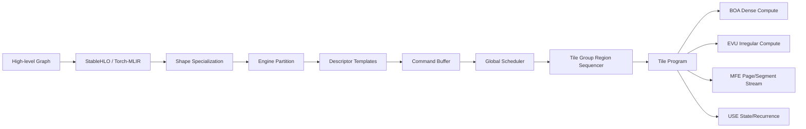
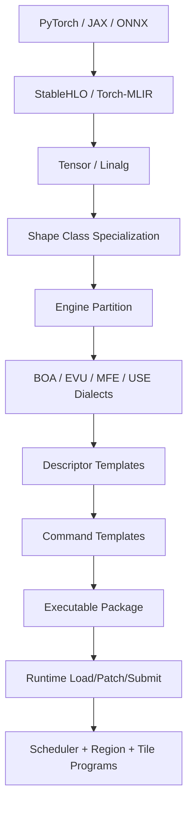

# Elenor AI 芯片设计技术评审

下载版本：[Elenor_technical_review_2026-06-23.md](sandbox:/mnt/data/Elenor_technical_review_2026-06-23.md)

## 执行摘要

Alwaysproblem/Elenor 当前更像一套**系统级架构评审文档集合**，而不是已经进入公开实现阶段的芯片项目：公开仓库只有一次提交、0 star、0 fork，语言统计为 Shell 100%，根目录主要是 `design/` 文档、`scripts/generate_pdf.sh` 和文档生成配置，没有公开 RTL、仿真环境、编译器实现、驱动代码或 bring-up 结果。仓库覆盖了架构总览、编译器栈、runtime ABI、global scheduler、workload mapping、physical/timing/power 等设计文档，说明作者在“如何把未来 AI serving 的不规则性硬件化”这个问题上有较系统的思考，但项目成熟度仍处在**架构定义/设计冻结前后**的位置，而不是可 tapeout 或可交付的软件栈阶段。citeturn1view0turn2view0turn21view0

从架构思想看，Elenor 最有价值的判断是：未来主流 AI 工作负载并不只是 dense GEMM，而是 dense compute、irregular compute、dynamic memory streaming 与 state/control 四类压力叠加，因此它没有直接复刻 TPU、SIMT GPU 或传统 descriptor-list NPU，而是拆成 BOA、EVU、MFE、USE 四类引擎，再配合 Region/Tile program、descriptor-driven runtime 和 stream queue 来组织执行。这个方向与 PagedAttention、MoE、Mamba/SSM 等近年 workload 的演化趋势是对齐的：PagedAttention 的核心是 KV 页式流和动态重排，MoE 的瓶颈常常在 routing/batching/imbalance，SSM/RWKV 则更强调状态更新与顺序依赖，而不只是矩阵乘本身。citeturn3view0turn24view0turn19search0turn19search1turn19search2turn19search7

但我对该设计的总体判断是：**方向对，切分有启发性，V1 收敛风险很高**。最大的风险不是“算力不够”，而是“边界太多导致硬件、编译器、runtime 同时爆炸”。仓库自己其实已经识别了这些风险：compiler complexity、dialect 边界混乱、descriptor ABI 频繁变化、dynamic shape 爆炸、SRAM/NoC contention、MFE 过度设计、Scheduler 变成 graph interpreter、page walk ownership 未冻结等，说明作者的问题意识是强的；但这也意味着，如果没有明确的 first-silicon cutline，Elenor 很容易从“为未来 workload 设计”滑向“把未来一切 workload 问题都塞进 V1”。citeturn11view0turn24view0turn12view5turn13view0turn15view3

我的结论可以压缩成一句话：**Elenor 适合作为“serving-first、memory-centric、heterogeneous AI accelerator”的路线继续推进，但不适合作为第一代就挑战通用训练 GPU 的路线。** 第一代应收敛成一个偏推理、偏长上下文、偏 MoE/分页 KV/动态 batch 的芯片；若这样收敛，它有机会在“低延迟 + 长上下文 + 多模型并发”的细分市场形成竞争力；若继续以“Edge 到 Data Center、推理到轻训练、dense 到 irregular 全覆盖”的目标同时推进，则落地风险会快速超过收益。citeturn5view0turn24view2turn24view3

| 维度           | 评价   | 结论                                                        |
| -------------- | ------ | ----------------------------------------------------------- |
| 架构方向       | 高     | 命中了 PagedAttention/MoE/SSM 的结构性变化                  |
| 硬件可实现性   | 中     | 需强制收敛到 Balanced-small first silicon                   |
| 编译器可实现性 | 中偏低 | MLIR 路线合理，但自定义 dialect/ABI 边界风险高              |
| 性能上限       | 中高   | dense 路径有潜力，但 serving 常态下更可能被 memory/NoC 限制 |
| 产品竞争力     | 中     | 适合做差异化 serving 芯片，不适合直接对标通用训练 GPU       |
| 当前项目成熟度 | 低     | 公开仓库仍是文档驱动的 architecture 阶段                    |

## 仓库现状与架构定位

仓库总文档将 ELENOR 描述为面向未来 5 到 10 年 AI 推理和轻训练场景的统一 AI compute accelerator，强调它既可以是独立加速芯片，也可以是 SoC 内 NPU 子系统，或者以 chiplet 形式接入系统。V1 目标 workload 明确列出 Dense Transformer、MoE、Paged Attention、Dynamic Shape、Mamba/RWKV 等 SSM、多模型并发以及边缘/数据中心复用；推荐规模则给出了 Edge、Balanced、High End 三档，其中 Balanced 是 64 tile、8 个 tile group，High End 是 128 tile、16 个 tile group。citeturn3view0turn5view0turn24view2

Elenor 的核心架构原则是把 **Compute、Control、Data Movement** 三件事强制拆开；芯片把高层 graph 降为 graph schedule、Region Program、Tile Program、descriptor table 和 command sequence 后执行，而不让硬件直接解释高层 IR。这种“执行对象前移到 descriptor/program，硬件不直接看 graph”的做法，本质上是在把复杂性前置给 compiler/runtime，以换取硬件 deterministic 和可验证性。这个原则本身是成立的，而且与现代 serving 系统把静态 plan、runtime metadata 和低层 kernel artifact 分离的做法一致。citeturn3view0turn5view6turn14view5

从微架构上看，Elenor 的分层相当清晰：chip 级有 host interface、runtime processor、global scheduler、global DMA、memory controller、collective、NoC；tile-group 级负责 region sequencing、stream queue、barrier/event、group DMA、collective、shared SRAM/L2；tile 级则承载 Tile UCE、USE、MFE、BOA、EVU、L1 SRAM 和 tile DMA。对于一个目标是长期服务 LLM inference 的架构来说，这种“以 tile group 作为局部数据复用和局部同步域”的方案，比纯 flat-manycore 更合理，因为它天然把 group 内广播、局部 reduce、pipeline producer-consumer 和 L2 复用放在一个近距离域里，有助于降低全局 NoC 压力。citeturn4view3turn4view4turn6view5

我认为它最值得保留的设计取舍，是下面这张表里的四引擎分工。问题不在于“四引擎太多”，而在于**必须把它们各自不能做什么也冻结下来**。仓库里这一点已经写得相对清楚，但 page walk 的 owner、USE 与 MFE 在 metadata/state update 上的边界仍未完全锁死，这会直接决定编译器和 runtime 的复杂度。citeturn3view0turn24view0

| 引擎 | 设计目标                   | 适合的工作负载                                     | 我认为的主要风险                                         |
| ---- | -------------------------- | -------------------------------------------------- | -------------------------------------------------------- |
| BOA  | dense/block compute 主路径 | GEMM、Conv、QK/AV、Expert MLP                      | 若 epilogue/fusion 不够，会频繁回 EVU 造成数据回写       |
| EVU  | irregular vector path      | softmax、norm、activation、gather/scatter、tail    | gather/scatter 一旦过强，验证和 SRAM replay 会迅速复杂化 |
| MFE  | 动态数据流整形             | page walk、segment stream、reorder、coalesce       | 最容易变成“万能数据处理器”，导致面积与验证失控           |
| USE  | state/control assist       | scan、recurrence、checkpoint/restore、event assist | 若扩成通用控制器，会与 Tile UCE/Runtime boundary 冲突    |

表中分工依据仓库架构文档与 workload mapping 文档。citeturn4view4turn5view2turn24view0turn13view0

## 可行性与性能分析

从**硬件可行性**看，Elenor 最重要的一件事不是继续扩充功能，而是承认“first silicon 只能做一个可闭合的 SRAM/NoC profile”。仓库的主文档给出了相当激进的 Balanced 和 High End 配置，例如 Balanced 建议 64 tile、每 tile 2 MB L1、每 group 16–64 MB L2；但 physical/timing/power 文档又非常明确地指出，真正现实的起点应是 `Balanced-small`：64 tile、每 tile 1 MB L1、每 group 8 MB L2、总片上 SRAM 约 128 MB；同时还明确写出 High End 的 1.5 GB 级片上 SRAM 不能默认用普通片上 SRAM 实现。这份“主架构文档很理想化，物理文档更保守”的张力，本身说明作者已经意识到实现鸿沟；我的建议是把保守版本升级为**唯一 V1 目标**。citeturn24view2turn24view3turn11view4turn12view5

从**软件可行性**看，Elenor 的 compiler/runtime 路线在方法论上是正确的：高层输入来自 PyTorch/JAX/ONNX，经 StableHLO 或 Torch-MLIR 进入 MLIR lowering，再做 shape specialization、engine partition、descriptor template、command packing 和 executable package。StableHLO 本来就是 OpenXLA 用来做框架与编译器之间可移植层的规范，MLIR 也天然适合做分层 lowering 和自定义 dialect；因此 Elenor 选择 MLIR 家族没有问题。真正的问题在于：仓库自身把 First Silicon V1 定义为 pattern-based partition + tile kernel library，而不是 cost-model 驱动的完全自动编译；这其实不是弱点，反而是务实选择。我赞成保留这条 cutline。citeturn10view0turn10view2turn10view3turn26view3turn26view4turn26view5

为了进行性能估算，我采用下表中的**保守假设**。这些值不是仓库正式规格，而是根据仓库给出的 tile 结构与外存类别做的分析基线。Roofline 模型的基本上界来自 Williams 等人的经典论文：性能上界由峰值算力和带宽乘以 operational intensity 的较小者决定。citeturn16view0turn24view2turn18search0

| 假设项             | 基线值                           | 依据                                                                                                     |
| ------------------ | -------------------------------- | -------------------------------------------------------------------------------------------------------- |
| first-silicon 配置 | 64 tile，8 group                 | 仓库 Balanced/ Balanced-small 方向 citeturn5view0turn24view3                                         |
| 每 tile BOA        | 4 个 OPA                         | 仓库架构文档 citeturn16view0                                                                          |
| 单 OPA 形态        | 16×16 或 32×16 outer-product     | 仓库架构文档 citeturn16view0                                                                          |
| 频率               | 1.0 GHz 基线，0.8–1.2 GHz 观察窗 | 仓库未冻结频率，作为分析假设                                                                             |
| 外存带宽场景       | 0.8 / 1.6 / 3.0 TB/s             | 对应单/双 HBM3 量级到 H100 级 3 TB/s 参考带宽，不代表 Elenor 既定规格 citeturn17search1turn25search0 |

按上述假设，如果把一个 outer-product tile 视作每周期完成一次完整 outer product，那么每 tile 的理论 INT8 峰值约为：`4 × 16 × 16 × 2 × 1GHz = 2.048 TOPS`，或在 32×16 模式下约为 `4.096 TOPS`；64 tile 全芯片对应约 **131–262 TOPS @1GHz**。如果考虑 0.8–1.2 GHz 观察窗，则全芯片理论区间约为 **105–315 TOPS**。这只是**几何峰值**，不包含 operand stall、bank conflict、stream backpressure、scheduler stall 和 tail/utilization 损失，因此只能作为上界，而不是可交付性能。citeturn16view0turn16view2turn16view3

| OPA 假设      | 1 GHz 单 tile 理论峰值 | 64 tile 全芯片理论峰值 | 解读                              |
| ------------- | ---------------------- | ---------------------- | --------------------------------- |
| 16×16 × 4 OPA | 2.048 TOPS INT8        | 131 TOPS INT8          | 更保守、实现更稳                  |
| 32×16 × 4 OPA | 4.096 TOPS INT8        | 262 TOPS INT8          | 更激进，但对 L1/SRAM 带宽要求更高 |

这张表是基于仓库公开的 OPA/tile 配置做的作者估算。citeturn16view0

下一步看 roofline 的**带宽拐点**。若峰值为 131–262 TOPS，而外存为 0.8 / 1.6 / 3.0 TB/s，则算力转为带宽受限的操作强度阈值大约如下。对于 serving 来说，这张表比峰值 TOPS 更重要。citeturn18search0turn17search1

| 峰值算力 | 外存带宽 | 进入 compute-bound 所需 OI |
| -------- | -------- | -------------------------- |
| 131 TOPS | 0.8 TB/s | 164 ops/byte               |
| 131 TOPS | 1.6 TB/s | 82 ops/byte                |
| 131 TOPS | 3.0 TB/s | 44 ops/byte                |
| 262 TOPS | 0.8 TB/s | 328 ops/byte               |
| 262 TOPS | 1.6 TB/s | 164 ops/byte               |
| 262 TOPS | 3.0 TB/s | 87 ops/byte                |

这意味着：**大 GEMM/大 MLP 仍可能是 compute-bound，但 decode 场景下的 paged attention、MoE dispatch、embedding/gather、LayerNorm/softmax 极大概率是 memory-bound。** 例如单 token decode 的 attention 需要反复从 KV cache 读 K/V，算术强度通常极低；Cerebras 在其推理分析里也给出了同样的结论：当模型变成“每 token 需要大量权重/状态搬运”时，决定延迟的首先是带宽，而不是 TOPS。仓库自己也把 PagedAttention 的关键性能条件写成 `T_prefetch <= T_qk`，即 MFE 预取必须被 QK 计算覆盖，否则 BOA 会直接因 KV stream 不足而停顿。citeturn24view0turn13view0turn26view9

对 Elenor 来说，更尖锐的约束其实在**片上 SRAM 带宽**。仓库要求每 tile 至少 16 bank，并把 `BW_sram_required` 明确分解成 BOA A/B 读、acc read/write、EVU LSU、MFE stream、DMA、USE state 和 program/descriptor/event 的总和。按 4 OPA、1GHz 估算，仅 BOA INT8 operand 输入就约需要 **128–192 GB/s/ tile**；若是 BF16，则上升到 **256–384 GB/s/ tile**。64 tile 聚合后，芯片内部 L1 operand 读带宽需求大约在 **8.2–24.6 TB/s** 量级，尚未计入 accumulator 和 EVU/MFE 并发访问。换句话说，Elenor 的关键不是“有没有 2MB L1”，而是“这些 L1 能不能以足够多 bank、足够短的局部走线和足够稳定的 arbitration 提供可持续吞吐”。citeturn24view2turn12view6

NoC 上，Elenor 的架构思路是对的：它把命令/事件、DMA read response、DMA write/stream、collective 拆成不同 VC，并明确要求 VC0 的 command/event 不能被大流量数据阻塞。这一点非常关键，因为一旦 control plane 被 data plane 拖死，问题不是性能下降，而是系统“不可恢复地挂起”。但目前的文档还没有给出可审计的拓扑细节、group-to-group collective 带宽预算和跨 group all-reduce 的定量目标；对一个只想做 serving 的 V1，这不一定是阻塞项，但如果声称支持“轻训练 / fine-tuning 部分 kernel”，那么 collective 路线必须比现在具体得多。citeturn12view0turn12view5turn24view2turn26view7

综合来看，我对性能层面的判断是：

| 维度                    | 当前判断         | 评审意见                                                              |
| ----------------------- | ---------------- | --------------------------------------------------------------------- |
| Dense GEMM / Expert MLP | 有潜力           | BOA 路线成立，但必须先做 bank-aware layout 与双缓冲闭环               |
| Dense Attention         | 可行             | 适合作为 Phase 1/2 后的第一个成型 workload                            |
| Paged Attention         | 方向正确但高风险 | MFE 值得做，但 page walk ownership 与 metadata/update 边界必须冻结    |
| MoE                     | 具有差异化价值   | dispatch/combine/routing imbalance 的 PMU 与 compiler plan 是成败关键 |
| SSM / RWKV / Mamba      | 有潜力           | USE 只应做 recurrence/state assist，不应扩成通用控制器                |
| 多芯片扩展              | 目前偏弱         | 需要把跨 group 与跨 chip 的 collective 语义前置，而不是后补           |

## 灵活性、编程运行模型与生态

在**灵活性与算子支持**上，Elenor 的优势不是“支持所有算子”，而是它对**未来主要瓶颈算子**的认识比较准确。仓库把 matmul/conv/dense attention 映射到 BOA，把 softmax/norm/activation/tail 映射到 EVU，把 gather/scatter/layout/page/KV stream 交给 MFE+EVU，把 MoE dispatch 交给 MFE+EVU+USE，把 scan/recurrence/state update 放到 USE，把 branch 留给 Runtime/Tile UCE。这个分配比很多只强调 GEMM 的 NPU 更贴近真实的 LLM 服务链路。citeturn5view6turn10view2turn13view0

| 工作负载             | 仓库支持度 | 我的结论                                                  |
| -------------------- | ---------- | --------------------------------------------------------- |
| Dense Transformer    | 高         | 可以成为 V1 的主 benchmark                                |
| Paged Attention      | 高         | 是 Elenor 最该证明的差异化场景                            |
| MoE                  | 中高       | 关键不在 expert GEMM，而在 dispatch / imbalance / combine |
| Dynamic Shape        | 中         | 有方向，但必须限制为 finite shape class                   |
| SSM / Mamba / RWKV   | 中高       | USE 路线有前瞻性，但要严守边界                            |
| Embedding / GNN      | 中         | MFE 对 segment stream 有帮助，但随机访存性能取决于实现    |
| 轻训练 / fine-tuning | 低到中     | 目前更像“若干训练 kernel 可支持”，还不是完整训练架构      |

表中结论基于 workload mapping、架构文档与相关基础论文。citeturn13view0turn13view4turn19search0turn19search1turn19search2turn19search7

编程模型上，Elenor 采用的是一种**受控的、多层 program model**：Graph Schedule 负责 region 依赖，Region Program 推进 device pipeline，Tile Program 负责 tile-local kernel pipeline，descriptor 则承载各引擎的形参。这个模型的优点是 deterministic、好做 PMU 归因，也有利于多模型并发和故障隔离；缺点是对于新算子、新 epilogue、新数据布局的适配成本很可能高于 GPU kernel model，因为你不是只写一个 kernel，而是在同时维护 package、descriptor、command、region、tile program 五层契约。citeturn3view0turn5view6turn11view2turn15view3

从社区生态看，Elenor 目前最大的利好，是它显式拥抱了 MLIR/LLVM、StableHLO、Torch-MLIR、FileCheck/lit、Verilator/Yosys/OpenSTA/OpenROAD 这些“现实中有人用、有人维护、有人愿意贡献”的基础设施，而不是另起炉灶做闭门 IR 和私有工具链。StableHLO 的官方定位就是跨框架与 ML 编译器的可移植层；MLIR 天生支持 dialect conversion、bufferization、diagnostic 和 testing；Torch-MLIR 则在 PyTorch 到 MLIR 之间提供桥梁，虽然它仍处于 LLVM incubator 阶段，意味着稳定性和官方背书还不等价于主线 LLVM 组件。Elenor 如果走对这条路，生态成本会远低于重新发明一套前端体系。citeturn26view3turn26view4turn26view5

但“使用 MLIR”并不等于“拥有生态”。你真正需要的是**最小化自定义 dialect 表面积**。仓库已经把风险写出来了：dialect 边界混乱、descriptor ABI 频繁变化、memory planner 不准、dynamic shape 爆炸、kernel library 漂移。我的建议是：前端强绑定 StableHLO/Tensor/Linalg；中段只保留一个 `elenor.partition` 层和少量 runtime/package ops；后段 descriptor/command 打包尽量使用 table-driven schema，而不是在 IR 中暴露太多硬件细节。否则，Elenor 最终虽然“基于 MLIR”，但实际上会形成一个只有自己团队能维护的专用编译器岛。citeturn11view0turn10view3turn14view3

从社区支持角度，我建议按以下顺序推进：

| 优先级 | 建议                                                                   | 理由                                           |
| ------ | ---------------------------------------------------------------------- | ---------------------------------------------- |
| P0     | 发布 Python 性能模型、canonical trace、descriptor schema、golden tests | 这是吸引外部贡献者与验证正确性的最低门槛       |
| P0     | 提供 functional simulator / trace-driven simulator                     | 没有 simulator，外部很难围绕编译器和映射做贡献 |
| P1     | 前端对接 StableHLO 与 Torch-MLIR 子集                                  | 先接住主流输入，再谈自定义优化                 |
| P1     | 开源 runtime package loader、descriptor decoder、PMU decode            | 让软件生态能真正“摸到硬件契约”                 |
| P2     | 再决定是否开放 tile kernel library DSL                                 | 这一步太早会把 ABI 与 kernel 绑死              |

## 硬件实现、功耗与芯片设计建议

硬件设计上，Elenor 最先要解决的不是“HBM 还是 DDR”，而是**SRAM profile 先锁死**。仓库已经给出非常明确的现实信号：Balanced-small 的 128 MB 总片上 SRAM“更适合作为 first-silicon 现实配置”，而 Balanced-large 的 256 MB 已经需要 eDRAM/先进工艺或严格论证，高端的 1.5 GB 级更不能默认用普通片上 SRAM 实现。我的建议是把这个保守结论前移成产品策略：**V1 只能选 1 MB/tile + 8 MB/group，且 group SRAM 必须先按普通 SRAM 宏可实现方案约束 floorplan。** 只要你在 V1 就把 L2 拉到 16–64 MB/group，整个项目会立即转化成“先进封装/近存/3D SRAM 项目”，而不是 AI 芯片项目。citeturn24view2turn11view4turn12view5

在时钟、复位与功耗管理上，physical 文档的思路非常健康：要求所有 high-fanout control 走本地寄存复制或 clock-gating enable，不允许直接组合扇出；要求 reset release 同步化；要求 PMU 采样已寄存信号，不能侵入数据通路；同时给出了 `POWER_OFF -> ... -> ACTIVE -> QUIESCE -> RETENTION_OR_SLEEP -> WAKE_RESTORE` 的基本状态机。这些设计不是“锦上添花”，而是 heterogenous accelerator 能否稳定 bring-up 的基本条件。越是多引擎、多队列、多事件表的设计，越不能把 reset/drain/sleep/wake 留到最后。citeturn11view5turn12view5

NoC/floorplan 上，我赞成仓库提出的 VC 划分和层级 floorplan 原则：global NoC 只承载跨 group 通信与 runtime/control aggregation，group 内共享 SRAM 与 stream queue 不应直接拉成长距离全芯片路径，router 的 credit/arbitration 应寄存化，command/event 必须有独立低延迟 VC0。我的附加建议是：**在 first silicon 中不要追求好看的拓扑名词，而要追求可测的拥塞边界。** 具体说，应先把 64 tile/8 group 做成“组内局部全带宽、组间明确限速”的结构，并建立强制性的 NoC stress regression，而不是过早追求大而美的 hierarchical mesh。citeturn12view0turn12view5turn15view3

功耗方面，仓库没有给出冻结值，所以只能做保守推断。参考官方产品，Tenstorrent Wormhole 单板约 108 MB SRAM、288 GB/s GDDR6、1 GHz、160W；Blackhole 开发卡约 180 MB SRAM、512 GB/s GDDR6、300W；NVIDIA H100 SXM 则是 3.35 TB/s HBM、最高 700W；AMD MI300X 平台是 192 GB HBM3、5.3 TB/s 峰值本地带宽。以这些已量产产品做边界参照，我会把 Elenor 的功耗目标这样定：**Edge 20–75W，Balanced-first-silicon 200–400W，High-End 600W+ 只应作为后续代目标**。这不是仓库事实，而是基于“SRAM 规模 + 外存类型 + 1GHz 级时钟 + 多引擎控制面”的工程推断；其中只要引入多堆 HBM 或显著增大共享 SRAM，功耗会迅速向上跳。citeturn26view1turn26view2turn27view0turn26view7

| 配置策略     | 我建议的目标                              | 原因                             |
| ------------ | ----------------------------------------- | -------------------------------- |
| Edge         | 8–16 tile，LPDDR，20–75W                  | 适合端侧/车端/低时延小模型       |
| Balanced V1  | 64 tile，1 MB/tile + 8 MB/group，200–400W | 最可能闭合面积、时序、验证与冷却 |
| High End V2+ | 128 tile，HBM，多级 collective，600W+     | 只能在封装与工艺路线明确后推进   |

下面这个风险矩阵，基本就是我对 tapeout 风险的排序：

| 风险                                 | 概率 | 影响 | 评审意见                                                              |
| ------------------------------------ | ---- | ---- | --------------------------------------------------------------------- |
| SRAM 目标过高导致面积/时序/功耗失控  | 高   | 极高 | 立即冻结 Balanced-small，停止在 V1 讨论 256MB/1.5GB 级片上 SRAM       |
| MFE 过度设计                         | 高   | 高   | V1 只做 Page Stream + Segment Stream，禁止扩展成通用 memory processor |
| Descriptor/Runtime ABI 漂移          | 高   | 高   | schema version、golden binary、decoder、compat test 缺一不可          |
| Dynamic shape 方案膨胀               | 中高 | 高   | 仅支持 finite shape class + tail/ragged descriptor                    |
| Scheduler 复杂化为 graph interpreter | 中高 | 高   | 只消费 command/descriptor/program，显式依赖由 compiler/runtime 给出   |
| NoC event/data 死锁                  | 中   | 极高 | VC0 必须硬隔离且做死锁与 backpressure 形式验证                        |
| PMU 侵入关键路径                     | 中   | 中高 | local tap + registered snapshot，不允许直接挂临界仲裁器               |
| 多模型 QoS 过早引入                  | 中   | 中高 | V1 用 static partition + simple priority，不做 preemption             |

风险依据仓库 physical、runtime、scheduler、compiler 文档综合判断。citeturn12view5turn14view4turn14view6turn15view0turn15view3turn11view0

我给 Elenor 的**优先级变更清单**如下：

| 优先级 | 必做变更                                                         | 预期收益                               |
| ------ | ---------------------------------------------------------------- | -------------------------------------- |
| P0     | 把 first silicon 目标强制收敛到 Balanced-small                   | 让项目从“架构愿景”变成“可实现芯片”     |
| P0     | 冻结 page walk / metadata update 的最终 owner                    | 降低 compiler/runtime/RTL 三方边界争议 |
| P0     | 冻结 ABI v0：descriptor schema、command ring、event/fault layout | 没有 ABI 冻结，就不会有真实 bring-up   |
| P0     | 为 paged attention 和 MoE 建立 canonical PMU fingerprint         | 让差异化卖点可量化、可验证             |
| P1     | 做 bank-aware memory planner 与 slot-frame bank hint             | 直接改善 EVU/MFE/BOA 的 SRAM 争用      |
| P1     | 让 compiler 先依赖 tile kernel library，而不是全自动 codegen     | 快速收敛正确性与 bring-up              |
| P1     | 在 group 内实现可靠广播/局部 reduce，再谈跨 group 扩展           | 先把 64 tile 的 serving 性能做扎实     |
| P2     | 再引入更强 collective、更多 dataflow、更多训练 kernel            | 避免 V1 目标失控                       |

## 场景匹配、竞争定位与最终结论

如果按我上面的收敛建议推进，Elenor 最适合的场景不是“全面替代 GPU”，而是以下几类：第一，**长上下文 LLM 推理**，因为它显式把 paged attention/KV metadata/page walk 放进 MFE；第二，**MoE serving**，因为它把 token grouping、segment stream、expert batching、combine 的问题显式建模；第三，**多模型并发和多租户推理**，因为 runtime ABI、context/queue/event/fault 模型已经在设计上考虑了隔离与可观测；第四，**边缘到数据中心的软件栈复用**，前提是 V1/V2 维持同一套 package/descriptor/runtime 语义，而不是每代推倒重来。citeturn5view0turn13view0turn11view2turn15view3

反过来说，它**不适合**立即把自己定位成训练优先或通用 HPC/GPU 替代方案。原因很直接：仓库虽提到“轻训练 / fine-tuning 部分 kernel”，但尚未给出训练态所需的完整数据流、跨 group/跨芯片 collective 预算、optimizer/update 路径、激活检查点与反向图契约、更重的 BF16/FP16 归约精度策略，也没有公开任何能证明其在训练负载下优于通用 GPU 的软件生态或系统实装。相比之下，H100/Blackwell、MI300X 之类产品的真实优势不仅在算力和带宽，更在于成熟的系统互连、编译器、内核库与工程组织。citeturn24view2turn27view0turn26view7turn23search0

如果把 Elenor 放到竞品谱系里，我会这样定位：

| 路线                  | 代表                                | 优势                                         | Elenor 与之相比的机会                                       | Elenor 当前短板                                                                   |
| --------------------- | ----------------------------------- | -------------------------------------------- | ----------------------------------------------------------- | --------------------------------------------------------------------------------- |
| 通用训练/推理 GPU     | NVIDIA H100 / Blackwell、AMD MI300X | 巨大生态、成熟 kernel 库、强互连、HBM 高带宽 | 可在 paged attention / MoE / serving runtime 上做更强专用化 | 生态与系统成熟度远弱，训练能力未成形 citeturn27view0turn26view7turn23search0 |
| 低延迟专用推理        | Groq LPU                            | 对低延迟 token 生成和能效叙事强              | Elenor 可用 MFE + BOA + EVU 做更强 workload 兼容性          | 现阶段没有 Groq 那样聚焦的产品边界 citeturn26view8                             |
| 单巨芯片/超大片上存储 | Cerebras WSE-3                      | 超大片上存储与极高片上带宽，系统简化强       | Elenor 更现实、可做普通芯片或 chiplet                       | 无法靠普通片上 SRAM 复制 wafer-scale 优势 citeturn26view0turn26view9          |
| 开放软件栈 + manycore | Tenstorrent                         | 开源软件栈、现货硬件、mesh 扩展、RISC-V 友好 | Elenor 若尽快放出 simulator/runtime/ABI，可在开放社区上追赶 | 目前只有文档，没有可玩硬件或工具链 citeturn26view1turn26view2turn27view1     |

从未来发展上，我建议分三层看：

短期上，Elenor 的成功标准不是“做出很强的 paper architecture”，而是**做出两个不可替代的 canonical demo**：一个是 paged attention，在 PMU 上证明 `T_prefetch <= T_qk` 的覆盖关系；一个是 MoE dispatch，在 PMU 上证明 routing imbalance、expert batching 与 BOA 利用率之间存在可预测关系。只要这两条闭环能成立，Elenor 的“不是另一个 GEMM ASIC”这件事就站住了。citeturn24view0turn13view0turn10view3

中期上，应该把软件栈做成产品，而不是附件：开放 executable package、descriptor decoder、functional simulator、PMU tooling、StableHLO/Torch-MLIR importer、golden tests 和 workload traces。今天真正有竞争力的 AI 芯片公司，几乎都不是单纯靠“硬件结构更好”赢，而是靠“硬件结构 + 软件路径 + 调优闭环”一起赢。Tenstorrent 之所以即便体量远不如 NVIDIA，仍然能在开发者群体中形成存在感，很大程度上来自其开放文档、可购买硬件和开放软件栈。citeturn27view1turn26view2

长期上，Elenor 若想进入更高端市场，不能只扩 tile 数量，而必须决定自己要押哪一条路线：是押**更大 SRAM / 近存层 / HBM cache**，还是押**更强 collective 与多芯片 scale-out**，还是押**极端低延迟 serving**。这三条路线对物理设计、封装、软件栈和商业化对象的要求完全不同，不能继续用同一个模糊的“Edge 到 Data Center 统一架构”口号同时覆盖。仓库本身已经足够诚实地指出：当 Group SRAM 超出常规片上 SRAM 合理范围，就必须明确自己到底是在做 eDRAM、3D SRAM、HBM cache、chiplet SRAM die 还是外部近存层。未来战略必须在这里作出选择。citeturn24view2turn12view5

最终结论是：**Elenor 不是一个已经成熟的 AI chip 项目，但它是一个方向感明显优于平均概念设计的项目。** 它抓住了未来 AI serving 里真正难的问题：分页 KV、动态数据流、MoE 路由、状态更新与多模型并发；它的架构分层也比很多只会堆 MAC 的设计更深思熟虑。真正决定它成败的，不再是愿景，而是收敛：收敛 SRAM profile，收敛 MFE/USE ownership，收敛 ABI，收敛 first-silicon 功能面，收敛到两个能被 PMU 证明价值的 canonical workload。若做到这些，Elenor 在未来 AI 芯片设计里会是一个**有差异化竞争力的 serving-centric 架构**；若做不到，它更可能停留在一份很聪明、但实现代价过高的架构文档。
